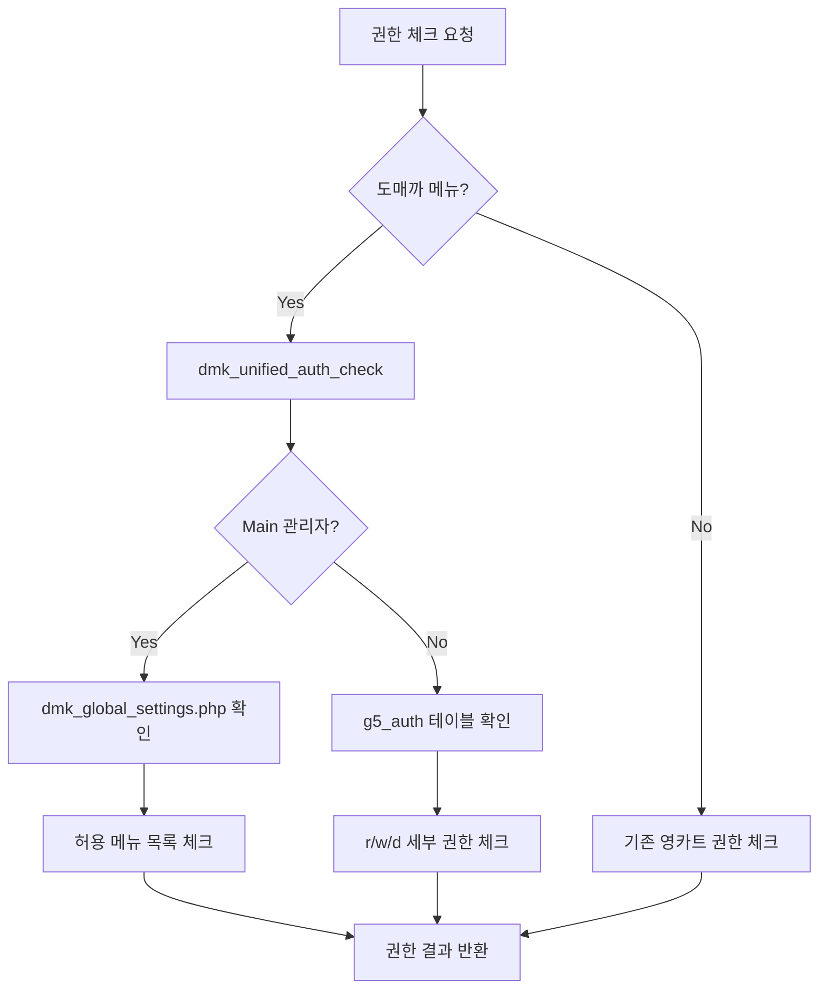

# 도매까 웹 관리자 시스템 가이드

## 시스템 개요

도매까 웹 시스템은 **그누보드5 + 영카트5를 기반으로 한 계층형 관리자 시스템**입니다. 카카오톡 봇과 연동된 공동구매 플랫폼으로, 4단계 계층별 권한 관리와 프랜차이즈 비즈니스 로직을 제공합니다.

### 핵심 특징
- **하이브리드 아키텍처**: 검증된 그누보드5/영카트5 + 도매까 확장 모듈
- **4단계 계층별 권한**: 본사(super) → 총판(distributor) → 대리점(agency) → 지점(branch)
- **카카오톡 봇 통합**: 실시간 메시지 발송 및 관리
- **계층별 데이터 필터링**: 권한에 따른 회원/주문/상품 데이터 자동 필터링

## 시스템 구조

```1
web/
├── adm/                    # 관리자 시스템 (그누보드5 기반 + 도매까 확장)
│   ├── index.php           # 메인 대시보드 (계층별 권한 적용)
│   ├── admin.menu*.php     # 권한별 메뉴 구조
│   ├── shop_admin/         # 쇼핑몰 관리 (영카트5 기반 + 계층별 확장)
│   └── sms_admin/          # SMS 발송 관리
├── dmk/                    # 도매까 전용 확장 모듈
│   ├── admin/              # 도매까 관리 기능
│   ├── ajax/               # AJAX 처리
│   └── lib/                # 도매까 라이브러리
├── bbs/                    # 게시판 시스템 (그누보드5)
└── shop/                   # 쇼핑몰 프론트엔드 (영카트5)
```

## 관리자 시스템 (`/adm`)

### 메뉴 시각적 구분 시스템

도매까 관리자 시스템은 **기존 영카트5 메뉴의 개조**와 **완전히 새로운 메뉴 추가**를 시각적으로 구분하기 위해 FontAwesome 아이콘을 사용합니다:

- **⭐ (fa-star)**: 신규 메뉴 - 도매까에서 새롭게 개발한 기능
- **🚩 (fa-flag)**: 개조 메뉴 - 기존 영카트5 기능을 도매까 계층형 권한에 맞게 수정

#### UI 구조
- **좌측 패널**: 메인 메뉴 FontAwesome 아이콘으로 표시
- **우측 영역**: 메인 메뉴 클릭 시 서브 메뉴 목록 표시
- **서브 메뉴**: 메뉴명 오른쪽에 구분 아이콘 표시

#### 메인 메뉴 아이콘 시스템 (FontAwesome)

도매까 시스템은 기존 영카트의 이미지 기반 아이콘을 **FontAwesome 아이콘 시스템**으로 업그레이드했습니다:

| 메뉴 | FontAwesome 아이콘 | 색상 | 설명 |
|------|-------------------|------|------|
| **환경설정** (100) | `fa-cog` | #6c757d | 시스템 설정 및 관리 |
| **봇 관리** (180) | `fa-android` | #28a745 | 카카오톡 봇 시스템 |
| **프랜차이즈 관리** (190) | `fa-sitemap` | #dc3545 | 도매까 핵심 기능 |
| **회원관리** (200) | `fa-users` | #17a2b8 | 계층별 회원 관리 |
| **게시판관리** (300) | `fa-list-alt` | #6610f2 | 커뮤니티 관리 |
| **상품/주문관리** (400) | `fa-shopping-cart` | #fd7e14 | 쇼핑몰 관리 |
| **쇼핑몰현황/기타** (500) | `fa-bar-chart` / `fa-line-chart` | #20c997 | 통계 및 분석 |
| **SMS관리** (900) | `fa-mobile` / `fa-comment` | #e83e8c | 문자 발송 관리 |

**특징**:
- **확장성**: 새로운 메뉴 추가 시 FontAwesome 아이콘만 설정하면 됨
- **반응형**: 화면 크기에 따라 아이콘 크기 자동 조정
- **접근성**: 명확한 색상 구분과 툴팁 제공
- **일관성**: 통일된 디자인 시스템으로 사용자 경험 향상

### 메뉴 권한 관리 시스템

도매까 관리자 메뉴의 권한은 `web/dmk/dmk_global_settings.php` 파일에서 중앙 집중식으로 관리됩니다.

#### 권한 설정 파일: `dmk_global_settings.php`

이 파일은 도매까 시스템의 **계층별 메뉴 접근 권한을 정의**하는 핵심 설정 파일입니다:

**주요 구성 요소**:
- **메뉴 코드 매핑**: 실제 `admin.menu*.php` 파일의 메뉴 코드와 연결
- **계층별 허용 메뉴**: `distributor`, `agency`, `branch` 계층별 접근 가능한 메뉴 목록
- **메뉴 제목 정의**: 각 메뉴의 표시 이름
- **서브 메뉴 구조**: 메인 메뉴 하위의 세부 메뉴 정의

**메뉴 코드 체계**:
```
100XXX: 환경설정 (admin.menu100.php)
180XXX: 봇 관리 (admin.menu180.php)  
190XXX: 프랜차이즈 관리 (admin.menu190.php)
200XXX: 회원관리 (admin.menu200.php)
300XXX: 게시판관리 (admin.menu300.php)
400XXX: 쇼핑몰관리 (admin.menu400.php)
500XXX: 쇼핑몰현황/기타 (admin.menu500.php)
900XXX: SMS관리 (admin.menu900.php)
```

**계층별 권한 적용**:
- **본사(super)**: 모든 메뉴 접근 가능 (별도 제한 없음)
- **총판(distributor)**: `dmk_global_settings.php`에서 정의된 메뉴만 접근
- **대리점(agency)**: 총판보다 제한된 메뉴 접근
- **지점(branch)**: 가장 제한된 메뉴 접근

**권한 체크 로직**:
1. 사용자 로그인 시 계층 타입 확인
2. `dmk_global_settings.php`에서 해당 계층의 `allowed_menus` 배열 조회
3. 현재 접근하려는 메뉴 코드가 허용 목록에 있는지 검증
4. 권한이 없으면 접근 차단

### 계층별 메뉴 구조

#### 1. 환경설정 (`menu100`) - 본사/총판만 접근
- **기본환경설정**: 사이트 기본 정보 및 설정
- **관리권한설정**: 관리자 권한 및 메뉴 관리
- **테마설정**: UI 테마 및 스킨 관리
- **메뉴설정**: 메뉴 구조 및 권한 설정
- **팝업레이어관리**: 공지사항 팝업 관리
- **시스템 관리**: 캐시/세션/파일 정리, DB 업그레이드

#### 2. 봇 관리 (`menu180`) - 카카오톡 봇 시스템
- **서버 관리** ⭐: 봇 서버 상태 모니터링 (본사 전용)
- **클라이언트 봇 관리** ⭐: 디바이스 승인 및 채팅방 관리
- **스케줄링 발송 관리** ⭐: 예약 메시지 발송 관리
- **메시지 즉시 발송** ⭐: 실시간 메시지 발송
- **채팅 내역 조회** ⭐: 대화 로그 조회 및 분석

#### 3. 프랜차이즈 관리 (`menu190`) - 도매까 핵심 기능
- **총판관리** ⭐: 총판 등록/수정/삭제 (본사 전용)
- **대리점관리** ⭐: 대리점 등록/수정/삭제 (본사/총판)
- **지점관리** ⭐: 지점 등록/수정/삭제 (본사/총판/대리점)
- **통계분석** ⭐: 계층별 매출 및 회원 통계
- **서브관리자관리** ⭐: 계층별 관리자 계정 관리
- **서브관리자권한설정** ⭐: 세부 메뉴별 권한 설정
- **관리자엑션로그** ⭐: 관리자 활동 추적
- **계층별메뉴권한설정** ⭐: 메뉴별 권한 매트릭스 관리

#### 4. 회원관리 (`menu200`) - 계층별 필터링
- **회원목록** 🚩: 권한에 따른 회원 조회 (계층별 필터링 적용)
  - 본사: 전체 회원
  - 총판: 소속 대리점/지점 회원만
  - 대리점: 소속 지점 회원만  
  - 지점: 자신만
- **포인트관리**: 계층별 포인트 지급/차감
- **메일발송**: 회원 대상 이메일 발송

#### 5. 게시판관리 (`menu300`) - 그누보드5 기반
- **게시판관리**: 게시판 생성/수정/삭제
- **게시글관리**: 게시글 관리 및 답변
- **댓글관리**: 댓글 관리 및 승인

#### 6. 쇼핑몰관리 (`menu400`, `menu500`) - 영카트5 + 도매까 확장

**상품 관리** (`menu400`):
- **분류관리** 🚩: 계층별 카테고리 소유권 관리
- **상품관리** 🚩: 계층별 상품 등록/수정 (소유자 필터링)
- **상품유형관리** 🚩: 소유자별 상품 유형 정의
- **재고관리** 🚩: 계층별 재고 조회 및 알림
- **상품옵션재고관리** 🚩: 옵션별 재고 관리

**주문 관리** (`menu400`):
- **주문관리** 🚩: 계층별 주문 조회 및 처리
- **미완료주문** 🚩: 미완료 주문 추적 관리

**매출 통계** (`menu500`):
- **매출현황** 🚩: 계층별 매출 통계
- **상품판매순위** 🚩: 상품별 판매 실적
- **주문내역출력** 🚩: 주문서 출력 관리
- **보관함현황** 🚩: 장바구니/관심상품 현황

**기타 기능**:
- **쿠폰관리**: 쿠폰 발행 및 관리
- **배너관리**: 사이트 배너 관리

#### 7. SMS관리 (`menu900`) - 아이코드 SMS 연동
- **SMS 설정**: SMS 서비스 기본 설정
- **SMS 발송**: 개별/그룹 SMS 발송
- **발송내역**: SMS 발송 이력 조회
- **주소록관리**: 연락처 그룹 관리

## 도매까 실제 메뉴 현황

### 신규 메뉴 (⭐ fa-star) - 총 13개

#### 봇 관리 (`menu180`) - 5개
| 메뉴코드 | 메뉴명 | 경로 | 설명 |
|---------|--------|------|------|
| 180100 | 서버 관리 | `/dmk/adm/bot/bot_server_status.php` | 봇 서버 상태 모니터링 |
| 180200 | 클라이언트 봇 관리 | `/dmk/adm/bot/bot_client_list.php` | 디바이스 승인 및 관리 |
| 180300 | 스케줄링 발송 관리 | `/dmk/adm/bot/bot_schedule_list.php` | 예약 메시지 발송 |
| 180400 | 메시지 즉시 발송 | `/dmk/adm/bot/bot_instant_send_form.php` | 실시간 메시지 발송 |
| 180500 | 채팅 내역 조회 | `/dmk/adm/bot/bot_chat_log_list.php` | 대화 로그 조회 |

#### 프랜차이즈 관리 (`menu190`) - 8개
| 메뉴코드 | 메뉴명 | 경로 | 설명 |
|---------|--------|------|------|
| 190100 | 총판관리 | `/dmk/adm/distributor_admin/distributor_list.php` | 총판 계정 관리 |
| 190200 | 대리점관리 | `/dmk/adm/agency_admin/agency_list.php` | 대리점 계정 관리 |
| 190300 | 지점관리 | `/dmk/adm/branch_admin/branch_list.php` | 지점 계정 관리 |
| 190400 | 통계분석 | `/dmk/adm/statistics/statistics_dashboard.php` | 계층별 통계 |
| 190600 | 서브관리자관리 | `/dmk/adm/admin_manager/admin_list.php` | 관리자 계정 관리 |
| 190700 | 서브관리자권한설정 | `/dmk/adm/admin_manager/dmk_auth_list.php` | 권한 설정 |
| 190800 | 계층별메뉴권한설정 | `/dmk/adm/admin_manager/menu_config.php` | 메뉴별 권한 매트릭스 |
| 190900 | 관리자엑션로그 | `/dmk/adm/logs/action_log_list.php` | 관리자 활동 로그 |

### 개조 메뉴 (🚩 fa-flag) - 총 12개

#### 회원관리 (`menu200`) - 1개
| 메뉴코드 | 메뉴명 | 개조 내용 |
|---------|--------|----------|
| 200100 | 회원목록 | 계층별 회원 필터링 적용 |

#### 쇼핑몰 관리 (`menu400`) - 7개
| 메뉴코드 | 메뉴명 | 개조 내용 |
|---------|--------|----------|
| 400200 | 분류관리 | 계층별 카테고리 소유권 관리 |
| 400300 | 상품관리 | 계층별 상품 소유자 필터링 |
| 400400 | 주문관리 | 계층별 주문 조회 권한 적용 |
| 400410 | 미완료주문 | 계층별 미완료 주문 관리 |
| 400500 | 상품옵션재고관리 | 계층별 옵션 재고 관리 |
| 400610 | 상품유형관리 | 소유자별 상품 유형 정의 |
| 400620 | 재고관리 | 계층별 재고 조회 및 알림 |

#### 쇼핑몰 통계 (`menu500`) - 4개
| 메뉴코드 | 메뉴명 | 개조 내용 |
|---------|--------|----------|
| 500100 | 상품판매순위 | 계층별 판매 실적 통계 |
| 500110 | 매출현황 | 계층별 매출 통계 |
| 500120 | 주문내역출력 | 계층별 주문서 출력 |
| 500140 | 보관함현황 | 계층별 장바구니/관심상품 현황 |

### 기존 메뉴 (아이콘 없음)

#### 환경설정 (`menu100`)
- 그누보드5 기본 환경설정 메뉴들 (수정 최소화)

#### 게시판관리 (`menu300`)
- 그누보드5 기본 게시판 관리 기능 (수정 없음)

#### SMS관리 (`menu900`)
- 기존 SMS 모듈 활용 (수정 없음)

### 통합 권한 시스템 (Revolutionary Permission System)

도매까는 **기존 영카트5 권한 함수를 직접 개조**하여 도매까 4단계 계층과 완벽하게 통합된 **통합 권한 시스템**을 구현했습니다. 이는 **별도의 도매까 전용 권한 함수 없이 기존 영카트 함수 그대로 사용**하면서도 도매까 계층형 권한이 자동으로 적용되는 혁신적인 접근법입니다.

#### 🚀 핵심 혁신 아이디어

> **"별도 함수를 만들지 말고 기존 영카트 함수를 개조하자!"**

1. **기존 함수 개조**: `dmk_auth_check()` 같은 새 함수 대신 **기존 `auth_check()` 함수를 직접 개조**
2. **완전한 호환성**: 기존 영카트 파일은 수정 없이 그대로 작동, 도매까 파일도 동일한 함수 사용
3. **AI 실수 방지**: 개발자가 어떤 권한 함수를 써야 할지 고민할 필요 없음
4. **영카트와의 통일성**: 모든 파일에서 `auth_check()`, `auth_check_menu()` 함수만 사용

#### 구현 방식: 기존 함수 내부 로직 확장

```php
// admin.lib.php - 기존 auth_check() 함수 개조
function auth_check($auth, $attr, $return = false) {
    // 🎯 핵심: 도매까 통합 권한 시스템이 있으면 자동 사용
    if (function_exists('dmk_unified_auth_check')) {
        return dmk_unified_auth_check($auth, $attr, null, $return);
    }
    
    // 기존 영카트 권한 로직 (백업용)
    // ... 기존 코드 그대로 유지
}
```

#### 결과: 완벽한 통일성

| 파일 유형 | 사용 함수 | 동작 방식 |
|----------|----------|----------|
| **기존 영카트 파일** | `auth_check()` | 기존 영카트 권한 로직 |
| **도매까 신규 파일** | `auth_check()` | 도매까 계층형 권한 로직 |
| **도매까 개조 파일** | `auth_check()` | 도매까 계층형 권한 로직 |

**→ 모든 파일에서 동일한 함수 사용, 내부에서 자동으로 적절한 권한 시스템 선택!**

#### 통합 권한 체크 구조



#### Main/Sub 관리자 구분 시스템

| 관리자 유형 | 권한 체크 방식 | 특징 |
|------------|---------------|------|
| **Main 관리자** | `dmk_global_settings.php` | 해당 계층에서 최고 권한 보유 |
| **Sub 관리자** | `g5_auth` 테이블 | 메뉴별 r/w/d 세부 권한 설정 |

#### 통합 권한 API

```php
// 1. 가장 간단한 권한 체크 (권장 방식)
dmk_quick_auth_check('r');           // 현재 페이지 읽기 권한
dmk_quick_auth_check('w', '190100'); // 총판관리 쓰기 권한

// 2. 상세 권한 체크
dmk_unified_auth_check('190100', 'r', '190100');        // 도매까 메뉴
dmk_unified_auth_check($auth['400100'], 'r');           // 영카트 메뉴

// 3. 조건부 권한 체크 (에러 메시지 반환)
$error = dmk_unified_auth_check('190100', 'w', '190100', true);
if ($error) {
    echo "권한 없음: $error";
}

// 4. 기존 함수 그대로 사용 (자동 통합) - 🎯 이것이 핵심!
auth_check($auth['400100'], 'r');           // 영카트 메뉴 → 영카트 권한 로직
auth_check('190100', 'r');                  // 도매까 메뉴 → 도매까 권한 로직
auth_check_menu($auth, '400100', 'r');      // 영카트 메뉴별 체크
auth_check_menu($auth, '190100', 'r');      // 도매까 메뉴별 체크
```

#### 🎯 개발자 관점: 완전한 통일성

```php
// ✅ 기존 영카트 파일 (itemlist.php) - 수정 없음
auth_check($auth['400300'], 'r');  // 상품관리 권한 체크

// ✅ 도매까 신규 파일 (distributor_list.php) - 동일한 함수 사용
auth_check('190100', 'r');         // 총판관리 권한 체크

// ✅ 도매까 개조 파일 (member_list.php) - 동일한 함수 사용  
auth_check($auth['200100'], 'r');  // 회원관리 권한 체크 (계층 필터링 자동 적용)
```

#### AI 개발 시 장점

1. **함수 선택 고민 불필요**: 모든 파일에서 `auth_check()` 사용
2. **실수 방지**: 도매까 파일에서 영카트 권한 함수 사용해도 자동으로 도매까 로직 적용
3. **학습 부담 감소**: 기존 영카트 권한 체크 패턴만 알면 됨
4. **일관성 보장**: 모든 프로젝트 파일에서 동일한 권한 체크 방식

#### 자동 메뉴 코드 감지

통합 권한 시스템은 **파일명과 URL 파라미터**를 기반으로 현재 메뉴 코드를 자동으로 감지합니다:

```php
// 파일명 기반 자동 감지 예시
distributor_list.php    → 190100 (총판관리)
agency_form.php         → 190200 (대리점관리)
bot_server_status.php   → 180100 (봇 서버관리)

// URL 파라미터 기반 감지
?menu=190100           → 190100 (메뉴 코드 직접 지정)
```

#### 권한별 접근 제어

```php
// 권한 확인 예시 (통합 시스템)
$user_hierarchy = dmk_get_user_hierarchy();

if ($user_hierarchy['is_super']) {
    // 본사: 모든 기능 접근
} else if ($user_hierarchy['is_main_admin']) {
    // Main 관리자: 허용된 메뉴에서 최고 권한
    $user_type_kr = dmk_get_user_type_korean($user_hierarchy['user_type']);
    echo "{$user_type_kr} 메인관리자로 로그인됨";
} else if ($user_hierarchy['is_sub_admin']) {
    // Sub 관리자: g5_auth 테이블 기반 세부 권한
    $user_type_kr = dmk_get_user_type_korean($user_hierarchy['user_type']);
    echo "{$user_type_kr} 서브관리자로 로그인됨";
}
```

### 🎯 혁신적 아이디어의 완벽한 구현

사용자의 **"기존 영카트 함수를 개조하자"** 아이디어가 다음과 같이 완벽하게 구현되었습니다:

#### Before (기존 방식) ❌
```php
// 도매까 파일
dmk_auth_check('190100', 'r');        // 도매까 전용 함수

// 영카트 파일  
auth_check($auth['400100'], 'r');     // 영카트 함수

// → 함수가 다름, AI가 혼동 가능, 개발자 부담 증가
```

#### After (혁신적 통합 방식) ✅
```php
// 도매까 파일
auth_check('190100', 'r');            // 동일한 함수 사용

// 영카트 파일
auth_check($auth['400100'], 'r');     // 동일한 함수 사용

// → 완전히 동일한 함수, 내부에서 자동 판별하여 적절한 로직 적용
```

#### 핵심 성과

1. **✅ 영카트와 100% 통일성**: 모든 파일에서 `auth_check()` 함수만 사용
2. **✅ 기존 파일 무수정**: 영카트 파일들은 전혀 수정하지 않고 그대로 동작
3. **✅ AI 실수 방지**: 어떤 권한 함수를 써야 할지 고민할 필요 없음
4. **✅ 자동 권한 적용**: 메뉴 코드만으로 영카트/도매까 권한 자동 판별

**→ 사용자님의 혁신적인 아이디어가 완벽하게 구현되어 개발 효율성과 안정성이 극대화되었습니다!**

### 데이터 필터링 시스템

모든 회원, 주문, 상품 데이터는 사용자의 권한에 따라 자동으로 필터링됩니다:

**회원 데이터**:
- WHERE 조건에 계층별 필터 자동 추가
- 상위 계층은 하위 계층 데이터 조회 가능

**주문 데이터**:
- 계층별 주문 조회 권한 적용
- 매출 통계도 계층별로 집계

**상품 데이터**:
- 소유자(`dmk_owner_type`, `dmk_owner_id`) 기반 필터링
- 계층별 상품 등록/수정 권한 적용

## 도매까 확장 모듈 (`/dmk`)

### 핵심 라이브러리 (`/dmk/lib`)
- **`dmk_admin_auth.php`**: 계층별 권한 인증
- **`dmk_common.php`**: 공통 유틸리티 함수
- **`dmk_menu.php`**: 메뉴 권한 관리
- **`dmk_data_filter.php`**: 데이터 필터링 로직

### 관리 기능 (`/dmk/admin`)
- **프랜차이즈 관리**: 총판/대리점/지점 CRUD
- **권한 관리**: 세부 메뉴별 권한 설정
- **통계 분석**: 계층별 매출/회원 통계
- **봇 관리**: 카카오톡 봇 연동 기능

### AJAX 처리 (`/dmk/ajax`)
- **계층별 데이터 로딩**: 대리점/지점 동적 로딩
- **권한 검증**: 실시간 권한 확인
- **통계 데이터**: 차트 및 그래프 데이터

## 개발 가이드라인

### 파일 수정 원칙
1. **기존 그누보드5/영카트5 파일 직접 수정 최소화**
2. **확장 기능은 `/dmk` 폴더에 구현**
3. **수정 내역은 `dmk/docs/g5_modifications_log.md`에 기록**

## 도매까 개조/신규 메뉴 개발 가이드라인

### 개발 접근 방식

도매까 시스템은 기존 영카트5 프로그램을 다음 두 가지 방식으로 확장합니다:

1. **개조(Modified)**: 기존 영카트5 메뉴를 도매까 4단계 계층별 권한에 맞게 수정
2. **신규(New)**: `list`, `form`, `form_update` 패턴을 복사하여 새로운 기능 구현

### 도매까 공통 파일 구조 개선

#### 권장 구조: `/web/dmk` 하위에 공통 파일 통합

현재 도매까 관련 공통 파일들이 여러 위치에 분산되어 있어 관리가 어려운 상황입니다. 다음과 같이 `/web/dmk` 폴더 하위로 통합하는 것을 권장합니다:

**현재 구조**:
```
/web/adm/dmk/include/          # 관리자 전용 include 파일
/web/dmk/lib/                  # 도매까 라이브러리
/web/dmk/dmk_global_settings.php  # 전역 설정
```

**권장 구조**:
```
/web/dmk/
├── include/                   # 공통 포함 파일 (dmk_head.sub.php 등)
│   ├── dmk_head.sub.php      # 공통 권한 체크 (모든 파일에서 include)
│   ├── dmk_auth_config.php   # 메뉴별 권한 설정 정의
│   ├── dmk_data_filter.php   # 공통 데이터 필터링 헬퍼
│   └── dmk_menu_icons.php    # FontAwesome 아이콘 설정
├── lib/                       # 도매까 라이브러리 (기존)
├── adm/                       # 관리자 기능 (기존)
├── ajax/                      # AJAX 처리 (기존)
├── dmk_global_settings.php    # 전역 설정 (기존)
└── docs/                      # 도매까 문서 (기존)
```

**장점**:
- **중앙 집중화**: 모든 도매까 관련 파일이 `/web/dmk` 하위에 통합
- **일관성**: 관리자/프론트엔드 구분 없이 공통 파일 사용 가능
- **유지보수성**: 파일 위치 예측 가능, 수정 시 영향 범위 명확
- **확장성**: 새로운 공통 기능 추가 시 일관된 구조 유지

### 통합 권한 체크 시스템 🚀

도매까 시스템은 **기존 영카트 권한 함수를 확장**하여 4단계 계층 권한과 통합된 권한 시스템을 제공합니다.

#### 핵심 아이디어: "하나의 함수로 모든 권한 체크"

기존 영카트의 `auth_check()` 함수를 확장하여:
- **기존 영카트 메뉴**: 기존 권한 로직 그대로 유지
- **도매까 개조/신규 메뉴**: 자동으로 4단계 권한 시스템 적용
- **AI 코딩 지원**: 권한 체크 누락 방지, 일관된 사용법

#### 1. 통합 권한 시스템 파일 구조

```
/web/dmk/include/
├── dmk_unified_auth.php      # 통합 권한 체크 핵심 함수들
├── dmk_auth_examples.php     # 실제 사용 예시 모음
└── dmk_menu_icons.php        # FontAwesome 아이콘 설정
```

#### 2. 주요 함수 소개

##### **`dmk_quick_auth_check($attr, $menu_code)`** - 가장 간단한 사용법
```php
// 모든 파일 상단에서 이것만 추가하면 끝!
include_once G5_PATH . '/dmk/include/dmk_unified_auth.php';
dmk_quick_auth_check('r');  // 현재 파일의 메뉴 코드 자동 감지하여 읽기 권한 체크
```

##### **`dmk_unified_auth_check($auth, $attr, $menu_code, $return)`** - 상세 제어
```php
// 도매까 메뉴
dmk_unified_auth_check('190100', 'r', '190100');  // 총판관리 읽기 권한

// 기존 영카트 메뉴 (기존 방식과 동일하게 작동)
global $auth;
dmk_unified_auth_check($auth['400100'] ?? '', 'r');  // 쇼핑몰설정
```

##### **`dmk_is_dmk_menu($menu_code)`** - 메뉴 타입 자동 판별
- `dmk_global_settings.php`의 메뉴 목록을 기반으로 도매까 메뉴 자동 식별
- 도매까 메뉴: 4단계 권한 시스템 적용
- 일반 메뉴: 기존 영카트 권한 로직 적용

#### 3. 실제 사용 패턴

##### **신규 도매까 메뉴 개발 시**
```php
<?php
// distributor_list.php (총판관리 목록)
include_once './_common.php';
include_once G5_PATH . '/dmk/include/dmk_unified_auth.php';

// 이것만 추가하면 자동으로 총판관리(190100) 읽기 권한 체크!
dmk_quick_auth_check('r');

// 페이지 로직 계속...
?>
```

##### **기존 영카트 메뉴 개조 시**
```php
<?php
// itemlist.php (기존 상품관리 개조)
include_once './_common.php';
include_once G5_PATH . '/dmk/include/dmk_unified_auth.php';

// 기존 방식과 100% 동일하게 작동!
global $auth;
dmk_unified_auth_check_menu($auth, '400300', 'r');

// 도매까 확장 기능이 있다면 추가 체크
if (dmk_is_dmk_menu('400300')) {
    // 도매까 4단계 권한 추가 적용
}
?>
```

##### **AJAX 요청 처리 시**
```php
<?php
// ajax_get_agencies.php
include_once './_common.php';
include_once G5_PATH . '/dmk/include/dmk_unified_auth.php';

// 에러 메시지 반환 방식으로 사용
$error = dmk_unified_auth_check('190200', 'r', '190200', true);
if ($error) {
    echo json_encode(['success' => false, 'message' => $error]);
    exit;
}

// 정상 처리...
?>
```

#### 4. 메뉴 코드 자동 감지 시스템

파일명 패턴을 기반으로 메뉴 코드를 자동으로 감지합니다:

| 파일명 패턴 | 자동 감지되는 메뉴 코드 | 설명 |
|------------|----------------------|------|
| `distributor_*` | 190100 | 총판관리 |
| `agency_*` | 190200 | 대리점관리 |
| `branch_*` | 190300 | 지점관리 |
| `bot_server*` | 180100 | 봇 서버 관리 |
| `bot_client*` | 180200 | 봇 클라이언트 관리 |

#### 5. 장점 및 특징

**🎯 개발자 편의성**:
- **한 줄 추가**만으로 권한 체크 완료: `dmk_quick_auth_check('r');`
- **메뉴 코드 자동 감지**로 실수 방지
- **기존 코드 호환성** 100% 유지

**🔒 권한 시스템 통합**:
- **도매까 메뉴**: 자동으로 `dmk_global_settings.php` 기반 4단계 권한 적용
- **영카트 메뉴**: 기존 `g5_auth` 테이블 기반 권한 유지
- **혼합 사용** 가능: 하나의 파일에서 도매까+영카트 권한 모두 체크

**🤖 AI 코딩 지원**:
- **통일된 함수명**으로 AI가 권한 체크 누락할 확률 최소화
- **명확한 사용 패턴**으로 일관된 코드 생성
- **자동 완성** 및 **예시 코드** 풍부

#### 6. 개발 가이드라인

**모든 도매까 메뉴 파일 상단에 필수 추가**:
```php
<?php
// 1. 기본 include
include_once './_common.php';
include_once G5_PATH . '/dmk/include/dmk_unified_auth.php';

// 2. 권한 체크 (둘 중 하나 선택)
dmk_quick_auth_check('r');  // 간단한 방법 (권장)
// 또는
dmk_unified_auth_check('190100', 'r', '190100');  // 상세 제어
```

**권한별 사용법**:
- **읽기**: `dmk_quick_auth_check('r')` - 목록 조회, 정보 보기
- **쓰기**: `dmk_quick_auth_check('w')` - 등록, 수정
- **삭제**: `dmk_quick_auth_check('d')` - 삭제 작업

**AI 코딩 시 권장 패턴**:
```php
// 모든 도매까 파일에서 이 패턴 사용 권장
include_once G5_PATH . '/dmk/include/dmk_unified_auth.php';
dmk_quick_auth_check('r');  // 또는 필요한 권한 ('w', 'd')
```

### 기존 권한 체크에서 통합 시스템으로 마이그레이션

#### 변경 전 (기존 도매까 방식):
```php
// 여러 파일에 분산된 권한 체크
include_once G5_DMK_PATH . '/adm/lib/admin.auth.lib.php';
$dmk_auth = dmk_get_admin_auth();
if (!$dmk_auth || !dmk_is_menu_allowed('190200', $dmk_auth['mb_type'])) {
    alert('접근 권한이 없습니다.');
}
```

#### 변경 후 (통합 시스템):
```php
// 한 줄로 모든 권한 체크 완료
include_once G5_PATH . '/dmk/include/dmk_unified_auth.php';
dmk_quick_auth_check('r', '190200');
```

#### 호환성 보장:
- **기존 코드 수정 불필요**: 기존 `auth_check()` 호출은 그대로 작동
- **점진적 마이그레이션**: 새로운 파일부터 통합 시스템 적용
- **혼합 사용 가능**: 같은 파일에서 기존 방식과 새 방식 동시 사용

### 통합 권한 시스템의 내부 작동 원리

#### 1. 메뉴 타입 자동 판별
```
파일 접근 → 메뉴 코드 감지 → 도매까 메뉴 여부 확인
                ↓
         도매까 메뉴 ←→ 영카트 메뉴
                ↓              ↓
        4단계 권한 시스템   기존 권한 시스템
                ↓              ↓
            접근 허용/차단
```

#### 2. dmk_global_settings.php 활용
- **메뉴 목록 자동 인식**: 설정 파일의 `allowed_menus` 배열 기반
- **계층별 권한 적용**: 사용자 타입에 따라 자동 필터링
- **중앙 집중 관리**: 권한 변경 시 설정 파일만 수정하면 전체 적용

#### 3. 성능 최적화
- **캐싱 지원**: 권한 정보 메모리 캐싱으로 반복 조회 최적화
- **지연 로딩**: 필요한 시점에만 권한 정보 로딩
- **최소한의 DB 쿼리**: 기존 세션 정보 최대한 활용

---

이 통합 권한 시스템을 통해 **개발자는 권한 체크를 신경 쓰지 않고 비즈니스 로직에 집중**할 수 있으며, **AI 코딩 시에도 일관된 패턴으로 안정적인 권한 관리**가 가능합니다.

## 도매까 확장 모듈 (`/dmk`)

### 핵심 라이브러리 (`/dmk/lib`)
- **`dmk_admin_auth.php`**: 계층별 권한 인증
- **`dmk_common.php`**: 공통 유틸리티 함수
- **`dmk_menu.php`**: 메뉴 권한 관리
- **`dmk_data_filter.php`**: 데이터 필터링 로직

### 관리 기능 (`/dmk/adm`)
- **프랜차이즈 관리**: 총판/대리점/지점 CRUD
- **권한 관리**: 세부 메뉴별 권한 설정
- **통계 분석**: 계층별 매출/회원 통계
- **봇 관리**: 카카오톡 봇 연동 기능

### AJAX 처리 (`/dmk/ajax`)
- **계층별 데이터 로딩**: 대리점/지점 동적 로딩
- **권한 검증**: 실시간 권한 확인
- **통계 데이터**: 차트 및 그래프 데이터

### 통합 권한 시스템 (`/dmk/include`)
- **`dmk_unified_auth.php`**: 통합 권한 체크 핵심 함수들
- **`dmk_auth_examples.php`**: 실제 사용 예시 모음
- **`dmk_menu_icons.php`**: FontAwesome 아이콘 설정

## 개발 가이드라인

### 파일 수정 원칙
1. **기존 그누보드5/영카트5 파일 직접 수정 최소화**
2. **확장 기능은 `/dmk` 폴더에 구현**
3. **수정 내역은 `dmk/docs/g5_modifications_log.md`에 기록**

### 통합 권한 시스템 사용법

**모든 도매까 메뉴 파일 상단에 필수 추가**:
```php
<?php
// 1. 기본 include
include_once './_common.php';
include_once G5_PATH . '/dmk/include/dmk_unified_auth.php';

// 2. 권한 체크 (둘 중 하나 선택)
dmk_quick_auth_check('r');  // 간단한 방법 (권장)
// 또는
dmk_unified_auth_check('190100', 'r', '190100');  // 상세 제어
```

**권한별 사용법**:
- **읽기**: `dmk_quick_auth_check('r')` - 목록 조회, 정보 보기
- **쓰기**: `dmk_quick_auth_check('w')` - 등록, 수정
- **삭제**: `dmk_quick_auth_check('d')` - 삭제 작업

## 테스트 및 배포

### Playwright 테스트
```bash
# 관리자 시스템 테스트
npx playwright test headquarters.spec.ts

# 권한별 접근 테스트
npx playwright test auth.spec.ts

# 쇼핑몰 기능 테스트
npx playwright test shop.spec.ts
```

### 데이터베이스 마이그레이션
```bash
# 기본 테이블 생성
mysql -u root -p domaeka < dmk/sql/001_create_dmk_tables.sql

# 기존 테이블 확장
mysql -u root -p domaeka < dmk/sql/002_alter_existing_tables.sql

# 테스트 데이터 삽입
mysql -u root -p domaeka < dmk/sql/005_insert_test_data.sql

# 관리자 비밀번호 업데이트
php dmk/sql/004_update_admin_passwords.php
```

### 파일 권한 설정
```bash
chmod +x perms.sh && ./perms.sh
```

## 보안 고려사항

- **CSRF 토큰 검증**: 모든 폼에 토큰 적용
- **XSS 방지**: 사용자 입력 데이터 필터링
- **SQL Injection 방지**: Prepared Statement 사용
- **권한별 데이터 격리**: 계층별 데이터 접근 제한
- **파일 업로드 보안**: 확장자 및 MIME 타입 검증

## 성능 최적화

- **데이터베이스 인덱스**: 계층별 필터링 쿼리 최적화
- **캐시 시스템**: 메뉴 권한 및 설정 캐싱
- **AJAX 비동기 로딩**: 대용량 데이터 페이징 처리
- **이미지 최적화**: 상품 이미지 리사이징 및 압축

이 시스템은 전통적인 CMS의 안정성과 현대적인 계층형 비즈니스 요구사항을 성공적으로 결합하여, 도매까 공동구매 플랫폼의 복잡한 권한 관리와 비즈니스 로직을 효과적으로 지원합니다.