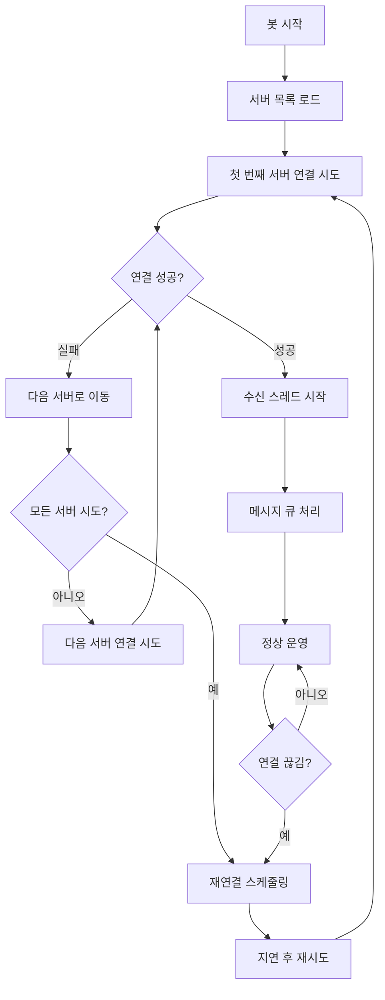

# MessengerBotR 다중 서버 지원 클라이언트

## 개요

MessengerBotR 다중 서버 지원 클라이언트는 무중단 서비스를 위해 여러 서버에 자동으로 연결하고 로테이션하는 기능을 제공합니다.

## 주요 기능

### 🔄 다중 서버 로테이션
- 여러 서버 목록을 설정하여 자동 로테이션
- 첫 번째 서버 연결 실패 시 자동으로 다음 서버 시도
- 모든 서버 연결 실패 시 처음부터 다시 시도

### 🔁 자동 재연결
- 연결 끊김 감지 시 자동 재연결 시도
- 지수 백오프 알고리즘으로 재연결 지연 시간 조절
- 최대 재연결 시도 횟수 제한

### 📦 메시지 큐잉
- 연결되지 않은 상태에서도 메시지 손실 방지
- 재연결 시 대기 중인 메시지 자동 전송
- 큐 크기 제한으로 메모리 사용량 관리

### 🔐 보안 강화
- HMAC 기반 인증
- 디바이스 고유 정보를 활용한 서명 생성
- 타임스탬프 기반 재생 공격 방지

## 파일 구조

```
client/messengerbotR/
├── bridge-v2.5.0.js      # 메인 클라이언트 코드
├── server-config.json    # 서버 설정 파일
└── README.md            # 이 파일
```

## 설정 방법

### 1. 서버 목록 설정

`server-config.json` 파일에서 서버 목록을 설정합니다:

```json
{
    "servers": [
        {
            "name": "Primary",
            "host": "kakao-bot.loa.best",
            "port": 37888,
            "priority": 1,
            "enabled": true,
            "description": "메인 서버"
        },
        {
            "name": "Backup1",
            "host": "backup1.loa.best",
            "port": 37888,
            "priority": 2,
            "enabled": true,
            "description": "백업 서버 1"
        }
    ]
}
```

### 2. 연결 설정

```json
{
    "connectionSettings": {
        "maxReconnectAttempts": 10,
        "baseReconnectDelay": 2000,
        "maxReconnectDelay": 60000,
        "connectionTimeout": 5000,
        "enableDebugLog": false,
        "enableConnectionLog": true
    }
}
```

### 3. 봇 설정

```json
{
    "botSettings": {
        "botName": "LOA.i",
        "maxMessageLength": 65000,
        "enableMessageQueue": true,
        "queueMaxSize": 100
    }
}
```

## 사용 방법

### 1. 클라이언트 코드 적용

MessengerBotR 앱에서 `bridge-v2.5.0.js` 파일을 봇 스크립트로 설정합니다.

### 2. 서버 설정 수정

필요에 따라 `server-config.json` 파일의 서버 목록을 수정합니다.

### 3. 봇 실행

봇을 시작하면 자동으로 다중 서버 연결이 시작됩니다.

## 로그 메시지

### 연결 관련 로그
- `[MULTI-SERVER] 서버 연결 시도`: 서버 연결 시도 시작
- `[MULTI-SERVER] 서버 연결 성공`: 서버 연결 성공
- `[MULTI-SERVER] 서버 연결 실패`: 서버 연결 실패
- `[MULTI-SERVER] 다음 서버로 이동`: 다음 서버로 로테이션

### 재연결 관련 로그
- `[MULTI-SERVER] 재연결 예약`: 재연결 스케줄링
- `[MULTI-SERVER] 재연결 시도 실행`: 재연결 시도 시작
- `[MULTI-SERVER] 최대 재연결 시도 횟수 초과`: 재연결 포기

### 메시지 큐 관련 로그
- `[QUEUE] 메시지 큐 처리 시작`: 큐 처리 시작
- `[QUEUE] 메시지가 큐에 추가됨`: 메시지 큐잉
- `[QUEUE] 메시지 큐 처리 완료`: 큐 처리 완료

## 연결 흐름



## 문제 해결

### 연결 실패 시
1. 서버 주소와 포트 번호 확인
2. 네트워크 연결 상태 확인
3. 방화벽 설정 확인
4. 로그에서 구체적인 오류 메시지 확인

### 메시지 손실 시
1. 메시지 큐 설정 확인
2. 큐 크기 제한 확인
3. 재연결 설정 확인

### 성능 문제 시
1. 재연결 지연 시간 조정
2. 로그 레벨 조정
3. 큐 크기 제한 조정

## 버전 정보

- **현재 버전**: v2.5.0
- **릴리즈 날짜**: 2025-01-10
- **호환성**: MessengerBotR 2.0+

## 변경 사항

### v2.5.0 (2025-01-10)
- 다중 서버 지원 추가
- 자동 로테이션 기능 구현
- 메시지 큐잉 시스템 추가
- 지수 백오프 재연결 알고리즘 적용
- 향상된 오류 처리 및 로깅

## 주의사항

1. **구식 JavaScript 호환성**: 라이노 엔진 사용으로 인해 `const` 키워드 사용 금지
2. **메모리 관리**: 큐 크기 제한으로 메모리 사용량 관리 필요
3. **네트워크 안정성**: 불안정한 네트워크 환경에서는 재연결 설정 조정 필요
4. **보안**: HMAC 키와 솔트 값을 안전하게 관리해야 함

## 지원

문제가 발생하거나 개선사항이 있으시면 개발팀에 문의해 주세요.