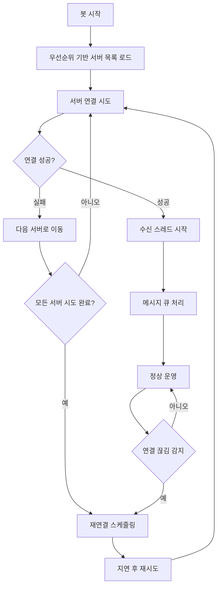

# MessengerBotR 클라이언트 v3.1.4

## 개요

MessengerBotR 클라이언트 v3.1.4는 장기 실행 안정성과 상세한 제어 기능에 초점을 맞춰 업그레이드된 버전입니다. 무중단 서비스를 위한 다중 서버 자동 연결 및 로테이션 기능을 기본으로 제공하며, Android ID를 활용한 기기 식별, 유연한 파일 전송 시간 설정, 메모리 자동 정리 등 고급 기능이 추가되었습니다.

## 주요 기능

### 🔄 다중 서버 로테이션
- 여러 서버 목록을 우선순위에 따라 설정하여 자동 로테이션합니다.
- 특정 서버 연결 실패 시 자동으로 다음 우선순위의 서버에 연결을 시도합니다.

### ♾️ 무한 자동 재연결
- 연결 끊김을 감지하면 설정된 딜레이에 따라 자동으로 재연결을 시도합니다.
- **무한 재연결** 옵션을 통해 연결이 복구될 때까지 지속적으로 재연결을 시도하여 연결성을 보장합니다.

### 📦 메시지 큐잉 및 TTL (Time-To-Live)
- 서버와 연결되지 않은 상태에서도 메시지를 큐에 저장하여 손실을 방지합니다.
- 재연결 시 대기 중인 메시지를 자동으로 전송합니다.
- **메시지 TTL** 기능이 추가되어, 설정된 시간 이상 큐에 머무른 메시지는 자동으로 폐기하여 큐가 막히는 현상을 방지합니다.

### 🔐 보안 강화
- HMAC-SHA256 기반의 강력한 인증을 사용합니다.
- **Android ID**를 `deviceID`로 추가하여 기기 식별을 강화했습니다.
- 타임스탬프를 활용하여 재생 공격(replay attack)을 방지합니다.

### 🧠 장기 실행 안정성 강화
- **주기적 정리**: 설정된 시간(기본 24시간)마다 오래된 임시 파일과 비활성 채팅방 정보를 자동으로 정리하여 시스템 자원을 최적화합니다.
- **스레드 관리**: 스레드를 안전하게 종료하고, 극단적인 상황을 대비해 메시지 큐 크기를 제한하여 메모리 문제를 예방합니다.

### 📊 상세한 로깅 및 모니터링
- **선택적 로깅**: 연결, 메시지 전송/수신, 큐 처리 등 핵심 동작에 대한 로깅을 선택적으로 활성화/비활성화할 수 있습니다.
- **리소스 모니터링**: 서버의 `ping` 요청에 응답할 때 메모리 사용량, 큐 크기 등 클라이언트의 상태 정보를 함께 전송하여 원격 모니터링을 지원합니다.

### 🚀 유연한 파일 전송 시간 제어
- **동적 대기 시간**: 파일 전송 시 파일의 개수와 총용량에 따라 대기 시간을 동적으로 계산하여 전송 성공률을 높였습니다.
- **사용자 설정**: 기기 성능이나 네트워크 환경에 맞춰 기본 대기 시간, 용량/개수별 추가 시간, 최소/최대 대기 시간을 세밀하게 조절할 수 있습니다.

## 파일 구조

```
client/messengerbotR/
├── bridge.js      # 메인 클라이언트 코드
└── README.md      # 이 파일
```

## 설정 방법

모든 설정은 `bridge.js` 파일 상단의 `BOT_CONFIG` 객체에서 직접 수정합니다.

### 1. 기본 및 서버 정보 설정

```javascript
var BOT_CONFIG = {
    // ...
    BOT_NAME: 'LOA.i',
    SECRET_KEY: "YOUR_SECRET_KEY", // 🔴 보안을 위해 반드시 변경하세요
    SERVER_LIST: [
        { host: "100.69.44.56", port: 1485, priority: 2, name: "Dev.PC 2" },
        { host: "100.73.137.47", port: 1485, priority: 3, name: "Dev.Laptop 1" }
        // ...
    ],
    // ...
};
```

### 2. 로깅 레벨 설정

`LOGGING` 객체에서 원하는 로그만 `true`로 설정하여 볼 수 있습니다. 디버깅 시 `MESSAGE_CONTENT_DETAIL`을 `true`로 설정하면 전체 메시지 내용을 확인할 수 있습니다.

```javascript
LOGGING: {
    CORE_MESSAGES: true,
    CONNECTION_EVENTS: true,
    MESSAGE_TRANSFER: true,
    PING_EVENTS: true,
    QUEUE_OPERATIONS: true,
    RESOURCE_INFO: true,
    MESSAGE_CONTENT: true,
    MESSAGE_CONTENT_DETAIL: false // 디버깅 시 true로 변경
},
```

### 3. 파일 전송 대기 시간 최적화

`FILE_SEND_TIMING` 객체에서 파일 전송 관련 대기 시간을 조절할 수 있습니다. 파일 전송이 자주 실패하거나 너무 느릴 경우 이 값을 조절하세요.

```javascript
// 🐌 느린 기기/네트워크 환경 예시
FILE_SEND_TIMING: {
    BASE_WAIT_TIME: 2500,           // 기본 대기 증가
    SIZE_BASED_WAIT_PER_MB: 3000,   // 용량당 대기 증가
    COUNT_BASED_WAIT_PER_FILE: 800, // 파일 개수당 대기 증가
    SINGLE_FILE: { MIN_WAIT: 6000, MAX_WAIT: 10000 },
    MULTI_FILE: { MIN_WAIT: 5000, MAX_WAIT: 25000 }
}
```
> 📋 **계산 공식:**
> - **단일 파일:** `BASE_WAIT_TIME + (파일크기MB × SIZE_BASED_WAIT_PER_MB)`
> - **멀티 파일:** `BASE_WAIT_TIME + (총파일크기MB × SIZE_BASED_WAIT_PER_MB) + ((파일개수-1) × COUNT_BASED_WAIT_PER_FILE)`
> - 최종 대기시간은 `MIN_WAIT`와 `MAX_WAIT` 범위 내로 제한됩니다.

## 사용 방법

MessengerBotR 앱의 스크립트 설정에서 `bridge.js` 파일을 불러오도록 설정한 후, 봇을 재시작하면 모든 기능이 자동으로 적용됩니다.

## 연결 흐름



## 문제 해결

### 연결 실패 시
1. `BOT_CONFIG`의 `SERVER_LIST`에 서버 주소와 포트가 올바르게 입력되었는지 확인합니다.
2. 네트워크 연결 상태와 방화벽 설정을 확인합니다.
3. 로그에서 구체적인 오류 메시지를 확인합니다.

### 파일 전송 실패 시
- `FILE_SEND_TIMING`의 값들을 조절해보세요. 특히 `BASE_WAIT_TIME`과 `SIZE_BASED_WAIT_PER_MB` 값을 늘리면 안정성이 향상될 수 있습니다.

### 메시지가 유실되는 것처럼 보일 때
- `MESSAGE_TTL` 설정이 너무 짧지 않은지 확인하세요. 네트워크가 불안정할 경우 이 값을 늘리는 것을 고려해볼 수 있습니다.

## 버전 정보

- **현재 버전**: v3.1.4
- **호환성**: MessengerBotR v0.7.38a ~ v0.7.39a
- **JavaScript 엔진**: Rhino

## 변경 사항

### v3.1.4
- **Android ID 추가**: `deviceID`로 Android ID를 사용하여 기기 식별 강화.
- **장기 실행 안정성 강화**:
    - 30일 이상 비활성 방 정보 자동 정리.
    - 7일 이상 된 임시 파일 자동 정리.
    - 극단적 상황을 대비한 메시지 큐 크기 제한.
    - 스레드 종료 대기 시간(Timeout) 설정.
- **모니터링 기능**: `ping` 응답 시 메모리 사용량, 큐 크기 등 리소스 정보 전송 기능 추가.
- **상세 로깅 설정**: 기능별로 로그 출력 여부를 제어할 수 있도록 `LOGGING` 객체 추가.
- **파일 전송 시간 제어**: `FILE_SEND_TIMING` 객체를 통해 파일 크기, 개수에 따른 대기 시간을 세밀하게 조절하는 기능 추가.
- **무한 재연결**: `MAX_RECONNECT_ATTEMPTS`를 `-1`로 설정하여 연결될 때까지 무한 재연결 시도.
- **메시지 TTL**: `MESSAGE_TTL`을 설정하여 오래된 메시지가 큐에서 자동으로 제거되도록 개선.
- **코드 구조 개선**: 전체 코드를 모듈(설정, 유틸, 인증, 미디어, 핵심 로직 등)로 재구성하여 가독성과 유지보수성 향상.

## 주의사항

1. **Rhino 엔진 호환성**: 스크립트는 Rhino JavaScript 엔진에서 실행되므로, 최신 ECMAScript 기능(예: `const`, `let`, 화살표 함수)은 사용할 수 없습니다. `var`를 사용해야 합니다.
2. **보안**: `SECRET_KEY`와 `BOT_SPECIFIC_SALT` 값은 외부로 노출되지 않도록 안전하게 관리해야 합니다.
3. **사용자 설정**: `FILE_SEND_TIMING`과 `MESSAGE_TTL` 값은 사용자의 기기 및 네트워크 환경에 따라 최적의 값이 다를 수 있습니다.

## 지원

문제가 발생하거나 개선사항이 있으시면 개발팀에 문의해 주세요.
