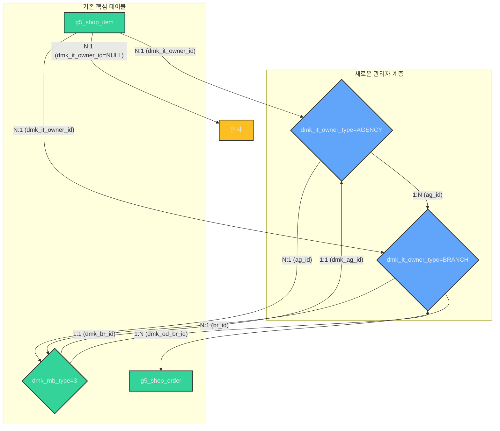

# Domaeka 프로젝트 단계별 개발 계획 (2023년 6월 25일)

이 문서는 Domaeka 프로젝트의 핵심 기능 확장을 위한 단계별 개발 계획을 명시합니다. 특히 '본사-대리점-지점' 계층 구조 관리자 시스템과 '지점별 상품/재고/주문 관리' 기능 구현에 초점을 맞춥니다.

## 1. 개요 및 목표

### 1.1. 현재 시스템 분석 요약
Domaeka 프로젝트는 그누보드 5 및 영카트 5 기반으로 구축되어 있으며, `g5_member`, `g5_shop_item`, `g5_shop_order` 등 기본적인 회원, 상품, 주문 관리 기능을 제공합니다. 현재는 단일 관리자 체계로 운영되고 있습니다.

### 1.2. 목표 기능
1.  **관리자 계층 구조 구현**: '본사-대리점-지점'으로 계층화된 관리자 시스템 구축.
    *   본사: 모든 대리점 및 지점의 데이터 조회 및 관리 권한.
    *   대리점: 소속 지점들의 데이터 조회 및 일부 관리 권한, 새로운 지점 생성 및 관리 권한.
    *   지점: 자신에게 할당된 상품/재고/주문 데이터만 조회 및 관리 권한.
2.  **지점별 상품/재고/주문 관리 구현**: 각 지점이 독립적으로 상품을 등록하고, 재고를 관리하며, 해당 지점으로 들어오는 주문을 처리할 수 있도록 기능 확장.

### 1.3. 신규 파일 및 모듈 위치 표준
도매까(Domaeka) 관련하여 새로 생성되는 모든 파일 및 모듈은 `main/dmk/` 폴더 아래에 작성하는 것을 원칙으로 합니다.

## 2. 데이터베이스 스키마 변경 계획

기존 `g5_member`, `g5_shop_item`, `g5_shop_order` 테이블을 확장하고, 새로운 테이블을 추가하여 계층 구조 및 지점별 관리 기능을 지원합니다.

### 2.1. 신규 테이블 추가

#### `dmk_agency` (대리점 정보 테이블)
- **목적**: 본사 아래에 속하는 대리점들의 정보를 저장합니다.
- **주요 컬럼**:
    - `id` (BIGINT, AUTO_INCREMENT): 대리점 고유 ID (기본키)
    - `ag_id` (VARCHAR): 대리점 시스템 ID (예: `AG001`)
    - `ag_name` (VARCHAR): 대리점명
    - `ag_ceo_name` (VARCHAR): 대표자명
    - `ag_phone` (VARCHAR): 대표 전화번호
    - `ag_address` (VARCHAR): 주소
    - `ag_mb_id` (VARCHAR): 해당 대리점을 관리하는 `g5_member` 테이블의 `mb_id` (외래키, 대리점 관리자 계정)
    - `ag_datetime` (DATETIME): 등록일시 (UTC ISO 8601)
    - `ag_status` (TINYINT): 대리점 상태 (예: 1: 활성, 0: 비활성)
- **관계**: `g5_member` 테이블의 `mb_id`와 1:1 관계 (대리점 관리자).

#### `dmk_branch` (지점 정보 테이블)
- **목적**: 대리점 아래에 속하는 개별 지점들의 정보를 저장합니다.
- **주요 컬럼**:
    - `id` (BIGINT, AUTO_INCREMENT): 지점 고유 ID (기본키)
    - `br_id` (VARCHAR): 지점 시스템 ID (예: `BR001`)
    - `ag_id` (VARCHAR): 소속 대리점 ID (`dmk_agency` 테이블의 `ag_id` 참조, 외래키)
    - `br_name` (VARCHAR): 지점명
    - `br_ceo_name` (VARCHAR): 지점 대표자명
    - `br_phone` (VARCHAR): 지점 대표 전화번호
    - `br_address` (VARCHAR): 지점 주소
    - `br_mb_id` (VARCHAR): 해당 지점을 관리하는 `g5_member` 테이블의 `mb_id` (외래키, 지점 관리자 계정)
    - `br_datetime` (DATETIME): 등록일시 (UTC ISO 8601)
    - `br_status` (TINYINT): 지점 상태 (예: 1: 활성, 0: 비활성)
- **관계**: `dmk_agency` 테이블의 `ag_id`와 N:1 관계, `g5_member` 테이블의 `mb_id`와 1:1 관계 (지점 관리자).

### 2.2. 기존 테이블 변경

#### `g5_member` (회원 정보 테이블)
- **컬럼 추가**:
    - `dmk_mb_type` (TINYINT): 회원 유형 (예: 0: 일반 회원, 1: 본사 관리자, 2: 대리점 관리자, 3: 지점 관리자). 기본값 0.
    - `dmk_ag_id` (VARCHAR, NULL 허용): 회원이 대리점 관리자일 경우 소속 대리점의 `dmk_agency.ag_id` 참조.
    - `dmk_br_id` (VARCHAR, NULL 허용): 회원이 지점 관리자일 경우 소속 지점의 `dmk_branch.br_id` 참조.
- **인덱스 추가**: `dmk_mb_type`, `dmk_ag_id`, `dmk_br_id` 컬럼에 인덱스 추가 (조회 성능 최적화).
- **변경 목적**: 관리자 계정 유형을 구분하고, 소속 대리점/지점 정보를 연동하여 권한 관리에 활용합니다.

#### `g5_shop_item` (상품 정보 테이블)
- **기존 컬럼 제거**: `br_id`, `it_exclusive_branch`
- **컬럼 추가**:
    - `dmk_it_owner_type` (VARCHAR): 상품 소유 계층 (예: 'HQ', 'AGENCY', 'BRANCH'). 상품을 등록한 주체.
    - `dmk_it_owner_id` (VARCHAR, NULL 허용): 상품 소유 계층의 ID. `dmk_it_owner_type`이 'HQ'일 경우 NULL, 'AGENCY'일 경우 `dmk_agency.ag_id`, 'BRANCH'일 경우 `dmk_branch.br_id`를 참조.
- **인덱스 추가**: `dmk_it_owner_type`, `dmk_it_owner_id` 컬럼에 인덱스 추가 (소유 계층별 상품 조회 성능 최적화).
- **변경 목적**: 본사, 대리점, 지점 모두 상품을 등록하고 소유하며, 각 소유 계층에서 재고를 관리할 수 있도록 유연성을 제공합니다. 하위 계층은 상위 계층이 등록한 상품을 가져다 사용할 수 있습니다.

#### `g5_shop_order` (주문 정보 테이블)
- **컬럼 추가**:
    - `dmk_od_br_id` (VARCHAR): 주문이 발생한 (배송/처리할) 지점의 `dmk_branch.br_id` 참조. (필수)
- **인덱스 추가**: `dmk_od_br_id` 컬럼에 인덱스 추가 (지점별 주문 조회 성능 최적화).
- **변경 목적**: 특정 지점에서 발생한 주문임을 명확히 하여 지점별 주문 처리를 가능하게 합니다.

### 2.3. 데이터베이스 스키마 다이어그램 (Mermaid)



## 3. 백엔드 로직 구현 계획

### 3.1. 관리자 인증 및 권한 관리 모듈

-   **파일 위치**: `main/dmk/adm/lib/admin.auth.lib.php` (신규 파일) 또는 기존 권한 관련 파일 확장
-   **구현 내용**:
    -   **로그인 시 `dmk_mb_type` 기반 권한 부여**: 로그인 시 `g5_member` 테이블의 `dmk_mb_type` 값을 확인하여 세션에 `dmk_ag_id`, `dmk_br_id` 등의 추가 권한 정보를 저장합니다.
    -   **계층별 메뉴 접근 제어**: `main/adm/admin.menu.php` (또는 유사한 메뉴 정의 파일)를 수정하여 `dmk_mb_type` 및 `dmk_ag_id`, `dmk_br_id`에 따라 접근 가능한 관리자 메뉴를 동적으로 생성합니다.
    -   **데이터 접근 필터링**: 모든 관리자 페이지에서 데이터를 조회하거나 수정할 때, 로그인한 관리자의 `dmk_mb_type`과 `dmk_ag_id`, `dmk_br_id`를 기반으로 접근 가능한 데이터 범위를 제한하는 쿼리 조건을 추가합니다.
        -   **본사 관리자**: 모든 데이터 조회/관리 (필터링 없음)
        -   **대리점 관리자**: 소속 대리점의 `dmk_ag_id`를 통해 해당 대리점 및 하위 지점의 데이터만 조회/관리.
        -   **지점 관리자**: 자신의 `dmk_br_id`를 통해 해당 지점의 데이터만 조회/관리.
    -   **슈퍼 관리자 (최고 관리자)**: 기존 `cf_admin` (g5_config 테이블)에 정의된 최고 관리자 ID는 모든 권한을 가집니다.

### 3.2. 지점 관리 기능 (본사/대리점 관리자용)

-   **파일 위치**: `main/dmk/adm/agency_admin/` 및 `main/dmk/adm/branch_admin/` (신규 폴더 및 파일)
-   **구현 내용**:
    -   **대리점 등록/수정/삭제**: 본사 관리자가 대리점 정보를 관리할 수 있는 CRUD (Create, Read, Update, Delete) 페이지 구현.
    -   **지점 등록/수정/삭제**:
        -   본사 관리자: 모든 지점 관리.
        -   대리점 관리자: 자신의 `ag_id`에 속하는 지점만 관리 (신규 지점 등록 포함).
    -   **관리자 계정 연결**: 대리점/지점 등록 시 기존 `g5_member` 테이블의 계정을 선택하여 해당 대리점/지점의 관리자로 지정하는 기능 구현.

### 3.3. 상품 관리 로직

-   **파일 위치**: `main/adm/shop_admin/itemform.php`, `main/adm/shop_admin/itemlist.php` 및 관련 라이브러리 (기존 파일 수정)
-   **구현 내용**:
    -   **상품 등록 시 소유 계층 설정**:
        -   로그인한 관리자의 `dmk_mb_type`에 따라 `dmk_it_owner_type` (`HQ`, `AGENCY`, `BRANCH`) 및 `dmk_it_owner_id` (해당 계층 ID)를 자동으로 설정합니다.
        -   본사 관리자는 상품 등록 시 `dmk_it_owner_type`을 선택할 수 있는 옵션을 제공하거나, 기본값을 'HQ'로 설정하고 필요 시 변경할 수 있도록 합니다. 대리점/지점 관리자는 자신의 계층에 맞게 자동 설정됩니다.
        -   `dmk_it_owner_id`는 'HQ'인 경우 NULL, 'AGENCY'인 경우 `dmk_agency.ag_id`, 'BRANCH'인 경우 `dmk_branch.br_id`가 자동으로 입력됩니다.
    -   **상품 목록 조회 및 필터링**:
        -   `g5_shop_item` 테이블 조회 시 로그인한 관리자의 `dmk_mb_type`, `dmk_ag_id`, `dmk_br_id`를 기반으로 `dmk_it_owner_type` 및 `dmk_it_owner_id`에 대한 WHERE 조건 추가.
            -   **본사 관리자**: 모든 상품 조회 (`dmk_it_owner_type` 무관).
            -   **대리점 관리자**: 자신이 소유한 상품 (`dmk_it_owner_type` = 'AGENCY', `dmk_it_owner_id` = 자신의 `ag_id`) 및 본사 소유 상품 (`dmk_it_owner_type` = 'HQ', `dmk_it_owner_id` = NULL) 조회.
            -   **지점 관리자**: 자신이 소유한 상품 (`dmk_it_owner_type` = 'BRANCH', `dmk_it_owner_id` = 자신의 `br_id`) 및 상위 대리점 소유 상품 (`dmk_it_owner_type` = 'AGENCY', `dmk_it_owner_id` = 소속 대리점의 `ag_id`) 및 본사 소유 상품 (`dmk_it_owner_type` = 'HQ', `dmk_it_owner_id` = NULL) 조회.
    -   **상품 수정/삭제 시 권한 검증**: 해당 상품의 `dmk_it_owner_type` 및 `dmk_it_owner_id`와 로그인한 관리자의 계층 정보를 비교하여 수정/삭제 권한 확인.
        -   자신이 소유한 상품만 수정/삭제 가능.

### 3.4. 재고 관리 로직

-   **파일 위치**: `main/adm/shop_admin/itemstock.php` (기존 파일 수정 또는 신규 모듈)
-   **구현 내용**:
    -   **재고 현황 조회**: `g5_shop_item` 테이블의 `it_stock_qty`를 기반으로 재고 현황을 보여주는 페이지.
        -   조회 시 `dmk_it_owner_type` 및 `dmk_it_owner_id`를 기반으로 한 필터링 적용 (위 상품 목록 조회 필터링과 동일).
    -   **재고 조정**: 해당 상품의 `dmk_it_owner_type` 및 `dmk_it_owner_id`와 일치하는 관리자만 재고 수량을 조정할 수 있는 기능.
        -   **본사 관리자**: 본사 소유 상품의 재고만 관리.
        -   **대리점 관리자**: 대리점 소유 상품의 재고만 관리.
        -   **지점 관리자**: 지점 소유 상품의 재고만 관리.
    -   **재고 이동/할당 (선택 사항)**: 각 계층의 상품 소유권과 재고 관리 책임을 고려하여 구현. (예: 본사가 소유한 상품을 대리점/지점에 '할당' 개념으로 재고를 배분하거나, 지점 간 재고 이동 로직 등은 추후 개발 고려).

### 3.5. 주문 관리 로직

-   **파일 위치**: `main/adm/shop_admin/orderlist.php`, `main/adm/shop_admin/orderform.php` 및 관련 라이브러리 (기존 파일 수정)
-   **구현 내용**:
    -   **주문 목록 조회 및 필터링**:
        -   `g5_shop_order` 테이블 조회 시 로그인한 관리자의 `dmk_mb_type`, `dmk_ag_id`, `dmk_br_id`에 따라 WHERE 조건 추가.
            -   **본사 관리자**: 모든 주문 조회.
            -   **대리점 관리자**: 소속 대리점의 하위 지점들의 주문만 조회.
            -   **지점 관리자**: 자신의 `dmk_br_id`에 해당하는 주문만 조회.
    -   **주문 처리**: 지점 관리자가 자신의 지점으로 들어온 주문의 상태를 변경(예: 입금 확인, 배송 시작, 배송 완료)할 수 있는 기능.
    -   **주문 상세 정보**: 주문 상세 페이지에서 `dmk_od_br_id` 정보를 명확히 표시.

## 4. 프론트엔드 UI/UX 변경 계획

### 4.1. 관리자 로그인 페이지 변경

-   **파일 위치**: `main/adm/login.php` (또는 유사 파일)
-   **변경 내용**: 기존 로그인 폼 유지, 하지만 로그인 후 `dmk_mb_type`에 따라 리다이렉션 또는 메뉴 구성 변경.

### 4.2. 관리자 대시보드 및 메뉴 구성 변경

-   **파일 위치**: `main/adm/admin.head.php`, `main/adm/admin.menu.php` (또는 유사 파일)
-   **변경 내용**:
    -   **계층별 메뉴 가시성**: `dmk_mb_type`에 따라 다른 메뉴 항목을 표시하거나 숨깁니다.
        -   **본사**: 모든 메뉴 접근 가능.
        -   **대리점**: `dmk_agency` 및 `dmk_branch` 관리 메뉴, 소속 지점들의 상품/재고/주문 메뉴.
        -   **지점**: 자신의 지점 상품/재고/주문 메뉴.
    -   **계층/소유주 선택 드롭다운 (옵션)**: 본사 및 대리점 관리자가 특정 계층(본사, 대리점, 지점) 또는 특정 소유주(대리점/지점 ID)의 데이터를 빠르게 필터링하여 볼 수 있도록 전역 선택 드롭다운 추가 (상단바 등에).

### 4.3. 상품/재고/주문 관리 페이지 UI 개선

-   **파일 위치**: `main/adm/shop_admin/itemlist.php`, `main/adm/shop_admin/itemform.php`, `main/adm/shop_admin/orderlist.php`, `main/adm/shop_admin/itemstock.php` 등
-   **변경 내용**:
    -   **상품 등록 폼**: `dmk_it_owner_type` 및 `dmk_it_owner_id` 설정 필드를 추가 (본사) 또는 자동 완성/고정 (대리점/지점).
    -   **상품 목록**: 각 상품의 `dmk_it_owner_type` 및 `dmk_it_owner_id` 정보(`본사`, `대리점: [대리점명]`, `지점: [지점명]`)를 명확하게 표시합니다.
    -   **재고 현황**: 각 상품의 재고 수량과 함께 `dmk_it_owner_type` 및 `dmk_it_owner_id` 정보를 표시합니다.
    -   **필터링 기능 추가**: 상품 목록 및 재고 현황 페이지에 `dmk_it_owner_type` 및 `dmk_it_owner_id` 기반의 필터링 옵션을 추가하여 특정 계층/소유주의 데이터만 조회할 수 있도록 개선합니다.
    -   **주문 목록**: 각 주문의 `dmk_od_br_id` (지점명)을 명확하게 표시하고, 지점별 필터링 옵션을 제공합니다.

## 5. 추가 고려사항

### 5.1. SQL 마이그레이션 스크립트 작성

-   새로운 테이블 `dmk_agency`, `dmk_branch` 생성 및 기존 테이블 컬럼 추가를 위한 SQL 마이그레이션 스크립트 (점진적 마이그레이션 원칙 준수).
-   롤백 스크립트도 함께 준비.
-   **주의**: 운영 환경에 적용 시 기존 데이터 손실 방지를 위한 철저한 백업 및 검증 절차 필수.

### 5.2. 오류 처리 및 로깅

-   새로 추가되는 모든 로직에 대해 적절한 예외 처리 및 로깅 구현.
-   각 계층 관리자의 작업 내역에 대한 상세 로깅 추가 (보안 및 감사 목적).

### 5.3. 성능 최적화

-   새로 추가되는 인덱스 외에, 데이터 증가에 따른 쿼리 성능 저하 가능성 검토 및 추가 최적화 고려.

### 5.4. 보안 강화

-   계층별 권한 분리가 정확히 작동하는지 철저히 테스트.
-   직접 URL 접근을 통한 권한 우회 시도 방지 로직 강화.

### 5.5. 테스트 계획

-   **단위 테스트**: 각 신규/수정 모듈의 핵심 로직에 대한 단위 테스트.
-   **통합 테스트**: 관리자 계층별 로그인부터 데이터 조회/수정/삭제까지의 전체 워크플로우 테스트.
-   **권한 테스트**: 각 `dmk_mb_type`별로 허용/차단되는 기능 및 데이터 접근 범위가 정확한지 테스트.

### 5.6. 기존 `g5` 파일 수정 내역 문서화

-   **목적**: 기존 `g5` 프레임워크의 코드를 수정하는 경우, 변경 이력 및 내용을 명확히 기록하여 유지보수 용이성과 투명성을 확보합니다.
-   **파일 위치**: `main/dmk/docs/g5_modifications_log.md` (또는 유사한 이름의 별도 마크다운 파일)
-   **문서화 내용**:
    -   **수정 파일 경로**: `g5` 내에서 수정된 파일의 상대 경로.
    -   **수정 일자**: 변경이 이루어진 날짜 (UTC ISO 8601).
    -   **수정자**: 변경을 수행한 개발자 또는 담당자.
    -   **수정 내용 요약**: 해당 파일에서 어떤 부분이, 왜 변경되었는지에 대한 간략한 설명.
    -   **상세 변경 내역**: 실제 코드 변경 내용(예: 추가된 함수, 수정된 로직, 변경된 변수) 또는 변경된 코드 라인 범위(```startLine:endLine:filepath``` 형식 활용)에 대한 상세 설명.
    -   **관련 기능**: 이 변경이 어떤 도매까(Domaeka) 기능과 연관되는지 명시 (`dmk_mb_type`, `dmk_it_owner_type` 등).
-   **규칙**: 모든 `g5` 파일 수정 시에는 반드시 이 문서화 절차를 준수합니다.

---

### **[작업 진행 단계]**

1.  **데이터베이스 스키마 변경**:
    *   `dmk_agency` 테이블 생성 SQL 작성
    *   `dmk_branch` 테이블 생성 SQL 작성
    *   `g5_member` 테이블 ALTER SQL 작성 (`dmk_mb_type`, `dmk_ag_id`, `dmk_br_id` 컬럼 추가)
    *   `g5_shop_item` 테이블 ALTER SQL 작성 (`dmk_it_owner_type`, `dmk_it_owner_id` 컬럼 추가)
    *   `g5_shop_order` 테이블 ALTER SQL 작성 (`dmk_od_br_id` 컬럼 추가)
    *   인덱스 추가 SQL 작성
    *   **승인 후 SQL 스크립트 실행**
2.  **백엔드 로직 개발**:
    *   관리자 인증 및 권한 처리 로직 구현 (가장 중요)
    *   대리점/지점 관리 CRUD 기능 구현
    *   상품/재고/주문 관련 로직 수정 및 필터링 구현
3.  **프론트엔드 UI/UX 개발**:
    *   관리자 메뉴 및 대시보드 수정
    *   상품/주문/재고 관리 페이지 UI 변경
4.  **테스트 및 검증**:
    *   각 기능별 테스트 및 통합 테스트 수행
    *   성능 및 보안 검토

### **[Mermaid 다이어그램 색상 가이드라인 준수 확인]**
- 다크모드에 적합한 색상 (텍스트: `#E5E7EB`, 배경: `#1F2937`, 강조색: `#60A5FA`, 보조색: `#34D399`, 경고색: `#F87171`)을 준수하여 다이어그램을 작성하였습니다.
