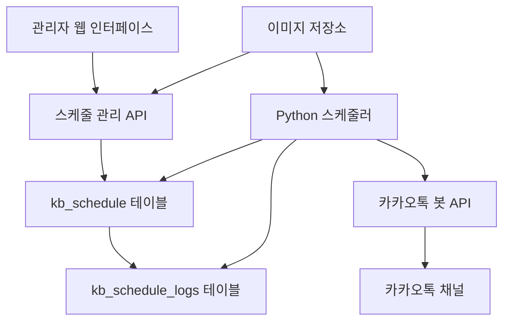

# 도매까 스케줄링 메시지 발송 시스템 설계

## 1. 개요

도매까 시스템에서 각 지점, 대리점, 본사가 카카오톡 봇을 통해 정해진 시간에 자동으로 메시지와 이미지를 발송할 수 있는 스케줄링 시스템을 구현합니다.

### 1.1. 목적
- 정기적인 안내 메시지 자동 발송
- 프로모션 및 이벤트 알림 자동화
- 업무 효율성 향상 및 인적 오류 최소화
- 다양한 발송 패턴 지원 (1회성, 반복)

### 1.2. 주요 기능
- 날짜/시간 기반 1회성 발송
- 요일/시간 기반 반복 발송
- 텍스트 + 다중 이미지 발송
- 발송 순서 제어 (텍스트 먼저/이미지 먼저/이미지만)
- 활성/비활성 상태 관리
- 유효기간 설정
- 계층별 권한 관리

### 1.3. 메시지 구성 및 발송 방식
메시지 발송은 최대 3개의 구성 요소로 이루어집니다:
1. **텍스트 메시지**: 일반 텍스트 메시지
2. **이미지 그룹 1**: 첫 번째 이미지 그룹 (다중 이미지)
3. **이미지 그룹 2**: 두 번째 이미지 그룹 (다중 이미지)

#### 발송 조합 예시
- **텍스트만**: 텍스트 메시지만 발송
- **텍스트 + 이미지 그룹 1**: 텍스트 발송 후 이미지 그룹 1 발송
- **텍스트 + 이미지 그룹 1 + 이미지 그룹 2**: 텍스트, 이미지 그룹 1, 이미지 그룹 2 순차 발송
- **이미지 그룹 1만**: 이미지 그룹 1만 발송
- **이미지 그룹 1 + 이미지 그룹 2**: 이미지 그룹 1 발송 후 이미지 그룹 2 발송

## 2. 시스템 아키텍처

### 2.1. 구성 요소



### 2.2. 데이터 흐름
1. 관리자가 웹 인터페이스에서 스케줄 등록
2. 스케줄 정보가 `kb_schedule` 테이블에 저장
3. Python 스케줄러가 주기적으로 테이블 폴링
4. 조건에 맞는 스케줄 발견 시 카카오톡 봇 API 호출
5. 발송 내역를 `kb_schedule_logs` 테이블에 기록

## 3. 데이터베이스 설계

### 3.1. kb_schedule 테이블

```sql
CREATE TABLE `kb_schedule` (
  `id` int(11) NOT NULL AUTO_INCREMENT,
  `title` varchar(255) NOT NULL COMMENT '스케줄 제목',
  `description` text COMMENT '스케줄 설명',
  
  -- 발송 주체 정보
  `created_by_type` enum('distributor','agency','branch') NOT NULL COMMENT '등록자 타입(총판, 대리점, 지점점)',
  `created_by_id` varchar(50) NOT NULL COMMENT '등록자 ID (dt_id, ag_id, br_id)',
  `created_by_mb_id` varchar(50) NOT NULL COMMENT '등록한 관리자 회원 ID (상위 관리자가 하위 관리자 정보 등록 가능)',
  
  -- 발송 대상 정보
  `target_bot_name` varchar(30) NOT NULL COMMENT '대상 봇',
  `target_room_id` varchar(100) NOT NULL COMMENT '대상 톡방 ID(channelId)',
  
  -- 메시지 내용
  `message_text` text COMMENT '텍스트 메시지',
  `message_images_1` json COMMENT '이미지 파일 정보 배열 1',
  `message_images_2` json COMMENT '이미지 파일 정보 배열 1',
  `send_interval_seconds` int(5) DEFAULT 1 COMMENT '메시지간 발송 간격(초), 0은 즉시 이어서 발송',
  `media_wait_time_1` int(5) DEFAULT 1 COMMENT 'message_images_1 이미지를 톡방에 전송한 후 대기 시간(ms), 0은 클라이언트 설정값을 따름',
  `media_wait_time_2` int(5) DEFAULT 1 COMMENT 'message_images_2 이미지를 톡방에 전송한 후 대기 시간(ms), 0은 클라이언트 설정값을 따름',
  
  -- 스케줄링 설정
  `schedule_type` enum('once','weekly','daily') NOT NULL COMMENT '스케줄 타입',
  `schedule_date` date NULL COMMENT '1회성 발송 날짜',
  `schedule_time` time NOT NULL COMMENT '발송 시간',
  `schedule_weekdays` set('monday','tuesday','wednesday','thursday','friday','saturday','sunday') NULL COMMENT '반복 발송 요일',
  
  -- 유효기간 설정
  `valid_from` datetime NOT NULL COMMENT '유효기간 시작',
  `valid_until` datetime NOT NULL COMMENT '유효기간 종료',
  
  -- 상태 관리
  `status` enum('active','inactive','completed','error') DEFAULT 'active' COMMENT '스케줄 상태',
  `last_sent_at` datetime NULL COMMENT '마지막 발송 시간',
  `next_send_at` datetime NULL COMMENT '다음 발송 예정 시간',
  `send_count` int(11) DEFAULT 0 COMMENT '총 발송 횟수',
  
  -- 시스템 필드
  `created_at` datetime NOT NULL DEFAULT CURRENT_TIMESTAMP,
  `updated_at` datetime NOT NULL DEFAULT CURRENT_TIMESTAMP ON UPDATE CURRENT_TIMESTAMP,
  
  PRIMARY KEY (`id`),
  KEY `idx_schedule_polling` (`status`, `next_send_at`, `valid_from`, `valid_until`),
  KEY `idx_created_by` (`created_by_type`, `created_by_id`),
  KEY `idx_target_room` (`target_room_id`, `target_bot_name`),
    KEY `idx_target_bot` (`target_bot_name`, `target_room_id`)
) ENGINE=InnoDB DEFAULT CHARSET=utf8mb4 COLLATE=utf8mb4_unicode_ci COMMENT='카카오봇 스케줄링 발송 설정';
```

### 3.2. kb_schedule_logs 테이블

```sql
CREATE TABLE `kb_schedule_logs` (
  `id` int(11) NOT NULL AUTO_INCREMENT,
  `schedule_id` int(11) NOT NULL COMMENT '스케줄 ID',
  `target_room_id` varchar(100) NOT NULL COMMENT '발송 대상 톡방 ID',
  
  -- 발송 내용
  `sent_message_text` text COMMENT '발송된 텍스트',
  `sent_images_1` json COMMENT '발송된 이미지 그룹 1',
  `sent_images_2` json COMMENT '발송된 이미지 그룹 2',
  `send_components` varchar(50) COMMENT '실제 발송된 구성 요소',
  
  -- 발송 결과
  `status` enum('success','failed','partial') NOT NULL COMMENT '발송 상태',
  `error_message` text COMMENT '오류 메시지',
  `api_response` json COMMENT 'API 응답 데이터',
  
  -- 발송 시간 정보
  `scheduled_at` datetime NOT NULL COMMENT '예정 발송 시간',
  `started_at` datetime NOT NULL COMMENT '발송 시작 시간',
  `completed_at` datetime NULL COMMENT '발송 완료 시간',
  `duration_ms` int(11) COMMENT '발송 소요 시간(밀리초)',
  
  -- 시스템 필드
  `created_at` datetime NOT NULL DEFAULT CURRENT_TIMESTAMP,
  
  PRIMARY KEY (`id`),
  KEY `fk_schedule_logs_schedule` (`schedule_id`),
  KEY `idx_target_room_logs` (`target_room_id`),
  KEY `idx_status_time` (`status`, `scheduled_at`),
  CONSTRAINT `fk_schedule_logs_schedule` FOREIGN KEY (`schedule_id`) REFERENCES `kb_schedule` (`id`) ON DELETE CASCADE
) ENGINE=InnoDB DEFAULT CHARSET=utf8mb4 COLLATE=utf8mb4_unicode_ci COMMENT='카카오봇 스케줄링 발송 로그';
```


## 4. 웹 인터페이스 설계

### 4.1. 메뉴 구조
- **봇 관리 (180XXX)**
  - 스케줄링 발송 관리 (180300)
    - 스케줄 목록 (`bot_schedule_list.php`)
    - 스케줄 등록/수정 (`bot_schedule_form.php`)

### 4.2. 스케줄 등록/수정 폼 필드

| 필드명 | 타입 | 필수 | 설명 |
|--------|------|------|------|
| 제목 | text | Y | 스케줄 식별용 제목 |
| 설명 | textarea | N | 스케줄 상세 설명 |
| 대상 톡방 | select | Y | 발송할 톡방 선택 |
| 톡방 타입 | radio | Y | 운영/테스트 톡방 선택 |
| 텍스트 메시지 | textarea | N | 발송할 텍스트 내용 |
| 이미지 파일들 | file(multiple) | N | 발송할 이미지들 (최대 10개) |
| 발송 순서 | select | Y | 텍스트/이미지 발송 순서 |
| 메시지 간격 | number | Y | 메시지간 발송 간격(초) |
| 이미지 그룹 1 대기시간 | number | N | 이미지 그룹 1 발송 후 대기시간(ms) |
| 이미지 그룹 2 대기시간 | number | N | 이미지 그룹 2 발송 후 대기시간(ms) |
| 스케줄 타입 | radio | Y | 1회성/주간 반복/매일 반복 |
| 발송 날짜 | date | 조건부 | 1회성 발송시 필수 |
| 발송 시간 | time | Y | 발송할 시간 |
| 반복 요일 | checkbox | 조건부 | 주간 반복시 필수 |
| 유효기간 시작 | datetime | Y | 스케줄 활성화 시작일시 |
| 유효기간 종료 | datetime | Y | 스케줄 활성화 종료일시 |
| 상태 | select | Y | 활성/비활성 |

### 4.2.1. UI/UX 상세 요구사항

#### 텍스트 메시지 입력부
- **편집기 형태**: 최소 10줄 이상의 텍스트 에어리어
- **기능**: 줄바꿈 지원, 문자 수 카운트 표시
- **템플릿**: 자주 사용하는 메시지 템플릿 저장/불러오기

#### 이미지 그룹 관리
- **업로드 방식**: 드래그앤드롭 지원
- **썸네일 표시**: 업로드된 이미지 썸네일 미리보기
- **순서 변경**: 썸네일을 드래그하여 순서 변경 가능
- **개별 삭제**: 각 이미지별 삭제 버튼
- **파일 형식**: JPG, PNG, GIF 지원
- **파일 크기**: 개별 이미지 최대 10MB
- **이미지 그룹 구분**: 이미지 그룹 1과 2를 시각적으로 구분

### 4.3. 권한 관리

| 사용자 타입 | 등록 권한 | 조회 권한 | 수정 권한 | 삭제 권한 |
|-------------|-----------|-----------|-----------|-----------|
| 본사 | 전체 | 전체 | 전체 | 전체 |
| 총판 | 소속 대리점/지점 | 소속 대리점/지점 | 소속 대리점/지점 | 소속 대리점/지점 |
| 대리점 | 소속 지점 | 소속 지점 | 소속 지점 | 소속 지점 |
| 지점 | 자신의 톡방만 | 자신의 톡방만 | 자신의 톡방만 | 자신의 톡방만 |

## 5. Python 스케줄러 설계

### 5.1. 스케줄러 구조

```python
class KakaoScheduler:
    def __init__(self):
        self.db_connection = None
        self.kakao_api = None
        self.running = False
        self.polling_interval = 60  # 1분마다 폴링
    
    def start(self):
        """스케줄러 시작"""
        pass
    
    def stop(self):
        """스케줄러 중지"""
        pass
    
    def poll_schedules(self):
        """스케줄 폴링 및 처리"""
        pass
    
    def process_schedule(self, schedule):
        """개별 스케줄 처리"""
        pass
    
    def send_messages(self, schedule):
        """메시지 발송 실행"""
        pass
    
    def update_next_send_time(self, schedule):
        """다음 발송 시간 계산 및 업데이트"""
        pass
    
    def log_send_result(self, schedule, result):
        """발송 결과 로깅"""
        pass
```

### 5.2. 폴링 쿼리

```sql
SELECT * FROM kb_schedule 
WHERE status = 'active' 
  AND NOW() BETWEEN valid_from AND valid_until
  AND (next_send_at IS NULL OR next_send_at <= NOW())
ORDER BY next_send_at ASC, id ASC
LIMIT 100;
```

### 5.3. 다음 발송 시간 계산 로직

```python
def calculate_next_send_time(schedule):
    """다음 발송 시간 계산"""
    if schedule['schedule_type'] == 'once':
        return None  # 1회성은 다음 발송 없음
    
    elif schedule['schedule_type'] == 'daily':
        # 매일 반복: 다음날 같은 시간
        next_date = datetime.now().date() + timedelta(days=1)
        return datetime.combine(next_date, schedule['schedule_time'])
    
    elif schedule['schedule_type'] == 'weekly':
        # 주간 반복: 다음 해당 요일 같은 시간
        current_date = datetime.now().date()
        weekdays = schedule['schedule_weekdays']
        
        for i in range(1, 8):  # 최대 7일 후까지 검색
            check_date = current_date + timedelta(days=i)
            weekday_name = check_date.strftime('%A').lower()
            
            if weekday_name in weekdays:
                return datetime.combine(check_date, schedule['schedule_time'])
    
    return None
```

### 5.4. 발송 순서 처리

```python
async def send_scheduled_messages(room_id, schedule):
    """스케줄에 따른 메시지 전송"""
    
    text = schedule.get('message_text')
    images_1 = schedule.get('message_images_1', [])
    images_2 = schedule.get('message_images_2', [])
    interval = schedule.get('send_interval_seconds', 1)
    media_wait_time_1 = schedule.get('media_wait_time_1', 0)
    media_wait_time_2 = schedule.get('media_wait_time_2', 0)
    
    # 발송 구성 결정
    components = []
    if text:
        components.append(('text', text, None))
    if images_1:
        components.append(('images', images_1, media_wait_time_1))
    if images_2:
        components.append(('images', images_2, media_wait_time_2))
    
    # 순차적으로 발송
    for i, (comp_type, content, wait_time) in enumerate(components):
        if comp_type == 'text':
            await send_text_message(room_id, content)
        elif comp_type == 'images':
            await send_images_with_wait_time(room_id, content, wait_time)
        
        # 다음 컴포넌트가 있으면 대기
        if i < len(components) - 1:
            await asyncio.sleep(interval)

async def send_images_with_wait_time(room_id, images, media_wait_time):
    """이미지 그룹 발송 (media_wait_time 포함)"""
    for i, image in enumerate(images):
        await send_image_message(room_id, image, media_wait_time)
        # 마지막 이미지가 아니면 잠시 대기
        if i < len(images) - 1:
            await asyncio.sleep(0.5)
```

## 6. API 설계

### 6.1. 스케줄 관리 API

| 메서드 | 엔드포인트 | 설명 |
|--------|------------|------|
| GET | `/api/schedules` | 스케줄 목록 조회 |
| POST | `/api/schedules` | 스케줄 등록 |
| GET | `/api/schedules/{id}` | 스케줄 상세 조회 |
| PUT | `/api/schedules/{id}` | 스케줄 수정 |
| DELETE | `/api/schedules/{id}` | 스케줄 삭제 |
| POST | `/api/schedules/{id}/toggle` | 스케줄 활성/비활성 토글 |

### 6.2. 발송 로그 API

| 메서드 | 엔드포인트 | 설명 |
|--------|------------|------|
| GET | `/api/schedules/{id}/logs` | 특정 스케줄 발송 로그 |
| GET | `/api/logs/send` | 전체 발송 로그 조회 |

## 7. 보안 고려사항

### 7.1. 데이터 보안
- 이미지 파일 업로드 시 파일 타입 및 크기 검증
- SQL 인젝션 방지를 위한 Prepared Statement 사용
- XSS 방지를 위한 입력값 이스케이프 처리

### 7.2. 접근 제어
- 계층별 권한 검증 강화
- API 호출 시 인증 토큰 검증
- 톡방 접근 권한 이중 확인

### 7.3. 발송 제한
- 동일 톡방 대상 발송 간격 제한 (최소 30초)
- 일일 발송 횟수 제한 (톡방당 최대 50회)
- 스팸 방지를 위한 메시지 길이 제한

## 8. 모니터링 및 알림

### 8.1. 시스템 모니터링
- 스케줄러 프로세스 상태 모니터링
- 발송 성공률 추적
- 오류 발생 시 관리자 알림

### 8.2. 성능 지표
- 평균 발송 지연 시간
- 시간당 처리 가능한 스케줄 수
- 데이터베이스 쿼리 성능

## 9. 구현 단계

### Phase 1: 기본 구조 (1주)
- 데이터베이스 테이블 생성
- 웹 인터페이스 기본 CRUD 구현
- 권한 관리 시스템 연동

### Phase 2: 스케줄러 개발 (2주)
- Python 스케줄러 기본 구조 구현
- 폴링 및 발송 로직 개발
- 로깅 시스템 구현

### Phase 3: 고급 기능 (1주)
- 다중 이미지 발송 구현
- 발송 순서 제어 구현
- 유효기간 및 상태 관리 완성

### Phase 4: 테스트 및 최적화 (1주)
- 통합 테스트 실행
- 성능 최적화
- 문서화 완성

## 10. 추가 권장사항

### 10.1. 백업 및 복구
- 스케줄 데이터 일일 백업
- 발송 로그 월별 아카이빙
- 장애 시 복구 절차 수립

### 10.2. 확장성 고려
- 스케줄러 다중 인스턴스 지원
- 로드 밸런싱 구조 설계
- 대용량 발송 처리 최적화

### 10.3. 사용자 경험 개선
- 스케줄 등록 마법사 UI
- 발송 결과 실시간 알림
- 템플릿 기반 메시지 작성 기능

### 10.4. 분석 및 리포팅
- 발송 통계 대시보드
- 효과 분석 리포트
- 사용 패턴 분석 기능 