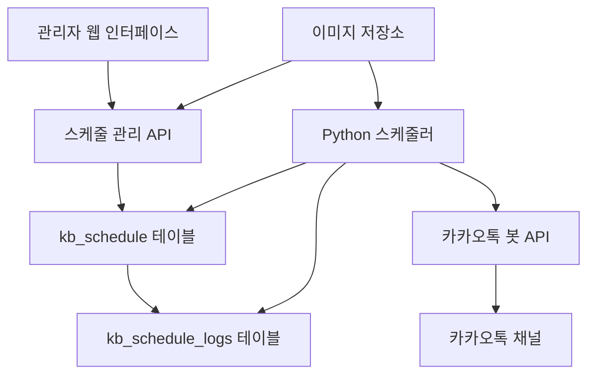

# 도매까 스케줄링 메시지 발송 시스템 설계

## 1. 개요

도매까 시스템에서 각 지점, 대리점, 본사가 카카오톡 봇을 통해 정해진 시간에 자동으로 메시지와 이미지를 발송할 수 있는 스케줄링 시스템을 구현합니다.

### 1.1. 목적
- 정기적인 안내 메시지 자동 발송
- 프로모션 및 이벤트 알림 자동화
- 업무 효율성 향상 및 인적 오류 최소화
- 다양한 발송 패턴 지원 (1회성, 반복)

### 1.2. 주요 기능
- 날짜/시간 기반 1회성 발송
- 요일/시간 기반 반복 발송
- 텍스트 + 다중 이미지 발송
- 발송 순서 제어 (텍스트 먼저/이미지 먼저/이미지만)
- 활성/비활성 상태 관리
- 유효기간 설정
- 계층별 권한 관리

### 1.3. 메시지 구성 및 발송 방식
메시지 발송은 최대 3개의 구성 요소로 이루어집니다:
1. **텍스트 메시지**: 일반 텍스트 메시지
2. **이미지 그룹 1**: 첫 번째 이미지 그룹 (다중 이미지)
3. **이미지 그룹 2**: 두 번째 이미지 그룹 (다중 이미지)

#### 발송 조합 예시
- **텍스트만**: 텍스트 메시지만 발송
- **텍스트 + 이미지 그룹 1**: 텍스트 발송 후 이미지 그룹 1 발송
- **텍스트 + 이미지 그룹 1 + 이미지 그룹 2**: 텍스트, 이미지 그룹 1, 이미지 그룹 2 순차 발송
- **이미지 그룹 1만**: 이미지 그룹 1만 발송
- **이미지 그룹 1 + 이미지 그룹 2**: 이미지 그룹 1 발송 후 이미지 그룹 2 발송

## 2. 시스템 아키텍처

### 2.1. 구성 요소



### 2.2. 데이터 흐름
1. 관리자가 웹 인터페이스에서 스케줄 등록
2. 스케줄 정보가 `kb_schedule` 테이블에 저장
3. Python 스케줄러가 주기적으로 테이블 폴링
4. 조건에 맞는 스케줄 발견 시 카카오톡 봇 API 호출
5. 발송 내역를 `kb_schedule_logs` 테이블에 기록

## 3. 데이터베이스 설계

### 3.1. kb_schedule 테이블

```sql
CREATE TABLE `kb_schedule` (
  `id` int(11) NOT NULL AUTO_INCREMENT,
  `title` varchar(255) NOT NULL COMMENT '스케줄 제목',
  `description` text COMMENT '스케줄 설명',
  
  -- 발송 주체 정보
  `created_by_type` enum('distributor','agency','branch') NOT NULL COMMENT '등록자 타입(총판, 대리점, 지점점)',
  `created_by_id` varchar(50) NOT NULL COMMENT '등록자 ID (dt_id, ag_id, br_id)',
  `created_by_mb_id` varchar(50) NOT NULL COMMENT '등록한 관리자 회원 ID (상위 관리자가 하위 관리자 정보 등록 가능)',
  
  -- 발송 대상 정보
  `target_bot_name` varchar(30) NOT NULL COMMENT '대상 봇',
  `target_room_id` varchar(100) NOT NULL COMMENT '대상 톡방 ID(channelId)',
  
  -- 메시지 내용
  `message_text` text COMMENT '텍스트 메시지',
  `message_images_1` json COMMENT '이미지 파일 정보 배열 1',
  `message_images_2` json COMMENT '이미지 파일 정보 배열 1',
  `send_interval_seconds` int(5) DEFAULT 1 COMMENT '메시지간 발송 간격(초), 0은 즉시 이어서 발송',
  `media_wait_time_1` int(5) DEFAULT 1 COMMENT 'message_images_1 이미지를 톡방에 전송한 후 대기 시간(ms), 0은 클라이언트 설정값을 따름',
  `media_wait_time_2` int(5) DEFAULT 1 COMMENT 'message_images_2 이미지를 톡방에 전송한 후 대기 시간(ms), 0은 클라이언트 설정값을 따름',
  
  -- 스케줄링 설정
  `schedule_type` enum('once','weekly','daily') NOT NULL COMMENT '스케줄 타입',
  `schedule_date` date NULL COMMENT '1회성 발송 날짜',
  `schedule_time` time NOT NULL COMMENT '발송 시간',
  `schedule_weekdays` set('monday','tuesday','wednesday','thursday','friday','saturday','sunday') NULL COMMENT '반복 발송 요일',
  
  -- 유효기간 설정
  `valid_from` datetime NOT NULL COMMENT '유효기간 시작',
  `valid_until` datetime NOT NULL COMMENT '유효기간 종료',
  
  -- 상태 관리
  `status` enum('active','inactive','completed','error') DEFAULT 'active' COMMENT '스케줄 상태',
  `last_sent_at` datetime NULL COMMENT '마지막 발송 시간',
  `next_send_at` datetime NULL COMMENT '다음 발송 예정 시간',
  `send_count` int(11) DEFAULT 0 COMMENT '총 발송 횟수',
  
  -- 시스템 필드
  `created_at` datetime NOT NULL DEFAULT CURRENT_TIMESTAMP,
  `updated_at` datetime NOT NULL DEFAULT CURRENT_TIMESTAMP ON UPDATE CURRENT_TIMESTAMP,
  
  PRIMARY KEY (`id`),
  KEY `idx_schedule_polling` (`status`, `next_send_at`, `valid_from`, `valid_until`),
  KEY `idx_created_by` (`created_by_type`, `created_by_id`),
  KEY `idx_target_room` (`target_room_id`, `target_bot_name`),
    KEY `idx_target_bot` (`target_bot_name`, `target_room_id`)
) ENGINE=InnoDB DEFAULT CHARSET=utf8mb4 COLLATE=utf8mb4_unicode_ci COMMENT='카카오봇 스케줄링 발송 설정';
```

### 3.2. kb_schedule_logs 테이블

```sql
CREATE TABLE `kb_schedule_logs` (
  `id` int(11) NOT NULL AUTO_INCREMENT,
  `schedule_id` int(11) NOT NULL COMMENT '스케줄 ID',
  `target_room_id` varchar(100) NOT NULL COMMENT '발송 대상 톡방 ID',
  
  -- 발송 내용
  `sent_message_text` text COMMENT '발송된 텍스트',
  `sent_images_1` json COMMENT '발송된 이미지 그룹 1',
  `sent_images_2` json COMMENT '발송된 이미지 그룹 2',
  `send_components` varchar(50) COMMENT '실제 발송된 구성 요소',
  
  -- 발송 결과
  `status` enum('success','failed','partial') NOT NULL COMMENT '발송 상태',
  `error_message` text COMMENT '오류 메시지',
  `api_response` json COMMENT 'API 응답 데이터',
  
  -- 발송 시간 정보
  `scheduled_at` datetime NOT NULL COMMENT '예정 발송 시간',
  `started_at` datetime NOT NULL COMMENT '발송 시작 시간',
  `completed_at` datetime NULL COMMENT '발송 완료 시간',
  `duration_ms` int(11) COMMENT '발송 소요 시간(밀리초)',
  
  -- 시스템 필드
  `created_at` datetime NOT NULL DEFAULT CURRENT_TIMESTAMP,
  
  PRIMARY KEY (`id`),
  KEY `fk_schedule_logs_schedule` (`schedule_id`),
  KEY `idx_target_room_logs` (`target_room_id`),
  KEY `idx_status_time` (`status`, `scheduled_at`),
  CONSTRAINT `fk_schedule_logs_schedule` FOREIGN KEY (`schedule_id`) REFERENCES `kb_schedule` (`id`) ON DELETE CASCADE
) ENGINE=InnoDB DEFAULT CHARSET=utf8mb4 COLLATE=utf8mb4_unicode_ci COMMENT='카카오봇 스케줄링 발송 로그';
```


## 4. 웹 인터페이스 설계

### 4.1. 메뉴 구조
- **봇 관리 (180XXX)**
  - 스케줄링 발송 관리 (180300)
    - 스케줄 목록 (`bot_schedule_list.php`)
    - 스케줄 등록/수정 (`bot_schedule_form.php`)

### 4.2. 스케줄 등록/수정 폼 필드

| 필드명 | 타입 | 필수 | 설명 |
|--------|------|------|------|
| 제목 | text | Y | 스케줄 식별용 제목 |
| 설명 | textarea | N | 스케줄 상세 설명 |
| 대상 톡방 | select | Y | 발송할 톡방 선택 |
| 톡방 타입 | radio | Y | 운영/테스트 톡방 선택 |
| 텍스트 메시지 | textarea | N | 발송할 텍스트 내용 |
| 이미지 파일들 | file(multiple) | N | 발송할 이미지들 (최대 10개) |
| 발송 순서 | select | Y | 텍스트/이미지 발송 순서 |
| 메시지 간격 | number | Y | 메시지간 발송 간격(초) |
| 이미지 그룹 1 대기시간 | number | N | 이미지 그룹 1 발송 후 대기시간(ms) |
| 이미지 그룹 2 대기시간 | number | N | 이미지 그룹 2 발송 후 대기시간(ms) |
| 스케줄 타입 | radio | Y | 1회성/주간 반복/매일 반복 |
| 발송 날짜 | date | 조건부 | 1회성 발송시 필수 |
| 발송 시간 | time | Y | 발송할 시간 |
| 반복 요일 | checkbox | 조건부 | 주간 반복시 필수 |
| 유효기간 시작 | datetime | Y | 스케줄 활성화 시작일시 |
| 유효기간 종료 | datetime | Y | 스케줄 활성화 종료일시 |
| 상태 | select | Y | 활성/비활성 |

### 4.2.1. UI/UX 상세 요구사항

#### 텍스트 메시지 입력부
- **편집기 형태**: 최소 10줄 이상의 텍스트 에어리어
- **기능**: 줄바꿈 지원, 문자 수 카운트 표시
- **템플릿**: 자주 사용하는 메시지 템플릿 저장/불러오기

#### 이미지 그룹 관리
- **업로드 방식**: 드래그앤드롭 지원
- **썸네일 표시**: 업로드된 이미지 썸네일 미리보기
- **순서 변경**: 썸네일을 드래그하여 순서 변경 가능
- **개별 삭제**: 각 이미지별 삭제 버튼
- **파일 형식**: JPG, PNG, GIF 지원
- **파일 크기**: 개별 이미지 최대 10MB
- **이미지 그룹 구분**: 이미지 그룹 1과 2를 시각적으로 구분

### 4.3. 권한 관리

| 사용자 타입 | 등록 권한 | 조회 권한 | 수정 권한 | 삭제 권한 |
|-------------|-----------|-----------|-----------|-----------|
| 본사 | 전체 | 전체 | 전체 | 전체 |
| 총판 | 소속 대리점/지점 | 소속 대리점/지점 | 소속 대리점/지점 | 소속 대리점/지점 |
| 대리점 | 소속 지점 | 소속 지점 | 소속 지점 | 소속 지점 |
| 지점 | 자신의 톡방만 | 자신의 톡방만 | 자신의 톡방만 | 자신의 톡방만 |

## 5. Python 스케줄러 설계

### 5.1. 스케줄링 구현 방법론 비교

#### 방법 1: 데이터베이스 폴링 방식 (추천)
**장점:**
- 구현이 단순하고 직관적
- 서버 재시작 시 자동으로 미발송 건 처리 가능
- 부하 분산이 용이 (여러 서버 인스턴스 가능)
- 데이터베이스가 Single Source of Truth 역할

**단점:**
- 1분 단위 정확도 (초 단위 불가)
- 데이터베이스 부하 발생 (1분마다 쿼리)
- 발송 지연 가능성 (최대 1분)

**구현 방식:**
```python
import asyncio
from datetime import datetime, timedelta

class DatabasePollingScheduler:
    def __init__(self):
        self.polling_interval = 60  # 1분
        self.running = False
        
    async def start(self):
        self.running = True
        while self.running:
            await self.poll_and_process()
            await asyncio.sleep(self.polling_interval)
    
    async def poll_and_process(self):
        # 현재 시각 기준으로 발송할 스케줄 조회
        now = datetime.now()
        schedules = await self.get_pending_schedules(now)
        
        # 병렬 처리로 성능 향상
        tasks = [self.process_schedule(s) for s in schedules]
        await asyncio.gather(*tasks)
```

#### 방법 2: 인메모리 스케줄러 (APScheduler)
**장점:**
- 초 단위 정확한 스케줄링 가능
- 데이터베이스 부하 최소화
- 다양한 스케줄링 옵션 (cron, interval, date)

**단점:**
- 서버 재시작 시 스케줄 재등록 필요
- 메모리 사용량 증가
- 분산 환경에서 복잡도 증가

**구현 방식:**
```python
from apscheduler.schedulers.asyncio import AsyncIOScheduler
from apscheduler.jobstores.sqlalchemy import SQLAlchemyJobStore

scheduler = AsyncIOScheduler(
    jobstores={
        'default': SQLAlchemyJobStore(url='mysql://...')
    }
)
```

#### 방법 3: 메시지 큐 기반 (Redis/RabbitMQ)
**장점:**
- 높은 확장성과 신뢰성
- 재시도 메커니즘 내장
- 분산 처리 최적화

**단점:**
- 구현 복잡도 높음
- 추가 인프라 필요
- 운영 비용 증가

### 5.2. 추천 구현 방식: 하이브리드 접근법

**1분 폴링 + 미발송 건 확인 방식**을 추천합니다:

```python
class HybridScheduler:
    def __init__(self):
        self.polling_interval = 60
        self.catch_up_window = 300  # 5분 이내 미발송 건 처리
        
    async def poll_and_process(self):
        now = datetime.now()
        
        # 1. 정확히 현재 분에 해당하는 스케줄
        current_minute_schedules = await self.get_schedules_for_minute(now)
        
        # 2. 미발송 건 확인 (재시작 대응)
        missed_schedules = await self.get_missed_schedules(
            now - timedelta(seconds=self.catch_up_window),
            now
        )
        
        # 3. 중복 제거 후 처리
        all_schedules = self.deduplicate_schedules(
            current_minute_schedules + missed_schedules
        )
        
        # 4. 우선순위에 따라 정렬
        sorted_schedules = sorted(all_schedules, 
            key=lambda x: (x['priority'], x['scheduled_at']))
        
        # 5. 병렬 처리
        await self.process_schedules_batch(sorted_schedules)
```

### 5.3. 서버 재시작 대응 전략

#### 재시작 시 미발송 건 처리
```python
async def handle_server_restart(self):
    """서버 재시작 시 미발송 건 일괄 처리"""
    
    # 1. 미발송 스케줄 조회
    missed_schedules = await self.db.query("""
        SELECT * FROM kb_schedule 
        WHERE status = 'active'
        AND next_send_at < NOW()
        AND next_send_at > DATE_SUB(NOW(), INTERVAL 24 HOUR)
        AND last_sent_at IS NULL OR last_sent_at < next_send_at
        ORDER BY next_send_at ASC
    """)
    
    # 2. 발송 여부 재확인 (중복 방지)
    for schedule in missed_schedules:
        if not await self.check_already_sent(schedule):
            await self.process_schedule(schedule, is_catch_up=True)
```

#### 중복 발송 방지
```python
async def check_already_sent(self, schedule):
    """발송 로그 확인으로 중복 방지"""
    
    result = await self.db.query("""
        SELECT COUNT(*) as cnt FROM kb_schedule_logs
        WHERE schedule_id = %s
        AND scheduled_at = %s
        AND status IN ('success', 'partial')
    """, [schedule['id'], schedule['next_send_at']])
    
    return result[0]['cnt'] > 0
```

### 5.4. 스케줄러 구조

```python
class KakaoScheduler:
    def __init__(self):
        self.db_connection = None
        self.kakao_api = None
        self.running = False
        self.polling_interval = 60  # 1분마다 폴링
    
    def start(self):
        """스케줄러 시작"""
        pass
    
    def stop(self):
        """스케줄러 중지"""
        pass
    
    def poll_schedules(self):
        """스케줄 폴링 및 처리"""
        pass
    
    def process_schedule(self, schedule):
        """개별 스케줄 처리"""
        pass
    
    def send_messages(self, schedule):
        """메시지 발송 실행"""
        pass
    
    def update_next_send_time(self, schedule):
        """다음 발송 시간 계산 및 업데이트"""
        pass
    
    def log_send_result(self, schedule, result):
        """발송 결과 로깅"""
        pass
```

### 5.5. 폴링 쿼리 최적화

#### 기본 폴링 쿼리
```sql
-- 현재 시각 기준 발송 대상 조회
SELECT * FROM kb_schedule 
WHERE status = 'active' 
  AND NOW() BETWEEN valid_from AND valid_until
  AND next_send_at <= NOW()
  AND (last_sent_at IS NULL OR last_sent_at < next_send_at)
ORDER BY next_send_at ASC, id ASC
LIMIT 100;
```

#### 미발송 건 조회 쿼리
```sql
-- 재시작 시 미발송 건 확인
SELECT s.*, 
       CASE 
         WHEN l.id IS NULL THEN 'not_sent'
         WHEN l.status = 'failed' THEN 'retry_needed'
         ELSE 'sent'
       END as send_status
FROM kb_schedule s
LEFT JOIN kb_schedule_logs l ON (
    s.id = l.schedule_id 
    AND l.scheduled_at = s.next_send_at
)
WHERE s.status = 'active'
  AND s.next_send_at < NOW()
  AND s.next_send_at > DATE_SUB(NOW(), INTERVAL 5 MINUTE)
  AND (l.id IS NULL OR l.status = 'failed')
ORDER BY s.next_send_at ASC;
```

### 5.6. 동시성 및 분산 처리

#### 락 메커니즘을 통한 중복 처리 방지
```python
async def acquire_schedule_lock(self, schedule_id):
    """스케줄 처리 락 획득"""
    lock_key = f"schedule_lock_{schedule_id}"
    lock_acquired = await self.redis.set(
        lock_key, 
        self.instance_id,
        nx=True,  # 존재하지 않을 때만 설정
        ex=300    # 5분 후 자동 만료
    )
    return lock_acquired

async def process_with_lock(self, schedule):
    """락을 사용한 안전한 스케줄 처리"""
    if await self.acquire_schedule_lock(schedule['id']):
        try:
            await self.process_schedule(schedule)
        finally:
            await self.release_schedule_lock(schedule['id'])
    else:
        # 다른 인스턴스가 처리 중
        self.logger.info(f"Schedule {schedule['id']} is being processed by another instance")
```

### 5.7. 성능 최적화 전략

#### 배치 처리
```python
async def process_schedules_batch(self, schedules):
    """여러 스케줄을 배치로 처리"""
    
    # 방별로 그룹화
    room_groups = {}
    for schedule in schedules:
        room_id = schedule['target_room_id']
        if room_id not in room_groups:
            room_groups[room_id] = []
        room_groups[room_id].append(schedule)
    
    # 방별로 순차 처리 (같은 방은 순서 보장)
    tasks = []
    for room_id, room_schedules in room_groups.items():
        task = self.process_room_schedules(room_id, room_schedules)
        tasks.append(task)
    
    # 다른 방은 병렬 처리
    await asyncio.gather(*tasks)
```

#### 연결 풀 관리
```python
class DatabasePool:
    def __init__(self, min_size=5, max_size=20):
        self.pool = await aiomysql.create_pool(
            host=DB_HOST,
            port=3306,
            user=DB_USER,
            password=DB_PASSWORD,
            db=DB_NAME,
            minsize=min_size,
            maxsize=max_size,
            charset='utf8mb4',
            autocommit=True
        )
```

### 5.3. 다음 발송 시간 계산 로직

```python
def calculate_next_send_time(schedule):
    """다음 발송 시간 계산"""
    if schedule['schedule_type'] == 'once':
        return None  # 1회성은 다음 발송 없음
    
    elif schedule['schedule_type'] == 'daily':
        # 매일 반복: 다음날 같은 시간
        next_date = datetime.now().date() + timedelta(days=1)
        return datetime.combine(next_date, schedule['schedule_time'])
    
    elif schedule['schedule_type'] == 'weekly':
        # 주간 반복: 다음 해당 요일 같은 시간
        current_date = datetime.now().date()
        weekdays = schedule['schedule_weekdays']
        
        for i in range(1, 8):  # 최대 7일 후까지 검색
            check_date = current_date + timedelta(days=i)
            weekday_name = check_date.strftime('%A').lower()
            
            if weekday_name in weekdays:
                return datetime.combine(check_date, schedule['schedule_time'])
    
    return None
```

### 5.4. 발송 순서 처리

```python
async def send_scheduled_messages(room_id, schedule):
    """스케줄에 따른 메시지 전송"""
    
    text = schedule.get('message_text')
    images_1 = schedule.get('message_images_1', [])
    images_2 = schedule.get('message_images_2', [])
    interval = schedule.get('send_interval_seconds', 1)
    media_wait_time_1 = schedule.get('media_wait_time_1', 0)
    media_wait_time_2 = schedule.get('media_wait_time_2', 0)
    
    # 발송 구성 결정
    components = []
    if text:
        components.append(('text', text, None))
    if images_1:
        components.append(('images', images_1, media_wait_time_1))
    if images_2:
        components.append(('images', images_2, media_wait_time_2))
    
    # 순차적으로 발송
    for i, (comp_type, content, wait_time) in enumerate(components):
        if comp_type == 'text':
            await send_text_message(room_id, content)
        elif comp_type == 'images':
            await send_images_with_wait_time(room_id, content, wait_time)
        
        # 다음 컴포넌트가 있으면 대기
        if i < len(components) - 1:
            await asyncio.sleep(interval)

async def send_images_with_wait_time(room_id, images, media_wait_time):
    """이미지 그룹 발송 (media_wait_time 포함)"""
    for i, image in enumerate(images):
        await send_image_message(room_id, image, media_wait_time)
        # 마지막 이미지가 아니면 잠시 대기
        if i < len(images) - 1:
            await asyncio.sleep(0.5)
```

## 6. API 설계

### 6.1. 스케줄 관리 API

| 메서드 | 엔드포인트 | 설명 |
|--------|------------|------|
| GET | `/api/schedules` | 스케줄 목록 조회 |
| POST | `/api/schedules` | 스케줄 등록 |
| GET | `/api/schedules/{id}` | 스케줄 상세 조회 |
| PUT | `/api/schedules/{id}` | 스케줄 수정 |
| DELETE | `/api/schedules/{id}` | 스케줄 삭제 |
| POST | `/api/schedules/{id}/toggle` | 스케줄 활성/비활성 토글 |

### 6.2. 발송 로그 API

| 메서드 | 엔드포인트 | 설명 |
|--------|------------|------|
| GET | `/api/schedules/{id}/logs` | 특정 스케줄 발송 로그 |
| GET | `/api/logs/send` | 전체 발송 로그 조회 |

## 7. 보안 고려사항

### 7.1. 데이터 보안
- 이미지 파일 업로드 시 파일 타입 및 크기 검증
- SQL 인젝션 방지를 위한 Prepared Statement 사용
- XSS 방지를 위한 입력값 이스케이프 처리

### 7.2. 접근 제어
- 계층별 권한 검증 강화
- API 호출 시 인증 토큰 검증
- 톡방 접근 권한 이중 확인

### 7.3. 발송 제한
- 동일 톡방 대상 발송 간격 제한 (최소 30초)
- 일일 발송 횟수 제한 (톡방당 최대 50회)
- 스팸 방지를 위한 메시지 길이 제한

## 8. 모니터링 및 알림

### 8.1. 시스템 모니터링
- 스케줄러 프로세스 상태 모니터링
- 발송 성공률 추적
- 오류 발생 시 관리자 알림

### 8.2. 성능 지표
- 평균 발송 지연 시간
- 시간당 처리 가능한 스케줄 수
- 데이터베이스 쿼리 성능

## 9. 구현 단계

### Phase 1: 기본 구조 (1주)
- 데이터베이스 테이블 생성
- 웹 인터페이스 기본 CRUD 구현
- 권한 관리 시스템 연동

### Phase 2: 스케줄러 개발 (2주)
- Python 스케줄러 기본 구조 구현
- 폴링 및 발송 로직 개발
- 로깅 시스템 구현

### Phase 3: 고급 기능 (1주)
- 다중 이미지 발송 구현
- 발송 순서 제어 구현
- 유효기간 및 상태 관리 완성

### Phase 4: 테스트 및 최적화 (1주)
- 통합 테스트 실행
- 성능 최적화
- 문서화 완성

## 10. 추가 권장사항

### 10.1. 백업 및 복구
- 스케줄 데이터 일일 백업
- 발송 로그 월별 아카이빙
- 장애 시 복구 절차 수립

### 10.2. 확장성 고려
- 스케줄러 다중 인스턴스 지원
- 로드 밸런싱 구조 설계
- 대용량 발송 처리 최적화

### 10.3. 사용자 경험 개선
- 스케줄 등록 마법사 UI
- 발송 결과 실시간 알림
- 템플릿 기반 메시지 작성 기능

### 10.4. 분석 및 리포팅
- 발송 통계 대시보드
- 효과 분석 리포트
- 사용 패턴 분석 기능

## 11. 서버 폴링 시스템 상세 설계

### 11.1. 폴링 주기 및 타이밍

#### 폴링 전략
```python
class PollingStrategy:
    """폴링 전략 구현"""
    
    def __init__(self):
        self.base_interval = 60  # 기본 1분
        self.busy_interval = 30  # 바쁜 시간대 30초
        self.idle_interval = 120 # 한가한 시간대 2분
        
    def get_polling_interval(self):
        """시간대별 동적 폴링 주기"""
        current_hour = datetime.now().hour
        
        # 바쁜 시간대 (오전 9-12시, 오후 6-9시)
        if 9 <= current_hour <= 12 or 18 <= current_hour <= 21:
            return self.busy_interval
        
        # 한가한 시간대 (새벽 0-6시)
        elif 0 <= current_hour <= 6:
            return self.idle_interval
        
        # 일반 시간대
        else:
            return self.base_interval
```

### 11.2. 장애 복구 메커니즘

#### 자동 복구 시스템
```python
class FailureRecovery:
    """장애 복구 메커니즘"""
    
    async def check_and_recover(self):
        """장애 감지 및 복구"""
        
        # 1. 프로세스 상태 확인
        if not self.is_scheduler_healthy():
            await self.restart_scheduler()
        
        # 2. 데이터베이스 연결 확인
        if not await self.check_db_connection():
            await self.reconnect_database()
        
        # 3. 미발송 건 복구
        await self.recover_unsent_schedules()
    
    async def recover_unsent_schedules(self):
        """미발송 스케줄 복구"""
        
        # 최근 24시간 내 미발송 건 조회
        unsent = await self.get_unsent_schedules(hours=24)
        
        for schedule in unsent:
            # 발송 시도 횟수 확인
            retry_count = await self.get_retry_count(schedule['id'])
            
            if retry_count < 3:  # 최대 3회 재시도
                await self.retry_schedule(schedule)
            else:
                await self.mark_as_failed(schedule['id'])
```

### 11.3. 모니터링 및 알림

#### 실시간 모니터링
```python
class SchedulerMonitor:
    """스케줄러 모니터링"""
    
    def __init__(self):
        self.metrics = {
            'processed_count': 0,
            'success_count': 0,
            'failure_count': 0,
            'avg_processing_time': 0,
            'last_poll_time': None
        }
    
    async def report_metrics(self):
        """메트릭 리포트"""
        
        # 성공률 계산
        success_rate = (self.metrics['success_count'] / 
                       self.metrics['processed_count'] * 100 
                       if self.metrics['processed_count'] > 0 else 0)
        
        # 경고 조건 확인
        if success_rate < 90:
            await self.send_alert("Low success rate: {:.1f}%".format(success_rate))
        
        if self.metrics['avg_processing_time'] > 5000:  # 5초 이상
            await self.send_alert("High processing time: {:.1f}ms".format(
                self.metrics['avg_processing_time']
            ))
```

### 11.4. 보안 고려사항

#### 메시지 발송 제한
```python
class RateLimiter:
    """발송 속도 제한"""
    
    async def check_rate_limit(self, room_id):
        """방별 발송 제한 확인"""
        
        # 최근 1분간 발송 횟수
        recent_count = await self.get_recent_send_count(room_id, minutes=1)
        if recent_count >= 5:  # 분당 최대 5개
            return False
        
        # 최근 1시간 발송 횟수
        hourly_count = await self.get_recent_send_count(room_id, minutes=60)
        if hourly_count >= 50:  # 시간당 최대 50개
            return False
        
        # 일일 발송 횟수
        daily_count = await self.get_daily_send_count(room_id)
        if daily_count >= 200:  # 일일 최대 200개
            return False
        
        return True
```

### 11.5. 구현 권장사항

1. **초기 구현 (MVP)**
   - 단순 1분 폴링으로 시작
   - 기본적인 중복 방지 메커니즘
   - 최소한의 로깅

2. **안정화 단계**
   - 재시작 시 미발송 건 처리
   - 상세 로깅 및 모니터링
   - 발송 제한 기능

3. **고도화 단계**
   - 동적 폴링 주기
   - 분산 처리 지원
   - 실시간 모니터링 대시보드

### 11.6. 예상 문제점 및 해결방안

| 문제점 | 원인 | 해결방안 |
|--------|------|----------|
| 중복 발송 | 여러 서버 인스턴스 | Redis 기반 분산 락 |
| 발송 누락 | 서버 재시작 | 미발송 건 자동 감지 |
| 성능 저하 | 대량 스케줄 처리 | 배치 처리 및 병렬화 |
| DB 부하 | 빈번한 폴링 | 인덱스 최적화, 캐싱 |
| 시간 오차 | 서버 시간 불일치 | NTP 동기화 | 