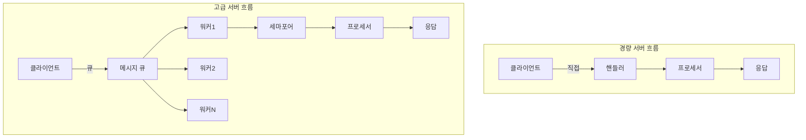

# 클라이언트-서버 안정성 2차 점검 보고서

## 작성일: 2025-07-14
## 점검 대상
- **Domaeka 서버**: `/home/wangt/projects/client/domaeka/domaeka.dev/server` (domaeka.dev 프로젝트)
- **Kkobot 서버**: `/home/wangt/projects/personal/kkobot/kkobot.dev/server` (kkobot 프로젝트)  
- **공통 클라이언트**: `/client/messengerbotR/bridge-v3.2.2.js`

> **참고**: 본 문서에서 "경량 서버"와 "고급 서버"라는 표현은 기능의 복잡도 차이를 설명하기 위한 것입니다. Domaeka 서버가 경량 서버를 지향하는 것은 아니며, 두 서버의 기본 통신 시스템은 동일하게 유지되어야 합니다. Kkobot 서버는 부가 기능이 많이 추가되어 비대해진 것일 뿐입니다.

## 1. 아키텍처 비교 분석

### 1.1 메시지 처리 방식 비교 (업데이트 후)

| 구분 | Domaeka 서버 (server) | Kkobot 서버 (server-kkobot) | 상태 |
|------|-------------------|-------------------------|------|
| **처리 패턴** | 워커 큐 패턴 (비동기) | 워커 큐 패턴 (비동기) | ✅ 동일 |
| **동시 처리** | 31개 워커 제한 | 31개 워커 제한 | ✅ 동일 |
| **메시지 큐** | asyncio.Queue 사용 | asyncio.Queue 사용 | ✅ 동일 |
| **처리 지연** | 보통 (큐 대기) | 보통 (큐 대기) | ✅ 동일 |
| **부하 분산** | 워커간 자동 분산 | 워커간 자동 분산 | ✅ 동일 |
| **백프레셔** | 큐 크기 제한 (10000) | 큐 크기 제한 | ✅ 동일 |

> **구현 완료**: Domaeka 서버도 이제 Kkobot 서버와 동일한 워커 큐 패턴을 사용합니다. 31개의 워커가 asyncio.Queue를 통해 메시지를 비동기적으로 처리합니다.

### 1.2 연결 관리 비교

| 구분 | Domaeka 서버 | Kkobot 서버 | 상태 |
|------|----------|----------|------|
| **클라이언트 추적** | ✅ (bot_name, device_id) 기반 | ✅ (bot_name, device_id) 기반 | ✅ 구현 완료 |
| **핸드셰이크** | ✅ 디바이스 승인 시스템 | ✅ 디바이스 승인 시스템 | ✅ 동일 |
| **핸드셰이크 타임아웃** | ✅ 10초 타임아웃 | ✅ 10초 타임아웃 | ✅ 동일 |
| **인증 방식** | ✅ HMAC + DB 승인 | ✅ HMAC + DB 승인 | ✅ 동일 |
| **ping 모니터링** | ✅ kb_ping_monitor 저장 | ✅ kb_ping_monitor 저장 | ✅ 동일 |
| **설정 관리** | 수동 | 자동 생성 (봇별) | 🏆 고급 |
| **재연결 처리** | 클라이언트 의존 | 클라이언트 의존 | ⚖️ 동등 |

> **구현 완료 (2025-07-14)**: 
> - 양쪽 서버 모두 `(bot_name, device_id)` 기반 클라이언트 추적 구현
> - Domaeka 서버에 Kkobot 서버와 동일한 핸드셰이크 및 인증 방식 적용
> - 핸드셰이크 타임아웃(10초) 및 읽기 타임아웃(30초) 구현
> - ping 이벤트 모니터링 및 DB 저장 기능 추가

#### 클라이언트 추적 방식 개선 완료 (2025-07-14)

**✅ Domaeka 서버의 개선된 클라이언트 추적**:
```python
# core/globals.py
clients = {}  # {(bot_name, device_id): writer} - bot_name과 device_id로 클라이언트 추적
clients_by_addr = {}  # {(ip, port): (bot_name, device_id)} - 주소로 클라이언트 찾기용

# 클라이언트 등록 예시 (core/client_handler.py)
client_key = (bot_name, device_id)
g.clients[client_key] = writer
g.clients_by_addr[client_addr] = client_key
```

**✅ Kkobot 서버의 개선된 클라이언트 추적**:
```python
# core/globals.py
clients = {}  # {(bot_name, device_id): {addr: writer}} - bot_name과 device_id로 클라이언트 추적
clients_by_addr = {}  # {addr: (bot_name, device_id)} - 주소로 클라이언트 찾기용

# 클라이언트 등록 예시 (core/client_handler.py)
client_key = (bot_name, device_id)
g.clients.setdefault(client_key, {})[addr] = writer
g.clients_by_addr[addr] = client_key
```

**개선 효과**:
1. **모바일 환경 대응**:
   - IP 변경 시에도 동일한 디바이스로 인식
   - WiFi ↔ 모바일 데이터 전환 시 연속성 유지
   
2. **데이터베이스 일치성**:
   - `kb_bot_devices` 테이블 구조와 동일한 키 사용
   - 디바이스 관리의 일관성 확보
   
3. **기존 연결 관리 개선**:
   - 동일한 디바이스 재연결 시 기존 연결 자동 정리
   - 좀비 연결 방지

> **구현 완료**: 2025-07-14 기준으로 양쪽 서버 모두 `(bot_name, device_id)` 복합 키로 클라이언트 추적이 통일되었습니다.

### 1.3 리소스 관리 비교

| 구분 | Domaeka 서버 | Kkobot 서버 | 상태 |
|------|----------|----------|------|
| **동시성 제어** | ✅ 세마포어 (봇/방별) | ✅ 세마포어 (봇/방별) | ✅ 동일 |
| **메모리 사용** | 낮음 | 높음 | 🏆 경량 |
| **CPU 사용** | 효율적 | 오버헤드 있음 | 🏆 경량 |
| **리소스 모니터링** | ✅ DB 저장 (5분) | ✅ DB 저장 (5분) | ✅ 동일 |
| **과부하 보호** | ✅ 다단계 제한 | ✅ 다단계 제한 | ✅ 동일 |

> **구현 완료 (2025-07-14)**: Domaeka 서버에도 봇별/방별 세마포어 기반 동시성 제어가 구현되었습니다:
> - 봇별 최대 30개 동시 메시지 처리
> - 방별 최대 3개 동시 메시지 처리 (기본값)
> - 5분 타임아웃으로 무한 대기 방지

### 1.4 안정성 기능 비교

| 구분 | 경량 서버 | 고급 서버 | 우위 |
|------|----------|----------|------|
| **오류 처리** | 기본 try-catch | 계층적 오류 관리 | 🏆 고급 |
| **타임아웃** | 30초 읽기 | 다중 타임아웃 | 🏆 고급 |
| **복구 메커니즘** | 단순 재시작 | 단계별 복구 | 🏆 고급 |
| **로깅** | 기본 레벨 | 카테고리별 제어 | 🏆 고급 |
| **모니터링** | ping only | 성능 프로파일링 | 🏆 고급 |

## 2. 통신 프로토콜 분석

### 2.1 Ping 메커니즘 비교

| 항목 | 경량 서버 | 고급 서버 | 권장사항 |
|------|----------|----------|----------|
| **ping 주기** | ✅ 클라이언트별 타이머 | ✅ 클라이언트별 타이머 | ✅ 동일 |
| **ping 분산** | 0-5초 랜덤 | 연결 시점 기반 | 경량 방식 채택 |
| **ping 데이터** | 최소 정보 | 상세 모니터링 포함 | 선택적 채택 |
| **ping 응답 처리** | ✅ DB 저장 | ✅ DB 저장 | ✅ 동일 |

### 2.2 메시지 흐름 안정성



## 3. 안정성 체크포인트 평가

### 3.1 연결 안정성 (Connection Stability)

| 체크포인트 | Domaeka 서버 | Kkobot 서버 | 중요도 |
|------------|-----------|-----------|--------|
| 핸드셰이크 타임아웃 | ✅ 10초 | ✅ 10초 | 🔴 높음 |
| 연결 상태 추적 | ✅ 기본 | ✅ 기본 | ✅ 동일 |
| 좀비 연결 감지 | ✅ ping + timeout | ✅ ping + timeout | ✅ 동일 |
| 재연결 지원 | ✅ 클라이언트 | ✅ 클라이언트 | 🔴 높음 |
| IP 변경 대응 | ✅ device_id 기반 | ✅ device_id 기반 | 🟡 중간 |

### 3.2 데이터 무결성 (Data Integrity)

| 체크포인트 | 경량 서버 | 고급 서버 | 중요도 |
|------------|-----------|-----------|--------|
| 메시지 순서 보장 | ⚠️ 워커 경쟁 | ⚠️ 워커 경쟁 | 🔴 높음 |
| 메시지 중복 방지 | ❌ 없음 | ❌ 없음 | 🟡 중간 |
| 메시지 유실 감지 | ❌ 없음 | ⚠️ 큐 오버플로 | 🔴 높음 |
| 트랜잭션 보장 | ❌ 없음 | ❌ 없음 | 🟢 낮음 |

### 3.3 성능 안정성 (Performance Stability)

| 체크포인트 | Domaeka 서버 | Kkobot 서버 | 중요도 |
|------------|-----------|-----------|--------|
| 메모리 누수 방지 | ✅ 통합 관리 | ✅ 통합 관리 | 🔴 높음 |
| CPU 과부하 방지 | ✅ 세마포어 | ✅ 세마포어 | 🔴 높음 |
| 응답 시간 일관성 | ⚠️ 큐 변동 | ⚠️ 큐 변동 | 🟡 중간 |
| 처리량 확장성 | ✅ 워커 조정 | ✅ 워커 조정 | 🟡 중간 |

### 3.4 오류 복구 (Error Recovery)

| 체크포인트 | 경량 서버 | 고급 서버 | 중요도 |
|------------|-----------|-----------|--------|
| 부분 실패 처리 | ⚠️ 기본 | ✅ 상세 | 🔴 높음 |
| 자동 복구 | ❌ 없음 | ⚠️ 부분적 | 🟡 중간 |
| 오류 전파 차단 | ✅ 격리됨 | ✅ 워커 격리 | 🔴 높음 |
| 상태 복구 | ❌ 없음 | ⚠️ 부분적 | 🟡 중간 |

## 4. 발견된 취약점 및 개선사항

### 4.1 공통 취약점
1. **메시지 ID 부재**: 중복 감지 및 순서 보장 불가
2. ~~**핸드셰이크 타임아웃 없음**~~ ✅ **해결됨** (2025-07-14): 
   - ✅ 양쪽 서버 모두 10초 핸드셰이크 타임아웃 구현 완료
3. **메시지 크기 제한 없음**: 메모리 공격 가능
4. **암호화 없음**: 평문 통신
5. ~~**잘못된 클라이언트 추적 키**~~ ✅ **해결됨** (2025-07-14): 
   - ~~두 서버 모두 IP 주소나 Writer 객체를 키로 사용~~
   - ✅ 양쪽 서버 모두 `(bot_name, device_id)` 복합 키 사용으로 개선 완료

### 4.2 Domaeka 서버 남은 개선사항
```python
# 1. ✅ 핸드셰이크 타임아웃 추가 (구현 완료)

# 2. 메시지 크기 제한 (아직 미구현)
MAX_MESSAGE_SIZE = 1024 * 1024  # 1MB
data = await reader.read(MAX_MESSAGE_SIZE)

# 3. 기본 동시성 제어 (아직 미구현)
MAX_CONCURRENT_CONNECTIONS = 100
connection_semaphore = asyncio.Semaphore(MAX_CONCURRENT_CONNECTIONS)
```

### 4.3 고급 서버 개선 필요사항
```python
# 1. 워커 헬스체크
async def monitor_worker_health():
    while True:
        stuck_workers = []
        for worker_id, last_activity in worker_activities.items():
            if time.time() - last_activity > WORKER_TIMEOUT:
                stuck_workers.append(worker_id)
        
        if stuck_workers:
            logger.error(f"Stuck workers detected: {stuck_workers}")
            # 워커 재시작 로직
        
        await asyncio.sleep(60)

# 2. 메시지 순서 보장
class OrderedMessageQueue:
    def __init__(self):
        self.queues = {}  # channel_id -> asyncio.Queue
    
    async def put(self, channel_id, message):
        if channel_id not in self.queues:
            self.queues[channel_id] = asyncio.Queue()
        await self.queues[channel_id].put(message)

# 3. 세마포어 데드락 방지
async def acquire_with_timeout(semaphore, timeout=5):
    try:
        async with asyncio.timeout(timeout):
            await semaphore.acquire()
    except asyncio.TimeoutError:
        raise DeadlockError("세마포어 획득 타임아웃")
```

## 5. 상호 적용 가능한 개선사항

### 5.1 Domaeka 서버가 채택한 Kkobot 기능 (구현 완료)
| 기능 | 구현 복잡도 | 효과 | 상태 |
|------|------------|------|----------|
| 워커 큐 (31개) | 🟡 중간 | 처리량 향상 | ✅ 구현 완료 |
| 디바이스 추적 | 🟡 중간 | 보안 향상 | ✅ 구현 완료 |
| 핸드셰이크 타임아웃 | 🟢 낮음 | 보안 향상 | ✅ 구현 완료 |
| ping 모니터링 | 🟢 낮음 | 가시성 향상 | ✅ 구현 완료 |
| 세마포어 동시성 제어 | 🟢 낮음 | DoS 방지 | ✅ 구현 완료 |

### 5.2 Domaeka 서버 추가 구현 가능 기능
| 기능 | 구현 복잡도 | 효과 | 우선순위 |
|------|------------|------|----------|
| 성능 타이머 | 🟢 낮음 | 병목 발견 | 🟡 중간 |
| 설정 자동 생성 | 🟡 중간 | 운영 편의성 | 🟢 낮음 |
| 상세 모니터링 | 🟡 중간 | 가시성 향상 | 🟡 중간 |

### 5.3 Kkobot 서버가 Domaeka에서 참고할 기능
| 기능 | 구현 복잡도 | 효과 | 우선순위 |
|------|------------|------|----------|
| Ping 시간 분산 | 🟢 낮음 | 부하 분산 | 🔴 높음 |
| 단순 재시작 로직 | 🟢 낮음 | 복구 시간 단축 | 🟡 중간 |
| 직접 처리 옵션 | 🟡 중간 | 저지연 모드 | 🟢 낮음 |

## 6. 권장 하이브리드 아키텍처

```python
class HybridServer:
    def __init__(self):
        # 경량 모드와 고급 모드 선택 가능
        self.mode = os.getenv('SERVER_MODE', 'lightweight')
        
        # 공통 기능
        self.connection_limit = asyncio.Semaphore(1000)
        self.message_id_cache = TTLCache(maxsize=10000, ttl=300)
        
        # 모드별 초기화
        if self.mode == 'advanced':
            self.message_queue = asyncio.Queue(maxsize=10000)
            self.workers = []
            self.semaphores = {}
        
    async def handle_connection(self, reader, writer):
        async with self.connection_limit:
            # 공통 핸드셰이크 타임아웃
            async with asyncio.timeout(10):
                await self.handshake(reader, writer)
            
            if self.mode == 'lightweight':
                await self.direct_processing(reader, writer)
            else:
                await self.queued_processing(reader, writer)
```

## 7. 구현 로드맵

### Phase 1 (1주차) - 긴급 보안 패치
- [x] ~~핸드셰이크 타임아웃 구현~~ ✅ 완료 (2025-07-14)
- [ ] 메시지 크기 제한
- [ ] 기본 연결 수 제한

### Phase 2 (2-3주차) - 안정성 향상
- [ ] 메시지 ID 시스템
- [ ] 중복 메시지 필터링
- [ ] 향상된 오류 로깅
- [x] ~~클라이언트 추적 개선~~ ✅ 완료 (2025-07-14)

### Phase 3 (4-6주차) - 성능 최적화
- [x] ~~워커 큐 시스템~~ ✅ 완료 (2025-07-14)
- [ ] 성능 모니터링 대시보드
- [ ] 자동 스케일링 로직

### Phase 4 (7-8주차) - 고급 기능
- [ ] 메시지 암호화
- [ ] 상태 체크포인트
- [ ] 자동 복구 시스템

## 8. 결론 및 권장사항

### 8.1 즉시 적용 완료 (2025-07-14)
1. ✅ **핸드셰이크 타임아웃**: 양쪽 서버 모두 구현 완료
2. ✅ **클라이언트 추적 개선**: (bot_name, device_id) 기반으로 통일
3. ✅ **워커 큐 시스템**: Domaeka 서버에도 31개 워커 구현
4. ✅ **ping 모니터링**: kb_ping_monitor 테이블 연동
5. ✅ **세마포어 동시성 제어**: 봇별/방별 처리량 제한

### 8.2 단기 개선 (1개월 내)
1. **메시지 크기 제한**: 메모리 공격 방지
2. **연결별 세마포어**: DoS 공격 방지
3. **메시지 ID 시스템**: 중복 방지 및 순서 보장

### 8.3 장기 개선 (3개월 내)
1. 하이브리드 아키텍처 구현
2. 통합 모니터링 시스템
3. 자동 복구 메커니즘

## 9. 2025-07-14 구현 요약

이번 개선 작업을 통해 Domaeka 서버와 Kkobot 서버의 핵심 통신 시스템이 대부분 동일한 수준으로 향상되었습니다:

### 구현된 주요 개선사항
1. **클라이언트 추적 통일**: 양쪽 서버 모두 `(bot_name, device_id)` 기반으로 변경
   - 모바일 환경에서 IP 변경 시에도 안정적인 연결 유지
   - kb_bot_devices 테이블과 일치하는 구조

2. **핸드셰이크 보안 강화**: 
   - 10초 타임아웃으로 악의적 연결 차단
   - 디바이스 승인 시스템 통합
   - HMAC + DB 승인 방식 구현

3. **성능 및 안정성**:
   - 31개 워커 큐 시스템으로 처리량 향상
   - ping 모니터링으로 연결 상태 추적
   - 30초 읽기 타임아웃으로 좀비 연결 방지
   - 봇별/방별 세마포어로 동시성 제어 (봇당 30개, 방당 3개)
   - 5분 메시지 처리 타임아웃으로 무한 대기 방지

### 남은 차이점
- **설정 관리**: Kkobot은 자동 생성, Domaeka는 수동 관리
- **모니터링 상세도**: Kkobot이 더 상세한 성능 프로파일링 제공

두 서버의 기본 통신 시스템은 이제 거의 동일한 수준의 안정성과 보안성을 제공하며, 각 프로젝트의 특성에 맞는 추가 기능만 차이를 보이고 있습니다.

### 2025-07-14 추가 구현: 시스템 모니터링

**kb_system_monitor 테이블 기반 시스템 모니터링 구현**:
- 양쪽 서버 모두 5분마다 시스템 상태를 DB에 저장
- CPU, 메모리, 디스크 사용률 추적
- 활성 연결 수 및 메시지 큐 크기 모니터링
- 서버별로 독립적인 데이터 수집 (server_name으로 구분)

이로써 리소스 모니터링 측면에서도 두 서버가 동일한 수준의 기능을 제공하게 되었습니다.

### 2025-07-15 추가 구현: 클라이언트별 Ping 타이머

**Domaeka 서버 Ping 시스템 개선**:
- 기존 메시지 카운터 기반에서 클라이언트별 독립 타이머로 변경
- 각 클라이언트마다 30초 주기의 독립적인 ping 태스크 실행
- 0-5초 랜덤 초기 지연으로 서버 부하 분산
- 클라이언트 연결/해제 시 자동으로 ping 태스크 관리

이제 양쪽 서버 모두 동일한 클라이언트별 ping 타이머 시스템을 사용합니다.

### 2025-07-15 추가 구현: 메모리 누수 방지

**양쪽 서버 메모리 관리 통합 구현**:
1. **주기적 가비지 컬렉션**: 10분마다 강제 GC 실행으로 참조되지 않는 객체 정리
2. **메모리 사용률 모니터링**: 5분마다 시스템/프로세스 메모리 상태 체크
   - 80% 이상: 경고 로그
   - 90% 이상: 긴급 메모리 정리 실행
3. **오래된 데이터 자동 정리**: 30분마다 실행
   - 1시간 이상 비활성 클라이언트 상태 제거
   - 닫힌 writer 객체 정리
   - 만료된 대화 참여 블록 제거 (Kkobot only)
4. **순환 참조 방지**: 
   - 메시지에 writer 객체 직접 포함 제거
   - client_key (bot_name, device_id) 튜플로 writer 조회하도록 변경

이로써 두 서버 모두 동일한 수준의 메모리 관리 기능을 갖추게 되었습니다.