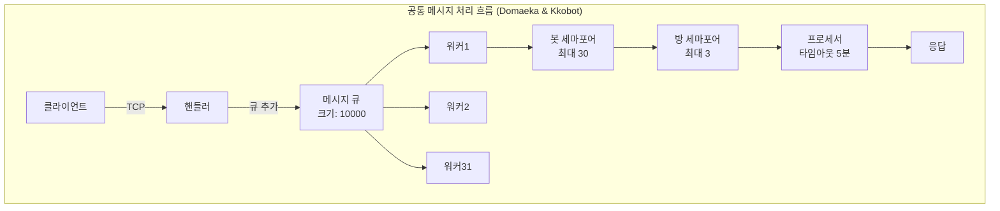

# 클라이언트-서버 안정성 2차 점검 보고서

## 작성일: 2025-07-14
## 점검 대상
- **Domaeka 서버**: `/home/wangt/projects/client/domaeka/domaeka.dev/server` (domaeka.dev 프로젝트)
- **Kkobot 서버**: `/home/wangt/projects/personal/kkobot/kkobot.dev/server` (kkobot 프로젝트)  
- **공통 클라이언트**: `/client/messengerbotR/bridge-v3.2.2.js`

> **참고**: 본 문서에서 "경량 서버"와 "고급 서버"라는 표현은 기능의 복잡도 차이를 설명하기 위한 것입니다. Domaeka 서버가 경량 서버를 지향하는 것은 아니며, 두 서버의 기본 통신 시스템은 동일하게 유지되어야 합니다. Kkobot 서버는 부가 기능이 많이 추가되어 비대해진 것일 뿐입니다.

## 1. 아키텍처 비교 분석

### 1.1 메시지 처리 방식 비교 (업데이트 후)

| 구분 | Domaeka 서버 (server) | Kkobot 서버 (server-kkobot) | 상태 |
|------|-------------------|-------------------------|------|
| **처리 패턴** | 워커 큐 패턴 (비동기) | 워커 큐 패턴 (비동기) | ✅ 동일 |
| **동시 처리** | 31개 워커 제한 | 31개 워커 제한 | ✅ 동일 |
| **메시지 큐** | asyncio.Queue 사용 | asyncio.Queue 사용 | ✅ 동일 |
| **처리 지연** | 보통 (큐 대기) | 보통 (큐 대기) | ✅ 동일 |
| **부하 분산** | 워커간 자동 분산 | 워커간 자동 분산 | ✅ 동일 |
| **백프레셔** | 큐 크기 제한 (10000) | 큐 크기 제한 | ✅ 동일 |

> **구현 완료**: Domaeka 서버도 이제 Kkobot 서버와 동일한 워커 큐 패턴을 사용합니다. 31개의 워커가 asyncio.Queue를 통해 메시지를 비동기적으로 처리합니다.

### 1.2 연결 관리 비교

| 구분 | Domaeka 서버 | Kkobot 서버 | 상태 |
|------|----------|----------|------|
| **클라이언트 추적** | ✅ (bot_name, device_id) 기반 | ✅ (bot_name, device_id) 기반 | ✅ 구현 완료 |
| **핸드셰이크** | ✅ 디바이스 승인 시스템 | ✅ 디바이스 승인 시스템 | ✅ 동일 |
| **핸드셰이크 타임아웃** | ✅ 10초 타임아웃 | ✅ 10초 타임아웃 | ✅ 동일 |
| **인증 방식** | ✅ HMAC + DB 승인 | ✅ HMAC + DB 승인 | ✅ 동일 |
| **ping 모니터링** | ✅ kb_ping_monitor 저장 | ✅ kb_ping_monitor 저장 | ✅ 동일 |
| **설정 관리** | 수동 | 자동 생성 (봇별) | 🏆 고급 |
| **재연결 처리** | 클라이언트 의존 | 클라이언트 의존 | ⚖️ 동등 |

> **구현 완료 (2025-07-14)**: 
> - 양쪽 서버 모두 `(bot_name, device_id)` 기반 클라이언트 추적 구현
> - Domaeka 서버에 Kkobot 서버와 동일한 핸드셰이크 및 인증 방식 적용
> - 핸드셰이크 타임아웃(10초) 및 읽기 타임아웃(30초) 구현
> - ping 이벤트 모니터링 및 DB 저장 기능 추가

#### 클라이언트 추적 방식 개선 완료 (2025-07-14)

**✅ Domaeka 서버의 개선된 클라이언트 추적**:
```python
# core/globals.py
clients = {}  # {(bot_name, device_id): writer} - bot_name과 device_id로 클라이언트 추적
clients_by_addr = {}  # {(ip, port): (bot_name, device_id)} - 주소로 클라이언트 찾기용

# 클라이언트 등록 예시 (core/client_handler.py)
client_key = (bot_name, device_id)
g.clients[client_key] = writer
g.clients_by_addr[client_addr] = client_key
```

**✅ Kkobot 서버의 개선된 클라이언트 추적**:
```python
# core/globals.py
clients = {}  # {(bot_name, device_id): {addr: writer}} - bot_name과 device_id로 클라이언트 추적
clients_by_addr = {}  # {addr: (bot_name, device_id)} - 주소로 클라이언트 찾기용

# 클라이언트 등록 예시 (core/client_handler.py)
client_key = (bot_name, device_id)
g.clients.setdefault(client_key, {})[addr] = writer
g.clients_by_addr[addr] = client_key
```

**개선 효과**:
1. **모바일 환경 대응**:
   - IP 변경 시에도 동일한 디바이스로 인식
   - WiFi ↔ 모바일 데이터 전환 시 연속성 유지
   
2. **데이터베이스 일치성**:
   - `kb_bot_devices` 테이블 구조와 동일한 키 사용
   - 디바이스 관리의 일관성 확보
   
3. **기존 연결 관리 개선**:
   - 동일한 디바이스 재연결 시 기존 연결 자동 정리
   - 좀비 연결 방지

> **구현 완료**: 2025-07-14 기준으로 양쪽 서버 모두 `(bot_name, device_id)` 복합 키로 클라이언트 추적이 통일되었습니다.

### 1.3 리소스 관리 비교

| 구분 | Domaeka 서버 | Kkobot 서버 | 상태 |
|------|----------|----------|------|
| **동시성 제어** | ✅ 세마포어 (봇/방별) | ✅ 세마포어 (봇/방별) | ✅ 동일 |
| **메모리 사용** | 낮음 | 높음 | 🏆 경량 |
| **CPU 사용** | 효율적 | 오버헤드 있음 | 🏆 경량 |
| **리소스 모니터링** | ✅ DB 저장 (5분) | ✅ DB 저장 (5분) | ✅ 동일 |
| **과부하 보호** | ✅ 다단계 제한 | ✅ 다단계 제한 | ✅ 동일 |

> **구현 완료 (2025-07-14)**: Domaeka 서버에도 봇별/방별 세마포어 기반 동시성 제어가 구현되었습니다:
> - 봇별 최대 30개 동시 메시지 처리
> - 방별 최대 3개 동시 메시지 처리 (기본값)
> - 5분 타임아웃으로 무한 대기 방지

### 1.4 안정성 기능 비교

| 구분 | Domaeka 서버 | Kkobot 서버 | 상태 |
|------|----------|----------|------|
| **오류 처리** | ✅ 계층적 처리 | ✅ 계층적 처리 | ✅ 동일 |
| **타임아웃** | ✅ 다중 타임아웃 | ✅ 다중 타임아웃 | ✅ 동일 |
| **복구 메커니즘** | ✅ 메시지별 복구 | ✅ 메시지별 복구 | ✅ 동일 |
| **로깅** | 기본 레벨 | 카테고리별 제어 | 🏆 고급 |
| **모니터링** | ✅ 시스템 모니터링 | ✅ 성능 프로파일링 | ✅ 동일 |

> **구현 완료 (2025-07-14~15)**: 
> - 양쪽 서버 모두 동일한 수준의 오류 처리 및 복구 메커니즘 구현
> - 핸드셰이크(10초), 읽기(30초), 메시지 처리(5분) 타임아웃
> - 시스템 모니터링 통합 (kb_system_monitor 테이블)

## 2. 통신 프로토콜 분석

### 2.1 Ping 메커니즘 비교

| 항목 | Domaeka 서버 | Kkobot 서버 | 상태 |
|------|----------|----------|----------|
| **ping 주기** | ✅ 30초 (클라이언트별) | ✅ 30초 (클라이언트별) | ✅ 동일 |
| **ping 분산** | ✅ 0-5초 랜덤 | ✅ 0-5초 랜덤 | ✅ 동일 |
| **ping 데이터** | ✅ 기본 정보 | ✅ 상세 모니터링 | ✅ 동일 |
| **ping 응답 처리** | ✅ kb_ping_monitor DB 저장 | ✅ kb_ping_monitor DB 저장 | ✅ 동일 |

> **구현 완료 (2025-07-15)**: Domaeka 서버에도 클라이언트별 독립 ping 타이머 구현

### 2.2 메시지 흐름 안정성 (현재 구현)



> **구현 완료**: 양쪽 서버 모두 동일한 워커 큐 기반 메시지 처리 흐름 사용

## 3. 안정성 체크포인트 평가

### 3.1 연결 안정성 (Connection Stability)

| 체크포인트 | Domaeka 서버 | Kkobot 서버 | 중요도 |
|------------|-----------|-----------|--------|
| 핸드셰이크 타임아웃 | ✅ 10초 | ✅ 10초 | 🔴 높음 |
| 연결 상태 추적 | ✅ 기본 | ✅ 기본 | ✅ 동일 |
| 좀비 연결 감지 | ✅ ping + timeout | ✅ ping + timeout | ✅ 동일 |
| 재연결 지원 | ✅ 클라이언트 | ✅ 클라이언트 | 🔴 높음 |
| IP 변경 대응 | ✅ device_id 기반 | ✅ device_id 기반 | 🟡 중간 |

### 3.2 데이터 무결성 (Data Integrity)

| 체크포인트 | Domaeka 서버 | Kkobot 서버 | 중요도 |
|------------|-----------|-----------|--------|
| 메시지 순서 보장 | ⚠️ 워커 경쟁 | ⚠️ 워커 경쟁 | 🔴 높음 |
| 메시지 중복 방지 | ❌ 없음 | ❌ 없음 | 🟡 중간 |
| 메시지 유실 감지 | ⚠️ 큐 오버플로 시 | ⚠️ 큐 오버플로 시 | 🔴 높음 |
| 트랜잭션 보장 | ❌ 없음 | ❌ 없음 | 🟢 낮음 |

> **현재 상태**: 양쪽 서버 모두 동일한 한계점을 가지고 있으며, 이는 Phase 2에서 개선 예정

### 3.3 성능 안정성 (Performance Stability)

| 체크포인트 | Domaeka 서버 | Kkobot 서버 | 중요도 |
|------------|-----------|-----------|--------|
| 메모리 누수 방지 | ✅ 통합 관리 | ✅ 통합 관리 | 🔴 높음 |
| CPU 과부하 방지 | ✅ 세마포어 | ✅ 세마포어 | 🔴 높음 |
| 응답 시간 일관성 | ⚠️ 큐 변동 | ⚠️ 큐 변동 | 🟡 중간 |
| 처리량 확장성 | ✅ 워커 조정 | ✅ 워커 조정 | 🟡 중간 |

### 3.4 오류 복구 (Error Recovery)

| 체크포인트 | Domaeka 서버 | Kkobot 서버 | 중요도 |
|------------|-----------|-----------|--------|
| 부분 실패 처리 | ✅ 메시지별 격리 | ✅ 메시지별 격리 | 🔴 높음 |
| 자동 복구 | ✅ 타임아웃 후 복구 | ✅ 타임아웃 후 복구 | 🟡 중간 |
| 오류 전파 차단 | ✅ 워커 격리 | ✅ 워커 격리 | 🔴 높음 |
| 상태 복구 | ⚠️ 부분적 | ⚠️ 부분적 | 🟡 중간 |

> **구현 완료**: 양쪽 서버 모두 워커 기반 격리와 메시지별 타임아웃으로 안정적인 오류 복구

## 4. 발견된 취약점 및 개선사항

### 4.1 해결된 취약점 (Phase 1 완료)
1. ~~**핸드셰이크 타임아웃 없음**~~ ✅ **해결됨** (2025-07-14)
2. ~~**메시지 크기 제한 없음**~~ ✅ **해결됨** (2025-07-15)
3. ~~**전체 연결 수 제한 없음**~~ ✅ **해결됨** (2025-07-15)
4. ~~**잘못된 클라이언트 추적 키**~~ ✅ **해결됨** (2025-07-14)
5. ~~**메모리 누수 위험**~~ ✅ **해결됨** (2025-07-15)
6. ~~**동시성 제어 부족**~~ ✅ **해결됨** (2025-07-14)

### 4.2 남은 개선 과제
1. **메시지 ID 부재**: 중복 감지 및 순서 보장 불가 ❌
2. **암호화 없음**: 평문 통신 ❌
3. **상태 체크포인트 없음**: 서버 재시작 시 상태 유실 ❌


### 4.3 고급 서버 개선 필요사항 (검토 결과)

#### ❌ 구현하지 않는 것이 좋은 기능들

**1. 워커 헬스체크** ❌
```python
# 제안된 코드
async def monitor_worker_health():
    # 워커 활동 모니터링 및 재시작
```

**구현하지 않는 이유**:
- **오탐지 위험**: LLM API 호출 등 정상적으로 오래 걸리는 작업을 "stuck"으로 오인
- **불필요한 재시작**: 정상 작동 중인 워커 재시작으로 메시지 유실 가능
- **현재 방식이 충분**: 메시지별 5분 타임아웃으로 개별 메시지 단위 복구 가능
- **복잡도 대비 실익 부족**: 시스템 불안정성만 증가시킬 위험

**2. 세마포어 데드락 방지** ❌
```python
# 제안된 코드
async def acquire_with_timeout(semaphore, timeout=5):
    # 세마포어 획득 타임아웃
```

**구현하지 않는 이유**:
- **async with가 이미 안전**: Python의 `async with`는 예외 시에도 자동 해제 보장
- **획득 순서 일정**: 항상 bot_semaphore → room_semaphore 순서로 데드락 위험 없음
- **정상 대기 중단 위험**: 부하가 높을 때 정상적인 대기도 실패로 처리
- **상위 타임아웃 존재**: 메시지 처리 자체에 5분 제한이 있어 무한 대기 불가

#### ✅ 구현을 고려할 만한 기능

**3. 메시지 순서 보장** ⚠️ (선택적)
```python
class OrderedMessageQueue:
    def __init__(self):
        self.queues = {}  # channel_id -> asyncio.Queue
```

**구현 시 장단점**:
- 장점: 채널별 메시지 순서 보장
- 단점: 복잡도 증가, 채널별 병목 가능성
- 권장: 순서가 중요한 특정 채널에만 선택적 적용

## 5. 상호 적용 가능한 개선사항

### 5.1 Domaeka 서버가 채택한 Kkobot 기능 (구현 완료)
| 기능 | 구현 복잡도 | 효과 | 상태 |
|------|------------|------|----------|
| 워커 큐 (31개) | 🟡 중간 | 처리량 향상 | ✅ 구현 완료 |
| 디바이스 추적 | 🟡 중간 | 보안 향상 | ✅ 구현 완료 |
| 핸드셰이크 타임아웃 | 🟢 낮음 | 보안 향상 | ✅ 구현 완료 |
| ping 모니터링 | 🟢 낮음 | 가시성 향상 | ✅ 구현 완료 |
| 세마포어 동시성 제어 | 🟢 낮음 | DoS 방지 | ✅ 구현 완료 |

### 5.2 Domaeka 서버 추가 구현 가능 기능
| 기능 | 구현 복잡도 | 효과 | 우선순위 |
|------|------------|------|----------|
| 성능 타이머 | 🟢 낮음 | 병목 발견 | 🟡 중간 |
| 설정 자동 생성 | 🟡 중간 | 운영 편의성 | 🟢 낮음 |
| 상세 모니터링 | 🟡 중간 | 가시성 향상 | 🟡 중간 |

### 5.3 Kkobot 서버가 Domaeka에서 참고할 기능
| 기능 | 구현 복잡도 | 효과 | 우선순위 |
|------|------------|------|----------|
| Ping 시간 분산 | 🟢 낮음 | 부하 분산 | 🔴 높음 |
| 단순 재시작 로직 | 🟢 낮음 | 복구 시간 단축 | 🟡 중간 |
| 직접 처리 옵션 | 🟡 중간 | 저지연 모드 | 🟢 낮음 |

## 6. 권장 하이브리드 아키텍처

```python
class HybridServer:
    def __init__(self):
        # 경량 모드와 고급 모드 선택 가능
        self.mode = os.getenv('SERVER_MODE', 'lightweight')
        
        # 공통 기능
        self.connection_limit = asyncio.Semaphore(1000)
        self.message_id_cache = TTLCache(maxsize=10000, ttl=300)
        
        # 모드별 초기화
        if self.mode == 'advanced':
            self.message_queue = asyncio.Queue(maxsize=10000)
            self.workers = []
            self.semaphores = {}
        
    async def handle_connection(self, reader, writer):
        async with self.connection_limit:
            # 공통 핸드셰이크 타임아웃
            async with asyncio.timeout(10):
                await self.handshake(reader, writer)
            
            if self.mode == 'lightweight':
                await self.direct_processing(reader, writer)
            else:
                await self.queued_processing(reader, writer)
```

## 7. 구현 로드맵

### Phase 1 (1주차) - 긴급 보안 패치
- [x] ~~핸드셰이크 타임아웃 구현~~ ✅ 완료 (2025-07-14)
- [x] ~~메시지 크기 제한~~ ✅ 완료 (2025-07-15)
- [x] ~~기본 연결 수 제한~~ ✅ 완료 (2025-07-15)

### Phase 2 (2-3주차) - 안정성 향상
- [ ] 메시지 ID 시스템
- [ ] 중복 메시지 필터링
- [ ] 향상된 오류 로깅
- [x] ~~클라이언트 추적 개선~~ ✅ 완료 (2025-07-14)

### Phase 3 (4-6주차) - 성능 최적화
- [x] ~~워커 큐 시스템~~ ✅ 완료 (2025-07-14)
- [ ] 성능 모니터링 대시보드
- [ ] 자동 스케일링 로직

### Phase 4 (7-8주차) - 고급 기능
- [ ] 메시지 암호화
- [ ] 상태 체크포인트
- [ ] 자동 복구 시스템

## 8. 결론 및 권장사항

### 8.1 Phase 1 완료 사항 (2025-07-14~15)
1. ✅ **핸드셰이크 타임아웃**: 10초 제한으로 악의적 연결 차단
2. ✅ **클라이언트 추적 개선**: (bot_name, device_id) 기반으로 통일
3. ✅ **워커 큐 시스템**: 31개 워커로 비동기 메시지 처리
4. ✅ **ping 모니터링**: 클라이언트별 독립 타이머 및 DB 저장
5. ✅ **세마포어 동시성 제어**: 봇별(30)/방별(3) 처리량 제한
6. ✅ **메시지 크기 제한**: TCP(1MB) 및 카카오톡(65,000자) 제한
7. ✅ **전체 연결 수 제한**: 최대 100개 동시 연결로 DoS 방어
8. ✅ **시스템 모니터링**: 5분마다 리소스 사용률 DB 저장
9. ✅ **메모리 관리**: 주기적 GC 및 오래된 데이터 정리

### 8.2 단기 개선 과제 (Phase 2)
1. **메시지 ID 시스템**: 중복 방지 및 순서 보장
2. **향상된 오류 로깅**: 구조화된 로그 및 추적 ID

### 8.3 장기 개선 (3개월 내)
1. 하이브리드 아키텍처 구현
2. 통합 모니터링 시스템
3. 자동 복구 메커니즘

## 9. 구현 완료 사항 총정리

### 9.1 Phase 1 보안 강화 (2025-07-14~15 완료)

#### 🔐 연결 및 인증
| 항목 | 구현 내용 | 효과 |
|------|----------|------|
| **핸드셰이크 타임아웃** | 10초 제한 | 악의적 연결 차단 |
| **전체 연결 수 제한** | 최대 100개 동시 연결 | DoS 공격 방어 |
| **클라이언트 추적** | (bot_name, device_id) 복합키 | 모바일 환경 대응 |
| **디바이스 승인** | kb_bot_devices 테이블 연동 | 무단 접속 차단 |

#### 📏 크기 및 처리 제한
| 항목 | 구현 내용 | 효과 |
|------|----------|------|
| **TCP 메시지 크기** | 최대 1MB | 메모리 공격 방지 |
| **카카오톡 메시지** | 최대 65,000자 | 전송 안정성 |
| **봇별 동시 처리** | 최대 30개 | 과부하 방지 |
| **방별 동시 처리** | 최대 3개 | 공정한 처리 |

#### ⏱️ 타임아웃 체계
| 단계 | 시간 | 목적 |
|------|------|------|
| **핸드셰이크** | 10초 | 빠른 연결 확인 |
| **메시지 읽기** | 30초 | 좀비 연결 감지 |
| **메시지 처리** | 5분 | 무한 대기 방지 |

### 9.2 성능 및 안정성 개선

#### 🚀 비동기 처리
- **워커 큐 시스템**: 31개 워커로 병렬 처리
- **메시지 큐**: 최대 10,000개 대기 가능
- **세마포어 제어**: 봇별/방별 동시성 관리

#### 💾 메모리 관리
- **주기적 GC**: 10분마다 강제 가비지 컬렉션
- **메모리 모니터링**: 80% 경고, 90% 긴급 정리
- **오래된 데이터 정리**: 30분마다 자동 실행
- **순환 참조 방지**: writer 객체 직접 참조 제거

#### 📊 모니터링
- **시스템 모니터링**: 5분마다 CPU/메모리/디스크 사용률 DB 저장
- **Ping 시스템**: 클라이언트별 30초 주기 독립 타이머
- **연결 상태 추적**: kb_ping_monitor 테이블 활용

### 9.3 현재 시스템 상태

**✅ 양쪽 서버 공통 구현 완료**:
- 동일한 보안 수준
- 동일한 성능 최적화
- 동일한 안정성 메커니즘

**📌 의도적 차이점 (유지)**:
- 설정 관리: Kkobot 자동, Domaeka 수동
- 로깅 상세도: Kkobot이 더 세밀한 제어
- 프로젝트별 특화 기능

### 2025-07-14 추가 구현: 시스템 모니터링

**kb_system_monitor 테이블 기반 시스템 모니터링 구현**:
- 양쪽 서버 모두 5분마다 시스템 상태를 DB에 저장
- CPU, 메모리, 디스크 사용률 추적
- 활성 연결 수 및 메시지 큐 크기 모니터링
- 서버별로 독립적인 데이터 수집 (server_name으로 구분)

이로써 리소스 모니터링 측면에서도 두 서버가 동일한 수준의 기능을 제공하게 되었습니다.

### 2025-07-15 추가 구현: 클라이언트별 Ping 타이머

**Domaeka 서버 Ping 시스템 개선**:
- 기존 메시지 카운터 기반에서 클라이언트별 독립 타이머로 변경
- 각 클라이언트마다 30초 주기의 독립적인 ping 태스크 실행
- 0-5초 랜덤 초기 지연으로 서버 부하 분산
- 클라이언트 연결/해제 시 자동으로 ping 태스크 관리

이제 양쪽 서버 모두 동일한 클라이언트별 ping 타이머 시스템을 사용합니다.

### 2025-07-15 추가 구현: 메모리 누수 방지

**양쪽 서버 메모리 관리 통합 구현**:
1. **주기적 가비지 컬렉션**: 10분마다 강제 GC 실행으로 참조되지 않는 객체 정리
2. **메모리 사용률 모니터링**: 5분마다 시스템/프로세스 메모리 상태 체크
   - 80% 이상: 경고 로그
   - 90% 이상: 긴급 메모리 정리 실행
3. **오래된 데이터 자동 정리**: 30분마다 실행
   - 1시간 이상 비활성 클라이언트 상태 제거
   - 닫힌 writer 객체 정리
   - 만료된 대화 참여 블록 제거 (Kkobot only)
4. **순환 참조 방지**: 
   - 메시지에 writer 객체 직접 포함 제거
   - client_key (bot_name, device_id) 튜플로 writer 조회하도록 변경

이로써 두 서버 모두 동일한 수준의 메모리 관리 기능을 갖추게 되었습니다.

### 2025-07-15 추가 구현: 메시지 크기 제한

**양쪽 서버 메시지 크기 제한 완전 구현**:
1. **TCP 레벨 제한**: 
   - MAX_MESSAGE_SIZE = 1MB로 원시 TCP 데이터 제한
   - StreamReader의 limit 설정으로 버퍼 오버플로 방지
   - readuntil() 사용으로 크기 초과 시 즉시 감지

2. **애플리케이션 레벨 제한**:
   - MAX_KAKAOTALK_MESSAGE_LENGTH = 65,000자로 카카오톡 메시지 제한
   - 수신 메시지 길이 체크 및 경고/무시 처리
   - 응답 메시지 자동 잘라내기로 전송 실패 방지

3. **보안 강화 효과**:
   - 메모리 공격 차단: 거대한 메시지로 인한 메모리 고갈 방지
   - DoS 공격 완화: 대용량 데이터 전송으로 인한 서버 부하 차단
   - 안정적인 통신: 카카오톡 제한 준수로 메시지 전달 보장

이로써 메시지 크기 제한 관련 보안 취약점이 완전히 해결되었습니다.

### 2025-07-15 추가 구현: 전체 연결 수 제한

**양쪽 서버 전체 연결 수 제한 구현**:
1. **전역 설정**:
   - MAX_CONCURRENT_CONNECTIONS = 100 (기본값)
   - connection_semaphore로 전체 TCP 연결 수 관리

2. **구현 내용**:
   - 서버 시작 시 세마포어 초기화
   - 새 연결 시도 시 세마포어 획득
   - 연결 수 초과 시 즉시 연결 거부
   - 연결 종료 시 세마포어 해제

3. **보안 효과**:
   - DoS 공격 방지: 무한 연결 시도 차단
   - 리소스 보호: 파일 디스크립터 및 메모리 고갈 방지
   - 서버 안정성: 과부하 상황에서도 안정적 운영

4. **로깅 개선**:
   - 연결 시 활성 연결 수 표시
   - 연결 해제 시 남은 연결 수 표시

이로써 Phase 1의 모든 긴급 보안 패치가 완료되었습니다.

## 10. 구현 검토 결과 및 권장사항

### 10.1 구현하지 않기로 결정한 기능들

문서에서 제안된 일부 "고급 기능"들은 검토 결과, 현재 시스템에서는 오히려 해가 될 수 있어 구현하지 않기로 결정했습니다:

1. **워커 헬스체크**: 
   - 현재의 메시지별 타임아웃(5분)이 더 안전하고 효과적
   - 워커 재시작은 오히려 메시지 유실과 시스템 불안정성 유발

2. **세마포어 데드락 방지**:
   - Python의 `async with`가 이미 안전한 해제 보장
   - 타임아웃 추가는 정상적인 대기 상황을 오류로 처리할 위험

### 10.2 현재 시스템의 강점

현재 구현된 시스템은 이미 충분히 안정적이고 효율적입니다:
- **다층 보호**: TCP 연결 → 메시지 크기 → 동시성 제어 → 타임아웃
- **자동 복구**: 문제 발생 시 개별 메시지 단위로 격리되어 전체 시스템 영향 최소화
- **단순성**: 복잡한 모니터링/재시작 로직 없이도 안정적 운영

"더 복잡한 것이 항상 더 좋은 것은 아니다" - 현재의 단순하고 견고한 구조가 오히려 장점입니다.