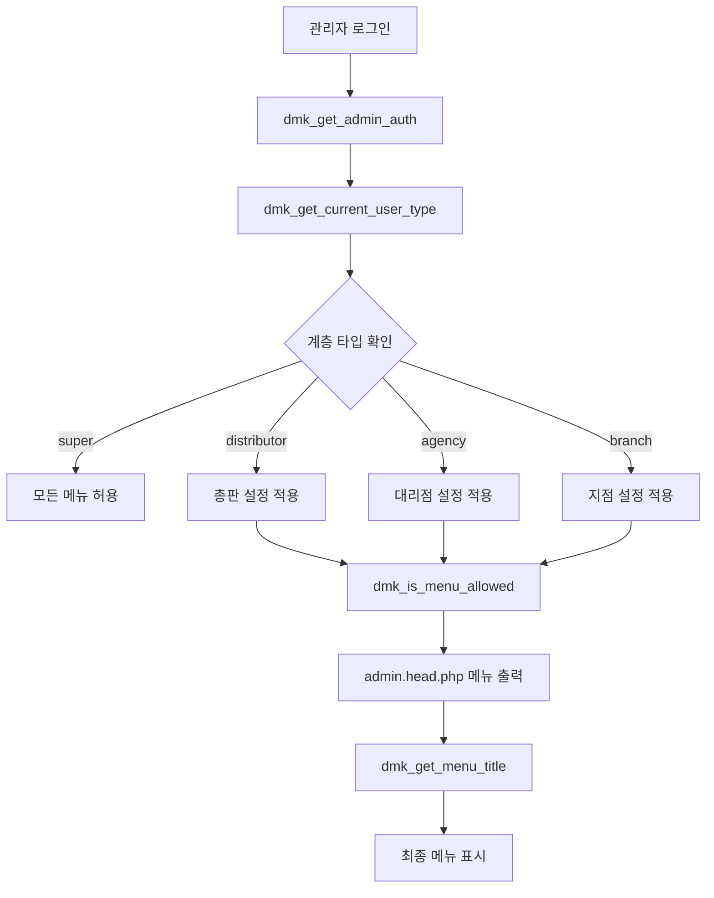

# 도매까 계층별 메뉴 시스템

## 개요

도매까 시스템에서 **본사(super) - 총판(distributor) - 대리점(agency) - 지점(branch)**의 4단계 계층 구조에 따른 관리자 메뉴 권한을 중앙 집중식으로 관리하는 시스템입니다.

## 🗂️ 파일 구조

```
dmk/
├── dmk_global_settings.php          # 전역 메뉴 설정 파일 (⭐ 핵심)
├── adm/lib/admin.auth.lib.php       # 권한 라이브러리 (개선됨)
└── test_menu_debug.php              # 디버그 페이지

adm/
├── _common.php                      # 전역 설정 포함 추가
└── admin.head.php                   # 메뉴 제목 변경 로직 추가
```

## 🎯 주요 기능

### 1. 계층별 메뉴 권한 제어
- ✅ **총판**: 환경설정, 게시판관리, SMS관리 숨김
- ✅ **대리점**: 환경설정, 게시판관리, SMS관리 숨김  
- ✅ **지점**: 환경설정, 게시판관리, SMS관리 숨김

### 2. 계층별 메뉴 제목 변경
- ✅ **총판/대리점/지점**: "주문관리" → "쇼핑몰관리"
- ✅ **전체**: "도매까 관리" 메뉴 제목 통일

### 3. 계층별 서브메뉴 자동 생성
- ✅ **총판**: 총판관리, 대리점관리, 지점관리, 분류관리(전용) 등
- ✅ **대리점**: 대리점관리(자신만), 지점관리(자신의 지점만) 등  
- ✅ **지점**: 지점관리(자신만), 통계분석(자신만) 등

## 📋 메뉴 코드 체계

| 코드 범위 | 메뉴 분류 | 설명 |
|----------|----------|------|
| `100XXX` | 환경설정 | 시스템 전반 설정 |
| `200XXX` | 도매까 관리 | 계층 관리, 권한 설정 |
| `300XXX` | 회원관리 | 회원 정보 관리 |
| `400XXX` | 게시판관리 | 게시판 설정 관리 |
| `500XXX` | 쇼핑몰관리 | 상품, 주문, 재고 관리 |
| `600XXX` | 쇼핑몰현황/기타 | 통계, 매출 현황 |
| `700XXX` | SMS관리 | SMS 발송 관리 |

## 🔧 설정 방법

### 1. 메뉴 권한 변경

`dmk/dmk_global_settings.php` 파일에서 `$DMK_MENU_CONFIG` 배열을 수정:

```php
// 총판(distributor) 설정 예시
'distributor' => array(
    'allowed_menus' => array(
        '200000', '200100', '200200',  // 허용할 메뉴 코드 목록
        '300000', '300100',
        '500000', '500100', '500200'
    ),
    'menu_titles' => array(
        '500000' => '쇼핑몰관리'       // 메뉴 제목 변경
    ),
    'sub_menus' => array(
        '200000' => array(             // 서브메뉴 정의
            '200100' => '총판관리',
            '200200' => '대리점관리'
        )
    )
)
```

### 2. 새로운 계층 추가

1. `$DMK_MENU_CONFIG`에 새 계층 설정 추가
2. `dmk_get_current_user_type()` 함수에 새 계층 타입 추가
3. 기존 권한 라이브러리에 새 상수 정의

### 3. 메뉴 제목 변경

```php
'menu_titles' => array(
    '메뉴코드' => '새로운 제목'
)
```

## 🧪 테스트 및 디버깅

### 디버그 페이지 접속
관리자 로그인 후 다음 URL로 접속:
```
http://도메인/dmk/test_menu_debug.php
```

### 확인 사항
- ✅ 현재 사용자의 계층 타입
- ✅ DMK 관리자 정보
- ✅ 메뉴별 권한 허용/거부 상태
- ✅ 계층별 커스텀 메뉴 제목
- ✅ 서브메뉴 설정 확인

## 🏗️ 시스템 아키텍처



## 📊 계층별 메뉴 권한 매트릭스

| 메뉴 | 본사 | 총판 | 대리점 | 지점 |
|------|------|------|--------|------|
| 환경설정 | ✅ | ❌ | ❌ | ❌ |
| 도매까 관리 | ✅ | ✅ | ✅ | ✅ |
| 회원관리 | ✅ | ✅ | ✅ | ✅ |
| 게시판관리 | ✅ | ❌ | ❌ | ❌ |
| 쇼핑몰관리 | ✅ | ✅ | ✅ | ✅ |
| 쇼핑몰현황/기타 | ✅ | ✅ | ✅ | ✅ |
| SMS관리 | ✅ | ❌ | ❌ | ❌ |

## 🔍 핵심 함수

### `dmk_is_menu_allowed($menu_code, $user_type)`
- **목적**: 특정 메뉴 코드가 해당 계층에서 허용되는지 확인
- **반환**: `boolean`

### `dmk_get_menu_title($menu_code, $user_type)`
- **목적**: 계층별 커스텀 메뉴 제목 가져오기
- **반환**: `string|null`

### `dmk_get_sub_menus($parent_menu_code, $user_type)`
- **목적**: 계층별 서브메뉴 목록 가져오기
- **반환**: `array`

### `dmk_get_current_user_type()`
- **목적**: 현재 로그인한 사용자의 계층 타입 확인
- **반환**: `'super'|'distributor'|'agency'|'branch'|'none'`

## 🚀 적용 방법

1. **파일 업로드**: 모든 구현 파일을 서버에 업로드
2. **권한 확인**: DMK 관리자 테이블에 올바른 `dmk_mb_type` 값 설정
3. **테스트**: 각 계층별 관리자로 로그인하여 메뉴 표시 확인
4. **디버깅**: 문제 발생 시 디버그 페이지에서 상태 확인

## 🛠️ 향후 확장 가능성

- ✨ **동적 메뉴 설정**: 데이터베이스 기반 메뉴 권한 관리
- ✨ **세부 권한**: 서브메뉴별 CRUD 권한 세분화
- ✨ **권한 상속**: 상위 계층 권한 자동 상속 기능
- ✨ **메뉴 그룹화**: 기능별 메뉴 그룹 관리
- ✨ **실시간 권한 변경**: 관리자 페이지에서 실시간 권한 수정

## 📝 주의사항

- ⚠️ **최고 관리자**: 항상 모든 메뉴에 접근 가능
- ⚠️ **캐시**: 메뉴 설정 변경 후 브라우저 캐시 클리어 필요
- ⚠️ **호환성**: 기존 그누보드/영카트 권한 시스템과 병행 운영
- ⚠️ **보안**: DMK 관리자 정보 유효성 검증 필수 