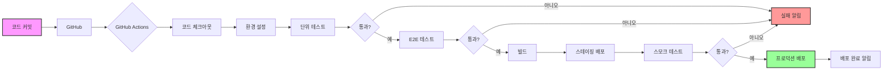

# CI/CD 통합 및 자동화 방안

## 1. 개요

도메까 계층형 관리자 시스템의 테스트 자동화를 CI/CD 파이프라인에 통합하여 코드 변경 시 자동으로 테스트가 실행되고, 문제를 조기에 발견할 수 있도록 합니다.

### 1.1 목표
- **지속적 통합**: 코드 커밋 시 자동 테스트 실행
- **품질 게이트**: 테스트 실패 시 배포 차단
- **신속한 피드백**: 개발자에게 즉각적인 테스트 결과 전달
- **자동화된 배포**: 테스트 통과 시 자동 배포
- **모니터링 및 리포팅**: 테스트 메트릭 추적 및 분석

## 2. CI/CD 파이프라인 아키텍처



## 3. GitHub Actions 워크플로우

### 3.1 메인 CI/CD 워크플로우

```yaml
# .github/workflows/main-ci-cd.yml
name: Main CI/CD Pipeline

on:
  push:
    branches: [ main, develop ]
  pull_request:
    branches: [ main ]
  workflow_dispatch:
    inputs:
      environment:
        description: 'Deployment environment'
        required: true
        default: 'staging'
        type: choice
        options:
        - staging
        - production

env:
  PHP_VERSION: '7.4'
  NODE_VERSION: '18'
  MYSQL_VERSION: '5.7'

jobs:
  # 1. 코드 품질 검사
  code-quality:
    name: Code Quality Check
    runs-on: ubuntu-latest
    steps:
      - uses: actions/checkout@v4
      
      - name: Setup PHP
        uses: shivammathur/setup-php@v2
        with:
          php-version: ${{ env.PHP_VERSION }}
          tools: phpcs, phpmd, phpstan
          
      - name: PHP Syntax Check
        run: find . -name "*.php" -not -path "./vendor/*" -exec php -l {} \;
        
      - name: PHP Code Sniffer
        run: phpcs --standard=PSR12 dmk/ adm/
        
      - name: PHP Mess Detector
        run: phpmd dmk/,adm/ text cleancode,codesize,controversial,design,naming,unusedcode
        
      - name: PHPStan Static Analysis
        run: phpstan analyse dmk/ adm/ --level=5

  # 2. 단위 테스트
  unit-tests:
    name: Unit Tests
    runs-on: ubuntu-latest
    needs: code-quality
    
    services:
      mysql:
        image: mysql:${{ env.MYSQL_VERSION }}
        env:
          MYSQL_ROOT_PASSWORD: root
          MYSQL_DATABASE: domaeka_test
        ports:
          - 3306:3306
        options: >-
          --health-cmd="mysqladmin ping"
          --health-interval=10s
          --health-timeout=5s
          --health-retries=3
          
    steps:
      - uses: actions/checkout@v4
      
      - name: Setup PHP
        uses: shivammathur/setup-php@v2
        with:
          php-version: ${{ env.PHP_VERSION }}
          extensions: mbstring, mysql, gd, zip
          tools: composer, phpunit
          
      - name: Cache Composer dependencies
        uses: actions/cache@v3
        with:
          path: vendor
          key: ${{ runner.os }}-composer-${{ hashFiles('**/composer.lock') }}
          restore-keys: |
            ${{ runner.os }}-composer-
            
      - name: Install dependencies
        run: composer install --prefer-dist --no-progress
        
      - name: Setup test database
        run: |
          mysql -h 127.0.0.1 -u root -proot domaeka_test < tests/fixtures/schema.sql
          mysql -h 127.0.0.1 -u root -proot domaeka_test < dmk/sql/001_create_dmk_tables.sql
          
      - name: Run PHPUnit tests
        run: vendor/bin/phpunit --coverage-xml coverage.xml
        
      - name: Upload coverage
        uses: codecov/codecov-action@v3
        with:
          file: ./coverage.xml
          fail_ci_if_error: true

  # 3. E2E 테스트
  e2e-tests:
    name: E2E Tests - ${{ matrix.user-type }}
    runs-on: ubuntu-latest
    needs: unit-tests
    
    strategy:
      fail-fast: false
      matrix:
        user-type: [headquarters, distributor, agency, branch]
        browser: [chromium, firefox]
        
    services:
      mysql:
        image: mysql:${{ env.MYSQL_VERSION }}
        env:
          MYSQL_ROOT_PASSWORD: root
          MYSQL_DATABASE: domaeka_test
        ports:
          - 3306:3306
        options: >-
          --health-cmd="mysqladmin ping"
          --health-interval=10s
          --health-timeout=5s
          --health-retries=3
          
    steps:
      - uses: actions/checkout@v4
      
      - name: Setup environment
        uses: ./.github/actions/setup-test-env
        with:
          php-version: ${{ env.PHP_VERSION }}
          node-version: ${{ env.NODE_VERSION }}
          
      - name: Setup database
        run: |
          mysql -h 127.0.0.1 -u root -proot domaeka_test < database/schema.sql
          mysql -h 127.0.0.1 -u root -proot domaeka_test < tests/fixtures/test-data.sql
          
      - name: Start application server
        run: |
          cp .env.ci .env
          php -S localhost:8000 &
          npx wait-on http://localhost:8000
          
      - name: Install Playwright
        run: |
          npm ci
          npx playwright install --with-deps ${{ matrix.browser }}
          
      - name: Run E2E tests
        run: |
          npx playwright test tests/${{ matrix.user-type }}.spec.ts \
            --project=${{ matrix.browser }} \
            --reporter=junit,html \
            --retries=2
        env:
          BASE_URL: http://localhost:8000
          TEST_USER_TYPE: ${{ matrix.user-type }}
          
      - name: Upload test artifacts
        if: always()
        uses: actions/upload-artifact@v3
        with:
          name: test-results-${{ matrix.user-type }}-${{ matrix.browser }}
          path: |
            test-results/
            playwright-report/
          retention-days: 7

  # 4. 성능 테스트
  performance-tests:
    name: Performance Tests
    runs-on: ubuntu-latest
    needs: e2e-tests
    
    steps:
      - uses: actions/checkout@v4
      
      - name: Setup environment
        uses: ./.github/actions/setup-test-env
        
      - name: Run Lighthouse CI
        run: |
          npm install -g @lhci/cli
          lhci autorun
        env:
          LHCI_GITHUB_APP_TOKEN: ${{ secrets.LHCI_GITHUB_APP_TOKEN }}
          
      - name: Run load tests
        run: |
          npm install -g k6
          k6 run tests/load/scenario.js --out json=load-test-results.json
          
      - name: Analyze results
        run: |
          node scripts/analyze-performance.js load-test-results.json

  # 5. 보안 스캔
  security-scan:
    name: Security Scanning
    runs-on: ubuntu-latest
    needs: e2e-tests
    
    steps:
      - uses: actions/checkout@v4
      
      - name: Run security checks
        run: |
          # PHP 의존성 취약점 검사
          composer audit
          
          # JavaScript 의존성 취약점 검사
          npm audit
          
          # OWASP 의존성 체크
          docker run --rm \
            -v "$PWD":/src \
            -v "$PWD/odc-reports":/report \
            owasp/dependency-check \
            --scan /src \
            --format "ALL" \
            --project "Domaeka"
            
      - name: Upload security reports
        uses: actions/upload-artifact@v3
        with:
          name: security-reports
          path: odc-reports/

  # 6. 빌드 및 패키징
  build:
    name: Build and Package
    runs-on: ubuntu-latest
    needs: [e2e-tests, security-scan]
    
    steps:
      - uses: actions/checkout@v4
      
      - name: Build application
        run: |
          # 프로덕션 의존성만 설치
          composer install --no-dev --optimize-autoloader
          
          # 프론트엔드 빌드
          npm ci --production
          npm run build
          
          # 불필요한 파일 제거
          rm -rf tests/ docs/ .git/
          
      - name: Create deployment package
        run: |
          tar -czf domaeka-${{ github.sha }}.tar.gz \
            --exclude='.env*' \
            --exclude='*.log' \
            --exclude='node_modules' \
            .
            
      - name: Upload build artifacts
        uses: actions/upload-artifact@v3
        with:
          name: deployment-package
          path: domaeka-${{ github.sha }}.tar.gz

  # 7. 스테이징 배포
  deploy-staging:
    name: Deploy to Staging
    runs-on: ubuntu-latest
    needs: build
    if: github.ref == 'refs/heads/develop'
    environment: staging
    
    steps:
      - name: Download artifacts
        uses: actions/download-artifact@v3
        with:
          name: deployment-package
          
      - name: Deploy to staging server
        uses: appleboy/ssh-action@v1.0.0
        with:
          host: ${{ secrets.STAGING_HOST }}
          username: ${{ secrets.STAGING_USER }}
          key: ${{ secrets.STAGING_SSH_KEY }}
          script: |
            cd /var/www/staging
            wget https://github.com/${{ github.repository }}/releases/download/${{ github.sha }}/domaeka-${{ github.sha }}.tar.gz
            tar -xzf domaeka-${{ github.sha }}.tar.gz
            php artisan migrate --force
            php artisan cache:clear
            php artisan config:cache
            
      - name: Run smoke tests
        run: |
          npx playwright test tests/smoke/ --project=chromium
        env:
          BASE_URL: ${{ secrets.STAGING_URL }}

  # 8. 프로덕션 배포
  deploy-production:
    name: Deploy to Production
    runs-on: ubuntu-latest
    needs: deploy-staging
    if: github.ref == 'refs/heads/main'
    environment: production
    
    steps:
      - name: Deploy to production
        uses: ./.github/actions/deploy-production
        with:
          package-name: domaeka-${{ github.sha }}.tar.gz
          
      - name: Verify deployment
        run: |
          curl -f ${{ secrets.PRODUCTION_URL }}/health-check || exit 1
          
      - name: Notify deployment
        uses: 8398a7/action-slack@v3
        with:
          status: ${{ job.status }}
          text: 'Production deployment completed for version ${{ github.sha }}'
        env:
          SLACK_WEBHOOK_URL: ${{ secrets.SLACK_WEBHOOK }}
```

### 3.2 야간 전체 테스트

```yaml
# .github/workflows/nightly-tests.yml
name: Nightly Full Test Suite

on:
  schedule:
    - cron: '0 2 * * *'  # 매일 새벽 2시
  workflow_dispatch:

jobs:
  full-test-suite:
    name: Full Test Suite
    runs-on: ubuntu-latest
    
    strategy:
      matrix:
        test-type: [unit, integration, e2e, performance, security]
        
    steps:
      - uses: actions/checkout@v4
      
      - name: Run ${{ matrix.test-type }} tests
        uses: ./.github/actions/run-tests
        with:
          test-type: ${{ matrix.test-type }}
          coverage: true
          
      - name: Generate test report
        run: |
          node scripts/generate-test-report.js \
            --type=${{ matrix.test-type }} \
            --output=reports/${{ matrix.test-type }}-report.html
            
      - name: Upload reports
        uses: actions/upload-artifact@v3
        with:
          name: nightly-test-reports
          path: reports/
          
  consolidate-reports:
    name: Consolidate Test Reports
    runs-on: ubuntu-latest
    needs: full-test-suite
    
    steps:
      - name: Download all reports
        uses: actions/download-artifact@v3
        
      - name: Generate consolidated report
        run: |
          node scripts/consolidate-reports.js \
            --input=nightly-test-reports \
            --output=consolidated-report.html
            
      - name: Send report email
        uses: dawidd6/action-send-mail@v3
        with:
          server_address: smtp.gmail.com
          server_port: 465
          username: ${{ secrets.EMAIL_USERNAME }}
          password: ${{ secrets.EMAIL_PASSWORD }}
          subject: Nightly Test Report - ${{ github.run_number }}
          to: dev-team@domaeka.com
          from: CI/CD Pipeline
          html_body: file://consolidated-report.html
```

## 4. 로컬 개발 환경 통합

### 4.1 Pre-commit 훅 설정

```bash
# .husky/pre-commit
#!/bin/sh
. "$(dirname "$0")/_/husky.sh"

# PHP 린트 체크
echo "Running PHP lint..."
find . -name "*.php" -not -path "./vendor/*" -print0 | xargs -0 -n1 php -l

# PHPStan 정적 분석
echo "Running PHPStan..."
vendor/bin/phpstan analyse dmk/ --level=5

# 변경된 파일에 대한 Playwright 테스트
echo "Running affected tests..."
npm run test:affected

# 커밋 메시지 검증
echo "Validating commit message..."
npx commitlint --edit $1
```

### 4.2 VS Code 통합

```json
// .vscode/settings.json
{
  "editor.formatOnSave": true,
  "php.validate.executablePath": "/usr/bin/php",
  "phpcs.enable": true,
  "phpcs.standard": "PSR12",
  "playwright.reuseBrowser": true,
  "playwright.showTrace": true,
  
  // 테스트 실행 단축키
  "testing.automaticallyOpenPeekView": "never",
  "testing.defaultGutterClickAction": "run",
  
  // 태스크 러너
  "tasks": {
    "version": "2.0.0",
    "tasks": [
      {
        "label": "Run E2E Tests",
        "type": "npm",
        "script": "test",
        "group": {
          "kind": "test",
          "isDefault": true
        }
      },
      {
        "label": "Run Specific Test",
        "type": "shell",
        "command": "npm test -- ${file}",
        "group": "test"
      }
    ]
  }
}
```

## 5. 모니터링 및 알림

### 5.1 테스트 대시보드

```typescript
// scripts/test-dashboard.ts
import express from 'express';
import { readTestResults, calculateMetrics } from './utils';

const app = express();

app.get('/api/test-metrics', async (req, res) => {
  const results = await readTestResults();
  const metrics = calculateMetrics(results);
  
  res.json({
    summary: {
      totalTests: metrics.total,
      passedTests: metrics.passed,
      failedTests: metrics.failed,
      successRate: metrics.successRate,
      averageDuration: metrics.avgDuration
    },
    byHierarchy: {
      headquarters: metrics.byUserType.headquarters,
      distributor: metrics.byUserType.distributor,
      agency: metrics.byUserType.agency,
      branch: metrics.byUserType.branch
    },
    trends: {
      last7Days: metrics.weeklyTrend,
      last30Days: metrics.monthlyTrend
    }
  });
});

app.listen(3000, () => {
  console.log('Test dashboard running on http://localhost:3000');
});
```

### 5.2 Slack 통합

```javascript
// scripts/slack-notifier.js
const { WebClient } = require('@slack/web-api');
const web = new WebClient(process.env.SLACK_TOKEN);

async function notifyTestResults(results) {
  const blocks = [
    {
      type: 'header',
      text: {
        type: 'plain_text',
        text: `테스트 결과: ${results.status === 'passed' ? '✅ 성공' : '❌ 실패'}`
      }
    },
    {
      type: 'section',
      fields: [
        {
          type: 'mrkdwn',
          text: `*전체 테스트:* ${results.total}`
        },
        {
          type: 'mrkdwn',
          text: `*성공:* ${results.passed}`
        },
        {
          type: 'mrkdwn',
          text: `*실패:* ${results.failed}`
        },
        {
          type: 'mrkdwn',
          text: `*성공률:* ${results.successRate}%`
        }
      ]
    }
  ];
  
  if (results.failed > 0) {
    blocks.push({
      type: 'section',
      text: {
        type: 'mrkdwn',
        text: '*실패한 테스트:*\n' + results.failures.map(f => `• ${f.name}`).join('\n')
      }
    });
  }
  
  await web.chat.postMessage({
    channel: '#dev-alerts',
    blocks,
    attachments: [{
      color: results.status === 'passed' ? 'good' : 'danger',
      footer: `Build #${process.env.GITHUB_RUN_NUMBER}`,
      ts: Date.now() / 1000
    }]
  });
}
```

## 6. 테스트 환경 관리

### 6.1 Docker Compose 설정

```yaml
# docker-compose.test.yml
version: '3.8'

services:
  web:
    build:
      context: .
      dockerfile: Dockerfile.test
    ports:
      - "8000:80"
    environment:
      - APP_ENV=testing
      - DB_HOST=db
      - DB_DATABASE=domaeka_test
      - DB_USERNAME=root
      - DB_PASSWORD=root
    depends_on:
      db:
        condition: service_healthy
    volumes:
      - ./:/var/www/html
      
  db:
    image: mysql:5.7
    environment:
      - MYSQL_ROOT_PASSWORD=root
      - MYSQL_DATABASE=domaeka_test
    ports:
      - "3307:3306"
    healthcheck:
      test: ["CMD", "mysqladmin", "ping", "-h", "localhost"]
      timeout: 20s
      retries: 10
    volumes:
      - db_data:/var/lib/mysql
      - ./tests/fixtures:/docker-entrypoint-initdb.d
      
  playwright:
    image: mcr.microsoft.com/playwright:v1.40.0-focal
    working_dir: /work
    volumes:
      - ./:/work
    environment:
      - BASE_URL=http://web
    command: npm test
    depends_on:
      - web
      
volumes:
  db_data:
```

### 6.2 테스트 데이터 시딩

```php
// tests/fixtures/TestDataSeeder.php
<?php

class TestDataSeeder
{
    private $db;
    
    public function __construct($db)
    {
        $this->db = $db;
    }
    
    public function seed()
    {
        $this->seedUsers();
        $this->seedHierarchy();
        $this->seedProducts();
        $this->seedOrders();
    }
    
    private function seedUsers()
    {
        $users = [
            ['admin', '최고관리자', 10, 'super'],
            ['dist_seoul', '서울총판', 8, 'distributor'],
            ['dist_busan', '부산총판', 8, 'distributor'],
            ['agency_gangnam', '강남대리점', 6, 'agency'],
            ['agency_songpa', '송파대리점', 6, 'agency'],
            ['branch_samsung', '삼성지점', 4, 'branch'],
            ['branch_yeoksam', '역삼지점', 4, 'branch']
        ];
        
        foreach ($users as $user) {
            $this->db->query("
                INSERT INTO g5_member (mb_id, mb_name, mb_level, dmk_type, mb_password)
                VALUES (?, ?, ?, ?, PASSWORD(?))
            ", $user[0], $user[1], $user[2], $user[3], 'test123');
        }
    }
    
    private function seedHierarchy()
    {
        // 총판 등록
        $this->db->query("
            INSERT INTO g5_dmk_distributors (mb_id, name) VALUES
            ('dist_seoul', '서울총판'),
            ('dist_busan', '부산총판')
        ");
        
        // 대리점 등록
        $this->db->query("
            INSERT INTO g5_dmk_agencies (mb_id, distributor_id, name) VALUES
            ('agency_gangnam', 'dist_seoul', '강남대리점'),
            ('agency_songpa', 'dist_seoul', '송파대리점')
        ");
        
        // 지점 등록
        $this->db->query("
            INSERT INTO g5_dmk_branches (mb_id, agency_id, name) VALUES
            ('branch_samsung', 'agency_gangnam', '삼성지점'),
            ('branch_yeoksam', 'agency_gangnam', '역삼지점')
        ");
    }
}
```

## 7. 성능 최적화

### 7.1 병렬 실행 전략

```javascript
// playwright.config.ts
export default defineConfig({
  workers: process.env.CI ? 2 : '50%',
  
  projects: [
    {
      name: 'setup',
      testMatch: /global.setup\.ts/,
    },
    {
      name: 'headquarters',
      dependencies: ['setup'],
      testMatch: /headquarters\.spec\.ts/,
    },
    {
      name: 'distributor',
      dependencies: ['setup'],
      testMatch: /distributor\.spec\.ts/,
    },
    {
      name: 'agency',
      dependencies: ['setup'],
      testMatch: /agency\.spec\.ts/,
    },
    {
      name: 'branch',
      dependencies: ['setup'],
      testMatch: /branch\.spec\.ts/,
    },
  ],
});
```

### 7.2 테스트 캐싱

```yaml
# GitHub Actions 캐시 설정
- name: Cache test results
  uses: actions/cache@v3
  with:
    path: |
      test-results/
      .playwright-cache/
    key: test-cache-${{ github.sha }}
    restore-keys: |
      test-cache-
      
- name: Cache database snapshots
  uses: actions/cache@v3
  with:
    path: tests/fixtures/snapshots/
    key: db-snapshots-${{ hashFiles('tests/fixtures/*.sql') }}
```

## 8. 비용 최적화

### 8.1 리소스 사용 최적화

```yaml
# 조건부 실행
on:
  push:
    paths:
      - 'dmk/**'
      - 'adm/**'
      - 'tests/**'
      - '.github/workflows/**'
    paths-ignore:
      - '**.md'
      - 'docs/**'
```

### 8.2 Self-hosted Runner 활용

```yaml
# Self-hosted runner 설정
runs-on: [self-hosted, linux, x64]

# 또는 매트릭스 전략으로 분산
strategy:
  matrix:
    runner: [self-hosted-1, self-hosted-2, github-hosted]
```

## 9. 문제 해결 가이드

### 9.1 일반적인 CI/CD 문제

| 문제 | 원인 | 해결 방법 |
|------|------|-----------|
| 빌드 실패 | 의존성 버전 충돌 | lock 파일 업데이트 및 캐시 삭제 |
| 테스트 타임아웃 | 느린 네트워크/DB | 타임아웃 값 증가 또는 Mock 사용 |
| 간헐적 실패 | 비동기 처리 문제 | 명시적 대기 추가 |
| 권한 오류 | 파일 시스템 권한 | chmod/chown 명령 추가 |

### 9.2 디버깅 도구

```bash
# GitHub Actions 디버깅
- name: Setup tmate session
  if: ${{ failure() }}
  uses: mxschmitt/action-tmate@v3
  
# 로컬에서 GitHub Actions 실행
act -j e2e-tests --secret-file .env.secrets
```

## 10. 지속적 개선

### 10.1 메트릭 추적

- **빌드 시간**: 평균 10분 이내 목표
- **테스트 커버리지**: 80% 이상 유지
- **배포 빈도**: 주 3회 이상
- **실패율**: 5% 미만 유지

### 10.2 정기 리뷰

- 주간 CI/CD 파이프라인 성능 리뷰
- 월간 테스트 커버리지 분석
- 분기별 인프라 비용 최적화 검토

이 문서는 도메까 시스템의 CI/CD 통합 및 자동화를 위한 종합적인 가이드를 제공합니다.