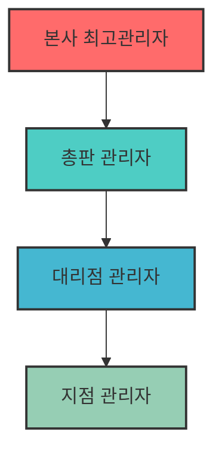

# 계층별 관리자 테스트 전략

## 1. 테스트 전략 개요

도메까 시스템의 4단계 계층 구조(본사-총판-대리점-지점)에서 각 계층별 관리자는 서로 다른 권한과 책임을 가집니다. 이 문서는 각 계층별로 수행해야 할 테스트 시나리오와 검증 포인트를 상세히 정의합니다.



## 2. 계층별 권한 매트릭스

### 2.1 권한 레벨 정의

| 계층 | 권한 레벨 | 영문명 | 주요 역할 |
|------|-----------|--------|-----------|
| 본사 | 10 | super | 전체 시스템 관리, 모든 권한 |
| 총판 | 8 | distributor | 하위 대리점/지점 관리, 상품 배분 |
| 대리점 | 6 | agency | 하위 지점 관리, 재고 관리 |
| 지점 | 4 | branch | 주문 처리, 고객 응대 |

### 2.2 기능별 권한 매트릭스

| 기능 분류 | 세부 기능 | 본사 | 총판 | 대리점 | 지점 |
|-----------|-----------|------|------|--------|------|
| **회원 관리** | 전체 회원 조회 | ✅ | ❌ | ❌ | ❌ |
| | 하위 계층 회원 조회 | ✅ | ✅ | ✅ | ❌ |
| | 회원 등록/수정 | ✅ | ✅ | ✅ | ❌ |
| | 회원 삭제 | ✅ | ❌ | ❌ | ❌ |
| **상품 관리** | 마스터 상품 등록 | ✅ | ❌ | ❌ | ❌ |
| | 상품 가격 설정 | ✅ | ✅ | ❌ | ❌ |
| | 상품 재고 조정 | ✅ | ✅ | ✅ | ❌ |
| | 상품 진열 관리 | ✅ | ✅ | ✅ | ✅ |
| **주문 관리** | 전체 주문 조회 | ✅ | ❌ | ❌ | ❌ |
| | 하위 계층 주문 조회 | ✅ | ✅ | ✅ | ❌ |
| | 자체 주문 조회 | ✅ | ✅ | ✅ | ✅ |
| | 주문 상태 변경 | ✅ | ✅ | ✅ | ✅ |
| **통계/리포트** | 전체 통계 | ✅ | ❌ | ❌ | ❌ |
| | 하위 계층 통계 | ✅ | ✅ | ✅ | ❌ |
| | 자체 통계 | ✅ | ✅ | ✅ | ✅ |
| **시스템 설정** | 전역 설정 | ✅ | ❌ | ❌ | ❌ |
| | 권한 관리 | ✅ | ❌ | ❌ | ❌ |
| | 메뉴 설정 | ✅ | ❌ | ❌ | ❌ |

## 3. 계층별 테스트 시나리오

### 3.1 본사 관리자 테스트 시나리오

#### 3.1.1 전체 시스템 관리
```gherkin
Feature: 본사 관리자 전체 시스템 관리
  
  Scenario: 모든 계층의 데이터 조회
    Given 본사 관리자로 로그인한 상태
    When 회원 목록 페이지에 접근
    Then 모든 계층(총판/대리점/지점)의 회원이 표시됨
    And 계층별 필터링이 가능함
    
  Scenario: 시스템 전역 설정 변경
    Given 본사 관리자로 로그인한 상태
    When 환경설정 페이지에 접근
    Then 모든 설정 항목이 수정 가능함
    And 설정 변경이 전체 시스템에 적용됨
```

#### 3.1.2 계층 관리
```gherkin
Feature: 계층 구조 관리
  
  Scenario: 새로운 총판 등록
    Given 본사 관리자로 로그인한 상태
    When 총판 등록 페이지에서 새 총판 정보 입력
    Then 총판이 성공적으로 등록됨
    And 총판 관리자 계정이 생성됨
    
  Scenario: 계층 간 이동
    Given 본사 관리자로 로그인한 상태
    When 대리점을 다른 총판으로 이동
    Then 대리점의 상위 총판이 변경됨
    And 하위 지점들도 함께 이동됨
```

### 3.2 총판 관리자 테스트 시나리오

#### 3.2.1 하위 계층 관리
```gherkin
Feature: 총판 관리자 하위 계층 관리
  
  Scenario: 대리점 목록 조회
    Given 총판 관리자로 로그인한 상태
    When 대리점 목록 페이지에 접근
    Then 자신의 하위 대리점만 표시됨
    And 다른 총판의 대리점은 표시되지 않음
    
  Scenario: 대리점 실적 조회
    Given 총판 관리자로 로그인한 상태
    When 매출 통계 페이지에 접근
    Then 하위 대리점별 매출 통계가 표시됨
    And 전체 총판 합계가 정확히 계산됨
```

#### 3.2.2 상품 배분 관리
```gherkin
Feature: 총판 상품 배분
  
  Scenario: 대리점별 상품 할당
    Given 총판 관리자로 로그인한 상태
    And 본사로부터 받은 상품 재고가 있음
    When 특정 대리점에 상품 수량 할당
    Then 대리점의 가용 재고가 증가함
    And 총판의 가용 재고가 감소함
```

### 3.3 대리점 관리자 테스트 시나리오

#### 3.3.1 지점 관리
```gherkin
Feature: 대리점 관리자 지점 관리
  
  Scenario: 지점 등록 및 관리
    Given 대리점 관리자로 로그인한 상태
    When 새로운 지점 등록
    Then 지점이 자신의 하위로 등록됨
    And 지점 관리자 계정이 생성됨
    
  Scenario: 지점 주문 모니터링
    Given 대리점 관리자로 로그인한 상태
    When 주문 관리 페이지 접근
    Then 하위 지점들의 주문만 표시됨
    And 주문 상태별 필터링이 가능함
```

#### 3.3.2 재고 관리
```gherkin
Feature: 대리점 재고 관리
  
  Scenario: 지점별 재고 배분
    Given 대리점 관리자로 로그인한 상태
    And 총판으로부터 받은 재고가 있음
    When 지점에 재고 할당
    Then 지점의 판매 가능 수량이 증가함
    And 할당 이력이 기록됨
```

### 3.4 지점 관리자 테스트 시나리오

#### 3.4.1 주문 처리
```gherkin
Feature: 지점 주문 관리
  
  Scenario: 고객 주문 접수
    Given 지점 관리자로 로그인한 상태
    When 새 주문 등록
    Then 주문이 자신의 지점으로 등록됨
    And 재고가 자동으로 차감됨
    
  Scenario: 주문 상태 관리
    Given 지점 관리자로 로그인한 상태
    And 처리 대기 중인 주문이 있음
    When 주문 상태를 '배송중'으로 변경
    Then 상태가 성공적으로 변경됨
    And 고객에게 알림이 발송됨
```

#### 3.4.2 제한된 권한 검증
```gherkin
Feature: 지점 권한 제한
  
  Scenario: 상위 계층 데이터 접근 차단
    Given 지점 관리자로 로그인한 상태
    When 대리점 관리 URL에 직접 접근 시도
    Then 권한 없음 메시지가 표시됨
    And 대시보드로 리다이렉트됨
    
  Scenario: 타 지점 데이터 접근 차단
    Given 지점 관리자로 로그인한 상태
    When 다른 지점의 주문 상세 페이지 접근 시도
    Then 접근이 거부됨
```

## 4. 테스트 데이터 시나리오

### 4.1 계층 구조 테스트 데이터

```sql
-- 테스트용 계층 구조 생성
INSERT INTO g5_member (mb_id, mb_name, mb_level, dmk_type) VALUES
('admin', '본사관리자', 10, 'super'),
('dist_seoul', '서울총판', 8, 'distributor'),
('dist_busan', '부산총판', 8, 'distributor'),
('agency_gangnam', '강남대리점', 6, 'agency'),
('agency_songpa', '송파대리점', 6, 'agency'),
('branch_samsung', '삼성지점', 4, 'branch'),
('branch_yeoksam', '역삼지점', 4, 'branch');

-- 계층 관계 설정
INSERT INTO g5_dmk_distributors (mb_id, name) VALUES
('dist_seoul', '서울총판'),
('dist_busan', '부산총판');

INSERT INTO g5_dmk_agencies (mb_id, distributor_id, name) VALUES
('agency_gangnam', 'dist_seoul', '강남대리점'),
('agency_songpa', 'dist_seoul', '송파대리점');

INSERT INTO g5_dmk_branches (mb_id, agency_id, name) VALUES
('branch_samsung', 'agency_gangnam', '삼성지점'),
('branch_yeoksam', 'agency_gangnam', '역삼지점');
```

### 4.2 권한별 테스트 케이스 데이터

```javascript
// test-cases/permission-test-data.js
export const permissionTestCases = {
  // 메뉴 접근 테스트
  menuAccess: [
    {
      user: 'admin',
      accessible: ['*'], // 모든 메뉴
      inaccessible: []
    },
    {
      user: 'dist_seoul',
      accessible: [
        '/adm/shop_admin/itemlist.php',
        '/adm/shop_admin/orderlist.php',
        '/adm/dmk/agency_list.php'
      ],
      inaccessible: [
        '/adm/config_form.php',
        '/adm/member_list.php'
      ]
    }
  ],
  
  // 데이터 조회 범위 테스트
  dataScope: [
    {
      user: 'branch_samsung',
      table: 'g5_shop_order',
      expectedFilter: "od_branch_id = 'branch_samsung'"
    },
    {
      user: 'agency_gangnam',
      table: 'g5_shop_order',
      expectedFilter: "od_agency_id = 'agency_gangnam'"
    }
  ]
};
```

## 5. 엣지 케이스 및 예외 상황

### 5.1 권한 경계 테스트

| 시나리오 | 기대 결과 |
|----------|-----------|
| 지점 관리자가 URL 조작으로 상위 메뉴 접근 | 403 에러 또는 리다이렉트 |
| 대리점 관리자가 타 대리점 데이터 조회 시도 | 빈 결과 또는 권한 오류 |
| 총판 관리자가 시스템 설정 변경 시도 | 저장 버튼 비활성화 또는 오류 |
| 삭제된 상위 계층의 하위 사용자 로그인 | 로그인 차단 또는 경고 메시지 |

### 5.2 데이터 일관성 테스트

```gherkin
Feature: 계층 간 데이터 일관성
  
  Scenario: 상위 계층 삭제 시 하위 계층 처리
    Given 대리점에 속한 지점들이 있는 상태
    When 대리점이 삭제되면
    Then 하위 지점들은 비활성화됨
    And 진행 중인 주문은 유지됨
    But 새로운 주문 생성은 불가능함
    
  Scenario: 재고 배분 트랜잭션
    Given 총판에서 대리점으로 재고 이동 중
    When 네트워크 오류로 처리 중단
    Then 재고 수량이 원래대로 복원됨
    And 이동 이력에 실패 기록됨
```

## 6. 성능 기준 및 부하 테스트

### 6.1 응답 시간 기준

| 작업 유형 | 목표 응답 시간 | 최대 허용 시간 |
|-----------|----------------|----------------|
| 로그인 | < 1초 | 3초 |
| 목록 조회 (100건) | < 2초 | 5초 |
| 상세 페이지 로드 | < 1.5초 | 4초 |
| 데이터 저장/수정 | < 2초 | 5초 |
| 통계 리포트 생성 | < 5초 | 10초 |

### 6.2 동시 사용자 시나리오

```javascript
// load-test/concurrent-users.js
export const loadTestScenarios = [
  {
    name: '일반 운영 시간',
    distribution: {
      branch: 50,      // 50명의 지점 관리자
      agency: 10,      // 10명의 대리점 관리자
      distributor: 3,  // 3명의 총판 관리자
      super: 1         // 1명의 본사 관리자
    },
    duration: '30m',
    rampUp: '5m'
  },
  {
    name: '피크 시간 (오전 9시)',
    distribution: {
      branch: 200,
      agency: 30,
      distributor: 5,
      super: 2
    },
    duration: '1h',
    rampUp: '10m'
  }
];
```

## 7. 보안 테스트 시나리오

### 7.1 인증/인가 테스트

```gherkin
Feature: 보안 및 권한 검증
  
  Scenario: SQL 인젝션 방어
    Given 로그인 페이지에서
    When SQL 인젝션 페이로드 입력
    Then 로그인이 실패함
    And 에러 로그에 공격 시도가 기록됨
    
  Scenario: 세션 하이재킹 방지
    Given 지점 관리자로 로그인한 상태
    When 다른 IP에서 동일 세션 ID로 접근
    Then 세션이 무효화됨
    And 재로그인이 요구됨
    
  Scenario: CSRF 토큰 검증
    Given 관리자로 로그인한 상태
    When CSRF 토큰 없이 데이터 수정 요청
    Then 요청이 거부됨
    And 보안 경고가 표시됨
```

### 7.2 데이터 접근 제어

| 테스트 항목 | 검증 방법 |
|-------------|-----------|
| 직접 URL 접근 차단 | 권한 없는 페이지 URL 직접 입력 시 차단 확인 |
| API 엔드포인트 보호 | 인증 토큰 없이 API 호출 시 401 에러 확인 |
| 파일 다운로드 권한 | 타 계층의 첨부파일 다운로드 시도 시 차단 |
| 데이터 마스킹 | 하위 계층 조회 시 민감정보 마스킹 확인 |

## 8. 테스트 실행 전략

### 8.1 테스트 우선순위

1. **Critical (P1)**: 로그인, 권한 체크, 주문 생성
2. **High (P2)**: 데이터 조회, 상태 변경, 재고 관리
3. **Medium (P3)**: 통계/리포트, 파일 업로드
4. **Low (P4)**: UI 일관성, 도움말 표시

### 8.2 회귀 테스트 범위

```yaml
# 코드 변경 영향도별 테스트 범위
authentication_change:
  - 모든 계층 로그인 테스트
  - 세션 관리 테스트
  - 권한 체크 테스트

permission_change:
  - 전체 권한 매트릭스 테스트
  - 메뉴 접근 테스트
  - 데이터 격리 테스트

ui_change:
  - 변경된 페이지의 모든 계층 표시 테스트
  - 반응형 디자인 테스트
  - 접근성 테스트
```

## 9. 테스트 결과 분석 및 리포팅

### 9.1 주요 메트릭

- **테스트 커버리지**: 각 계층별 기능 커버리지 80% 이상
- **테스트 성공률**: 95% 이상 유지
- **평균 실행 시간**: 전체 테스트 30분 이내
- **결함 발견율**: 릴리즈 전 90% 이상

### 9.2 리포트 템플릿

```markdown
## 계층별 관리자 테스트 결과 리포트

### 실행 요약
- 실행 일시: YYYY-MM-DD HH:MM
- 총 테스트 케이스: XXX개
- 성공: XXX개 (XX%)
- 실패: XX개
- 건너뜀: XX개

### 계층별 결과
| 계층 | 테스트 수 | 성공 | 실패 | 성공률 |
|------|-----------|------|------|--------|
| 본사 | 50 | 49 | 1 | 98% |
| 총판 | 45 | 45 | 0 | 100% |
| 대리점 | 40 | 38 | 2 | 95% |
| 지점 | 35 | 35 | 0 | 100% |

### 주요 이슈
1. [CRITICAL] 본사 관리자 통계 페이지 타임아웃
2. [HIGH] 대리점 재고 배분 시 트랜잭션 오류

### 개선 사항
- 통계 쿼리 최적화 필요
- 재고 배분 로직 리팩토링 검토
```

## 10. 지속적 개선

### 10.1 테스트 최적화
- 병렬 실행 가능한 테스트 식별 및 분리
- 테스트 데이터 셋업/클린업 시간 단축
- 불안정한 테스트(Flaky Test) 모니터링 및 개선

### 10.2 피드백 루프
- 개발팀과의 주간 테스트 결과 리뷰
- 실패 패턴 분석 및 근본 원인 해결
- 테스트 커버리지 갭 분석 및 보완